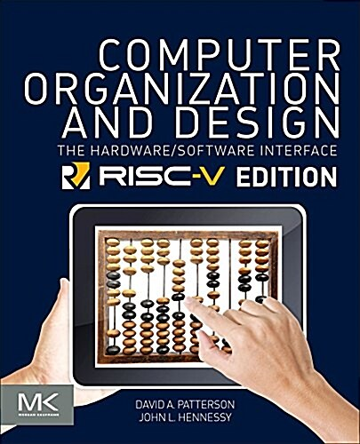

  
<h1 align="center">
  
Computer Organization and Design RISC-V Edition

  
</h1>
  
<b>David Patterson, John Hennessy 저</b> 
Elsevier · 2017년 4월 13일 출시</b> 

## :bulb: 목표

- **컴퓨터 구조를 공부한다.**

  > 컴퓨터 하드웨어, 소프트웨어 인터페이스를 자세히 공부한다.

 

## 🚩 정리한 문서 목록

### 📔 Computer Abstractions

 - [Computer Abstractions and Technology](https://github.com/erectbranch/Computer_Organization_and_Design/tree/master/ch01)

   > response time(execution time): wall clock time(elapsed time), CPU time, clock rate, clock period, CPI(Clock cycles Per Instruction), Effective CPI, MIPS

   > Power Wall, multicore processor, parallel programming, Amdahl's Law

### ⚙️ RISC-V

 - [RISC-V Instructions(RV64I)](https://github.com/erectbranch/Computer_Organization_and_Design/tree/master/ch02/summary01)

   > CISC vs RISC, general purpose register(register file), register operands, data alignment(MIPS vs RISC-V), byte addressing, little/big Endian, register spilling, bit extension

   > R-format instructions(arithmetic), I-format instructions(load, immediate arithmetic), S-format instructions(stores)

   > addressing mode(immediate, register, base, PC-relative), logical operations(shift, and, or, xor)

 - [Conditional Operation, Branch](https://github.com/erectbranch/Computer_Organization_and_Design/tree/master/ch02/summary02)

   > branch instructions(if-else, while example), procedure calling, procedure call instructions, memory layout, stack, leaf procedure, non-leaf procedure(factorial example), string copy example

 - [wide, branch instructions, data race](https://github.com/erectbranch/Computer_Organization_and_Design/tree/master/ch02/summary03)

   > wide immediate operands, branch addressing, SB-format, branching far away

   > data race, synchronization, atomic swap, mutex lock

 - [RISC-V Processor](https://github.com/erectbranch/Computer_Organization_and_Design/tree/master/ch04)

 

## :mag: 목차

### 1. Computer Abstractions and Technology

### 2. Instructions: Language of the Computer

### 3. Arithmetic for Computers

### 4. The RISC-V Processor

### 5. Large and Fast: Exploiting Memory Hierarchy

### 6. Parallel Processors from Client to Cloud

### A. The Basics of Logic Design

### B. Graphics and Computing GPUs

### C. Mapping Control to Hardware

### D. A Survey of RISC Architectures