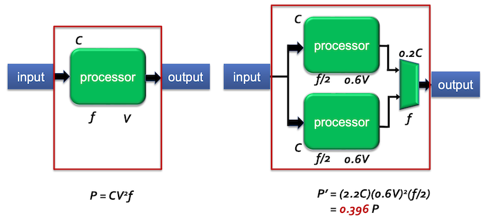
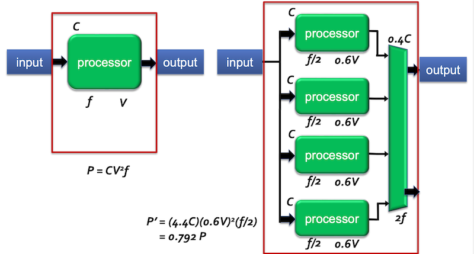

# 1 Computer Abstractions and Technology

## 1.1 컴퓨터의 응용 분야와 특성

컴퓨터는 크게 세 가지 응용 분야에서 사용된다.

- PC(Personal Computer)

- Server

    보통 network를 통해서만 접근되고, 대형 작업을 수행하기 위해 사용한다. 주로 특정한 기능을 수행할 수 있도록 customized되는 경우가 많다.

    > 고장이 나면 PC와는 비교할 수 없이 큰 손해가 발생하므로, 일반적으로 dependability(신용도)를 중요시한다.

    > 수만 개의 processor와 굉장히 큰 memory를 가진 슈퍼컴퓨터도 server에서는 작은 부분에 해당된다.

- embedded system

    오늘날 가장 많이 사용되고 있으며, 보통은 한 가지 application을 수행하거나 연관된 일련의 application을 수행하도록 설계된다.

    > embedded system에서 구현되는 software를 firmware라고 한다. 하지만 PC의 software와 다르게, firmware는 hardware의 논리적인 부분을 보강 및 대신할 수 있게 구현한다.(OS의 기능을 대신하므로 일종의 OS로도 볼 수도 있다.)

    > 요즘은 firmware를 수정이 가능한 PROM이나 flash에 저장하므로, 기능의 update가 필요하면 firmware를 수정해서 update를 한다.

    > 최근의 Embedded System은 processor를 대부분 가지고 있으며, processor의 OS를 사용해서 이더넷에 접속할 수 있다.

---

## 1.2 performance에 영향을 끼치는 요소

컴퓨터의 performance에 영향을 끼치는 몇 가지 hardware 혹은 software 구성 요소는 다음과 같은 것들이 있다.

- algorithm: I/O 작업 수, source program 문장 수, complexity 등을 결정한다.

    > 다양한 sorting altorithm을 떠올리면 알 수 있다.

- programming language: C, Java, Python 등. machine code 수를 결정한다.

- processor, memory system: instruction의 실행 속도를 결정한다.

- I/O system: I/O 작업의 속도를 결정한다.

이외 여러 parallelism과 memory hierarchy 최적화(cache blocking 등)와 같은 기법으로 performance를 더 향상시킬 수 있다.

---

## 1.3 compiler

**compiler**는 C, C++, Java 등 high level language를 machine code로 변환하는 역할을 수행한다.

- High-level language(C) -> Assembly language -> Machine language

처음 컴퓨터는 binary digit, 즉 **bit**를 사용해서, bit들의 집합인 **instruction**을 만들어 지시를 내렸다. 하지만 이런 과정은 너무나 복잡했기 때문에 사람이 생각하는 것과 비슷한 표시 방법을 고안했고, 이 작업을 수행하도록 만든 program이 바로 **assembler**(어셈블러)였다.

예를 들어 `add A, B`를 assembler에게 주면, assembler는 이를 `100101010010110`과 같은 machine language로 변환한다.

> 다른 machine language를 사용하는 processor도 opcode의 실제 bit pattern은 다르겠지만, assembly language에서 `add`와 같이 common한 opcode의 이름 자체는 같을 수 있다.

가장 중요한 **abstraction**(추상화) 중 하나가 바로 hardware와 최하위 software 간의 interfae로, 이를 **ISA**(Instruction Set Architecture) 또는 단순히 **architecture**라고 지칭한다.

---

## 1.4 register, buffer

**register**와 **buffer**는 모두 data를 임시로 저장하는 데 사용하지만 차이점이 있다.

- register: <U>processor 내부의 작은 memory space</U>로, processor에서 바로 access할 수 있다. 

    - 작은 양의 data만 저장할 수 있으며 특히 intermediate value를 저장하기 위해 사용한다.

- buffer: <U>memory</U>에서 data를 임시로 저장하기 위해 사용한다.

    - 주로 data를 다른 곳으로 전송 / data를 처리 / network에서 data를 수신하는 등 여러 작업에서 사용된다.

    - 대표적으로 **cache**가 DRAM의 buffer 역할을 수행하는 작고 빠른 memory이다.

---

## 1.5 performance의 정의

- **response time**(응답 시간) = **execution time**(실행 시간)

    task(작업, operation)의 시작부터 끝까지 걸린 시간. formal하게 **latency**로도 부른다.

- **throughput**(처리량) = **bandwidth**(대역폭)

    일정 시간동안 처리한 일(operation)의 양. 단위로 **FLOPS**(floating point operations per second)를 사용한다.

    > 예를 들어 2GFLOPS 능력을 가진 core가 4개가 있다면, 1초에 8GFLOPS를 처리할 수 있다. 

    > integer operation 단위로는 **TOPS**(tera operations per second)을 주로 사용한다.(주로 Deep Learning에서 볼 수 있다.)

---

### 1.5.1 performance 측정: execution time

그런데 execution time은 여러 방법으로 측정할 수 있다. 

- **wall clock time**(벽시계 시간) = **elapsed time**(경과 시간)

    한 task를 끝내는 데 필요한 전체 시간. disk/memory access, I/O, OS overhead 등을 모두 포함한다.

    > 주로 리눅스 시간을 사용해서 측정한다.

- **CPU time**(CPU 시간)

    program이 순수하게 해당 program을 시행하는 데 걸린 시간. 즉, I/O나 다른 program을 실행하는 데 걸린 시간은 포함되지 않는다.

또한 거의 모든 컴퓨터는 hardware event가 발생하는 시점을 **clock**을 이용해서 결정한다.

- **clock rate**(frequency)

    cycles/sec. 즉, cycle frequency. [Hz]

- **clock period**(clock cycle time)

    

    clock cycle 한 번에 걸리는 시간. 즉, clock cycle의 period. [s] (= 1/clock rate) 

> 예를 들어 1GHz frequency(clock rate)를 갖는 CPU가 있다면, period(clock cycle time)은 1/10^9 = 1ns이다.

따라서 어떤 program이 몇 clock cycles를 사용해서 수행됐는지를 알면, clock cycle time을 곱해서 총 CPU execution time을 구할 수 있는 것이다.

```
CPU execution time = CPU clock cycles * clock cycle time
```

혹은 역수 관계인 frequency로 표시한다면 다음과 같다.

```
CPU execution time = CPU clock cycles / clock rate
```

이 공식으로 알 수 있는 것은, 'execution time'을 줄이기 위해서는(performance 향상을 위해서는) frequency를 늘리거나, clock cycle time을 줄이는 방법이 필요하다는 사실이다.

---

### <span style='background-color: #393E46; color: #F7F7F7'>&nbsp;&nbsp;&nbsp;📝 예제 1: 성능 개선&nbsp;&nbsp;&nbsp;</span>

두 개의 컴퓨터 A, B가 있다. 두 컴퓨터는 같은 program을 실행한다.

- A: 2GHz clock rate를 가지며, program 실행에 10초가 걸린다.

- B: $x$ clock rate를 가지며, program 실행에 6초가 걸리도록 만들 것이다.

이를 위해 B의 clock cycle이 A의 1.2배가 필요하다면, B의 clock rate $x$ 는 얼마로 둬야 하는가?

### <span style='background-color: #C2B2B2; color: #F7F7F7'>&nbsp;&nbsp;&nbsp;🔍 풀이&nbsp;&nbsp;&nbsp;</span>

먼저 A를 바탕으로 program을 실행하는 데 필요한 CPU clock cycles을 구하자.(#CPU clock cycles for a program)

- \# program이 갖는 instructions $\times$ instruction당 average clock cycles

$$10 \times 2 \times 10^{9}$$

즉, program을 위해서 $20 \times 10^{9}$ cycles가 필요하다.

이제 6초동안 $20 \times 10^{9}$ cycles를 수행할 수 있는 B의 clock rate를 구하면 된다.

$$ 6 \times 1.2 \times (B \,\, clock \,\, rate) = 20 \times 10^{9} $$

즉, B clock rate는 $4 \times 10^{9}$ = 4GHz이다.


---

### 1.5.2 performance 측정: CPI

execution time은 instruction 수와 크게 관련이 있다.

```
CPU clock cycles = instruction 수 * CPI
```

- **CPI**(Clock cycles Per Instruction): instruction 하나에 필요한 clock cycle 수를 의미한다. 

   - instruction마다 실행 시간이 다르기 때문에, 모든 instruction의 평균 값으로 산출한다.

> cycle을 시간의 개념으로 바라보는 시각을 갖는 것이 중요하다. 필요한 cycle이 많을수록 오랜 시간이 걸린다.

---

### <span style='background-color: #393E46; color: #F7F7F7'>&nbsp;&nbsp;&nbsp;📝 예제 2: CPI를 이용한 성능 계산&nbsp;&nbsp;&nbsp;</span>

같은 ISA를 사용하는 두 컴퓨터 A, B가 있다.

- A: clock cycle time은 250ps, 어떤 program P에 대한 CPI는 2.0이다.

- B: clock cycle time은 500ps, 어떤 program P에 대한 CPI는 1.2이다.

program P를 실행하는 데 있어서 어떤 컴퓨터가 얼마나 더 빠른가?

### <span style='background-color: #C2B2B2; color: #F7F7F7'>&nbsp;&nbsp;&nbsp;🔍 풀이&nbsp;&nbsp;&nbsp;</span>

ISA가 같으므로 두 컴퓨터가 실행해야 하는 instruction의 총 개수는 같다. 따라서 다음과 같이 간단히 계산할 수 있다.

- A: instruction 수 \* 2.0 = 필요한 clock cycle 수

- B: instruction 수 \* 1.2 = 필요한 clock cycle 수 

execution time은 clock cycle 수 * clock cycle time이므로, 다음과 같이 계산할 수 있다.

- A: instruction 수 \* 2.0 \* 250ps (= 500)

- B: instruction 수 \* 1.2 \* 500ps (= 600)

따라서 A가 B보다 1.2배 더 빠르다. 

---

### <span style='background-color: #393E46; color: #F7F7F7'>&nbsp;&nbsp;&nbsp;📝 예제 3: CPI 비교&nbsp;&nbsp;&nbsp;</span>

어떤 엔지니어는 compiler 설계를 위해 두 가지 방법(1, 2) 중 하나를 선택할 것이다. 두 코드의 차이를 비교하라.

1. 어떤 코드가 더 많은 instruction을 실행하는가 

2. 어떤 코드가 더 빠른가 

3. 각 코드의 CPI는 얼마인가

| | | 실행에 필요한 instruction 개수 | |
| :---: | :---: | :---: | :---: | 
| 코드 | A | B | C |
| 1 | 2 | 1 | 2 |
| 2 | 4 | 1 | 1 |

- A는 CPI가 1, B는 CPI가 2, C는 CPI가 3이다.

> CPI가 클수록 더 complex한 instruction이다.

### <span style='background-color: #C2B2B2; color: #F7F7F7'>&nbsp;&nbsp;&nbsp;🔍 풀이&nbsp;&nbsp;&nbsp;</span>

1. instruction 총 개수는 각 A, B, C instruction 개수를 더하면 된다.

    - 코드 1: 2 + 1 + 2 = 5

    - 코드 2: 4 + 1 + 1 = 6

    따라서 절대적인 instruction 개수를 따지면 코드 1이 더 적다.

2. 어떤 코드가 더 빠른가

    먼저 instruction마다 필요한 cycle을 도출해 보자.

    - 코드 1: 2 \* 1 + 1 \* 2 + 2 \* 3 = 10

    - 코드 2: 4 \* 1 + 1 \* 2 + 1 \* 3 = 9

    코드 1이 더 사이클이 많으므로 execution time도 더 소요될 것이다. 따라서 코드 2가 instruction 수는 더 많아도 execution time 자체는 더 짧다.

3. 각 코드의 CPI는 얼마인가

    각 코드에 instruction 개수를 나눠서 평균을 구하면 된다.

    - 코드 1: 10 / 5 = 2.0

    - 코드 2: 9 / 6 = 1.5

---

### 1.5.4 Effective CPI

서로 다른 computer는 ISA가 다를 것이기 때문에, 실행 시간(CPU time)을 측정해서 비교하는 방법을 사용할 수 있다. 이때 사용하는 지표가 **effective CPI**(average CPI)이다.

```math
{\sum}_{i=1}^{n}{{CPI}_{i} \times IP_{i}}
```

- ${CPI}_{i}$ : instruction $i$ 실행에 소요되는 평균 clock cycle

- $IP_{i}$ : instruction $i$ 가 실행되는 percentage(비율)

예를 들어, instruction A가 20%의 비율로 실행되며 CPI가 2이고, 명령어 B가 80%의 비율로 실행되며 CPI가 4라면, "Effective CPI"는 다음과 같다..

$$ {0.2 \times 2 + 0.8 \times 4} = 3.6 $$

즉, 이 program의 Effective CPI는 3.6 cycle이다. 실행 시간을 의미하는 지표인 만큼 적을수록 빠르게 수행되는 program이다.

---

### <span style='background-color: #393E46; color: #F7F7F7'>&nbsp;&nbsp;&nbsp;📝 예제 4: 종류별 instruction 비교&nbsp;&nbsp;&nbsp;</span>

다음과 같은 instruction이 있다. 실행 빈도(Freq)와 CPI는 다음과 같다.

> clock freq가 아니라, instruction이 실행되는 percentage(비율)을 나타내는 freq이다.

| Op | Freq | ${\mathrm{CPI}}_{i}$ | Freq $\times {\mathrm{CPI}}_{i}$ | 
| --- | --- | --- | --- |
| ALU | 50% | 1 | |
| Load | 20% | 5 | |
| Store | 10% | 3 | |
| Branch | 20% | 2 | |

1. 더 나은 data cache가 average load time을 2 cycles로 줄인다면, machine은 얼마나 더 빨라지는가?

2. branch prediction을 사용하여 branch time을 한 cycle 절약하는 것과 비교하면 어떤 차이가 있는가?

3. 두 개의 ALU instruction을 동시에 실행할 수 있다면 어떠한 차이가 발생하는가?

### <span style='background-color: #C2B2B2; color: #F7F7F7'>&nbsp;&nbsp;&nbsp;🔍 풀이&nbsp;&nbsp;&nbsp;</span>

1. 더 나은 data cache가 average load time을 2 cycles로 줄인다면, machine은 얼마나 더 빨라지는가?

    - 위 도표에서 기존 Load는 5 cycles가 소요된다.

    Effective CPI를 계산하면 다음과 같다.

    - 기존 Effective CPI vs data cache 개선 Effective CPI

$$ (0.5 \times 1 + 0.2 \times 5 + 0.1 \times 3 + 0.2 \times 2) = 2.2 $$

$$ (0.5 \times 1 + 0.2 \times 2 + 0.1 \times 3 + 0.2 \times 2) = 1.6 $$


2. branch prediction을 사용하여 branch time을 한 cycle 절약하는 것과 비교하면 어떤 차이가 있는가?

    아래 계산에 따라 기존 Effective CPI보다 0.2 cycle 빨라지는 것을 알 수 있다.

$$ (0.2 \times -1) = -0.2 $$


3. 두 개의 ALU instruction을 동시에 실행할 수 있다면 어떠한 차이가 발생하는가?

    기존 $CPI_{i}$ 에 1/2를 해준 값으로 계산하면 된다. 아래 계산에 따라 0.25 cycle이 더 빨라지는 것을 알 수 있다.

$$-0.5 x 0.5 = -0.25$$

---

### 1.5.4 Benchmarks

processor A는 딥러닝 처리에 능하고, processor B는 다른 처리에 능하다면 어떻게 두 processor를 비교할 수 있을까? 대표적으로 **SPEC**(System Performance Evalutation Cooperative) benchmark와 같이 다양한 performance를 측정 및 비교할 수 있는 표준화된 benchmark를 이용하면 된다.

- integer benchmarks

- floating-point benchmarks

> Power workload, Java workload, Embedded application(EEMBC), Multithreaded programming(PARSEC), FPU benchmark 등

---

### 1.5.5 MIPS

performance matric으로 종종 **MIPS**(Millions of Instructions Per Second)라는 단위를 사용한다. 단, 아래와 같은 사항을 주의해서 사용해야 한다.

- 다른 computer끼리는 ISA가 다르다.

- 다른 instruction끼리는 complexity가 다르다.

```
MIPS = #instructions / execution time * 10^6
     // 이때 execution time = (#instructions * CPI)/clock rate이므로
     = (clock rate) / CPI * 10^6
```

---

## 1.6 Power Wall


> 검은 색 선은 Power(전력), 파란 색 선은 Clock Rate(frequency, 클럭 속도)를 의미한다.

> 사실 컴퓨터에서 power(전력)보다 더 중요한 지표는 energy이다. energy 척도인 J(joule)을 단위시간당 energy에 해당되는 W(Watt = joule/sec)보다 더 자주 사용한다.

위 그림을 보면 30년간 frequency와 power가 함께 빠르게 증가하다가 어느 순간 주춤해진 것을 확인할 수 있다. frequency와 power가 동시에 증가한 이유는 이 둘이 서로 연관이 있기 때문이다.

이는 integrated circuit을 구성하는 소자의 특성을 생각하면 알 수 있다. 주된 기술인 CMOS(Complementary Metal Oxide Semiconductor)는 다음과 같은 특성을 지닌다.

- CMOS의 주 energy 소비는 0 to 1 혹은 1 to 0으로 switching(dynamic energy)되는 사이에 이루어진다.

$$ energy \, \propto \, C \times V^{2}$$

- $C$ : capacitive load

- $V$ : voltage

> 위 식은 $0 \rightarrow 1 \rightarrow 0$ 이나 $1 \rightarrow 0 \rightarrow 1$ 처럼 logic이 두 번 바뀔 때 소모하는 energy로, 한 번 바뀔 때는 ${1 \over 2}$ 를 곱해야 한다.

transistor 하나가 소비하는 power는, (한 번 바뀔 때 소모되는 energy) $\times$ (시간당 logic이 바뀌는 frequency)다.

$$ power \, \propto \, {1 \over 2} \times C \times V^{2} \times Frequency \, switched $$

그런데 앞서 frequency가 계속해서 증가해서 1,000배 더 빨라진 것에 비해 power는 고작 30배 증가한 것을 확인할 수 있었다. 

- 새 공정기술의 등장으로 voltage는 줄어들었고, voltage는 power의 제곱으로 비례하기 때문에 초기에는 power가 낮아질 수 있었다.

- 하지만 voltage를 낮추면 낮출수록 transistor의 누설(leak) 전류가 생기게 되었고, 현재는 이 누설 전류가 너무 많아지게 되는 문제에 직면했다.

  - 예를 들어 server chip에서는 이미 power의 40%가 누설에 의해 소모되고 있다. 

  > 꽉 잠기지 않는 수도꼭지에 비유할 수 있다.
  
이 문제를 **Power Wall**(전력 장벽)이라 한다.

---

### 1.6.1 Vdd scaling


> Vdd는 굉장히 늘어났는데, Vth는 조금씩 늘어난 추세를 보인다.

Vth와 Vdd의 차이를 비교하면 더 확실하게 이해할 수 있다.

- high, low 사이의 small margin만 존재

  > 잠깐의 glitch로 low(0)이 갑자기 high(1)이 되는 일이 발생하면 안 된다.

- high variability or large leakage power

하지만 Vdd를 줄이면 Frequency가 줄어들게 된다. 이러한 문제를 해결할 대안으로 multiprocessor(multicore)가 등장한다.

---

## 1.7 multicore processor

같은 CPI를 갖는 N개의 core라면, 오직 1/N frequency로 동작할 수 있다. 다시 말해 low voltage(power)로 performance를 유지할 수 있는 것이다.

> 1core가 2GHz frequency로 동작했다면, 2core에서는 core 하나당 f/2인 1GHz로 동작하게 된다. 사실 core 하나만 놓고 비교하면, 낮은 frequency를 갖게 되서 latency가 늘어나게 되지만, core의 수가 많아져서 parallelism에 의해 전체적인 throughput은 더 향상되는 것이다.

> 하지만 그만큼 transistor 소자가 더 필요하게 된다.



> multiplexer가 각 core의 output을 모아서 처리한다.

multicore에서는 아래와 같은 코드를 거의 simultanaous하게 함께 처리할 수 있다.

```c
for (i = 0; i < 100; i++) {
    C[i] = A[i] + B[i];
}
```

하지만 다음과 같이 **dependency**가 있다면 이야기는 달라진다.

```c
// loop-carried dependence
for (i = 0; i < 100; i++) {
    C[i] = A[i] + B[i];
}
```

위 코드는 아래와 같이 간단히 나눌 수 없다.

- 1 core: 0 ~ 49까지의 index 처리

- 2 core: 50 ~ 99까지의 index 처리

왜냐하면 index 50은 dependency에 의해 index 49가 처리된 이후부터 처리할 수 있기 때문이다. 이러한 문제에서 짐작할 수 있듯이, multicore는 여러 core가 busy하게 유지하는 것이 핵심이다.

다음은 4 core를 나타낸 그림이다. 약 2배의 performance 향상을 얻을 수 있다.



하지만 여전히 문제는 남아 있다.

- 각 processor의 voltage를 40%까지 줄였지만, 엄밀히 따져서 voltage 총량은 여전히 많이 소모한다.

- dependence는 accelerate하기가 힘들다.

  > 사실 heterogeneous device가 계속해서 나오는 이유이기도 하다.(specific purpose를 수행하기 위한 device)

> 어떻게 같은 processor를 voltage를 조절해 가면서 사용할 수 있을까? 바로 **DVFS**(Dynamic Voltage Frequency Scaling)라는 기술의 덕택이다. power consumption을 줄이기 위해, processor가 workload에 따라서 voltage와 frequency를 조절하는 기술이다.

> game이나 browser 용도에서는 processor를 활발하게 사용하다가, 간단한 texting이나 application에서는 덜 사용하는 것과 같다.

---

## 1.8 parallel programming

따라서 multicore가 busy할 수 있는 explicit한 parallel programming이 필요하다.

- **ILP**(Instruction Level Parallelism)

  - hardware가 한번에 multiple instruction을 실행한다.

  - programmer에게는 보이지 않는다.(hidden)

하지만 다음과 같은 문제 때문에 구현이 힘들다.

- programming 난이도

- load balancing

  > "N core가 1/N frequency에 동일한 performance를 갖는다"는 전제는, 모든 N core가 idle하지 않고, 똑같은 수의 instruction을 실행할 수 있다는 가정을 기반으로 한다.

- optimizing communication and synchronization: 매우 느린 어떤 core에 의해, 결과를 취합하는 동안 overhead가 발생할 수 있다.

---

## 1.9 Amdahl's Law

**Amdahl's Law**(암달의 법칙)은 다음과 같다. 아무리 많이 processor의 core를 늘린다고 해도, performance를 늘릴 수 있는 한도가 존재한다.

```
(improved) Execution time = (Execution time affected by improvement) / (Amount of improvement) + Execution time unaffected
```

혹은 다음 수식으로 표현할 수 있다.

$$ {{1} \over {(1-P)+{{P}\over{S}}}} $$

- P: optimized part의 비율

- S: optimized part의 speedup

### <span style='background-color: #393E46; color: #F7F7F7'>&nbsp;&nbsp;&nbsp;📝 예제 5: Amdahl's law&nbsp;&nbsp;&nbsp;</span>

한 program이 computer에서 수행되는 데 100초가 걸린다. 이중에서 multiply operation(곱하기 연산)은 100초 중 80초를 소모한다.

만약 이 program에서 5배 speedup을 얻으려면, 얼마나 multiply operation의 속도를 높여야 하는가?

### <span style='background-color: #C2B2B2; color: #F7F7F7'>&nbsp;&nbsp;&nbsp;🔍 풀이&nbsp;&nbsp;&nbsp;</span>

- multiply operation은 수행 시간에서 80%를 차지한다.(P=0.8)

- 전체 speedup은 5이다.

$$ {{1} \over {(1 - 0.8) + {{0.8} \over S}}} = 5 $$

문제를 풀면 얻을 수 없는 speedup 수치임을 알 수 있다.

---