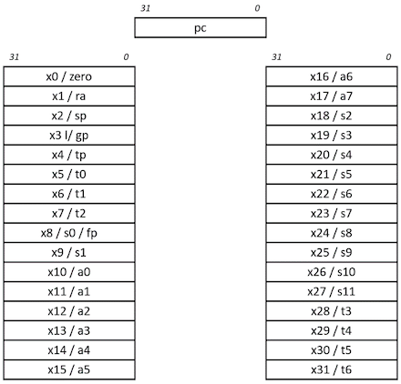
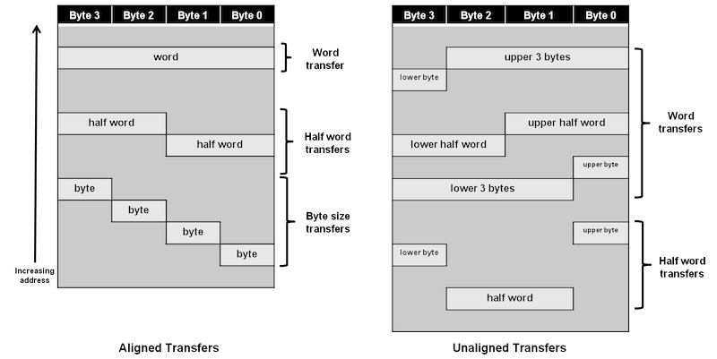
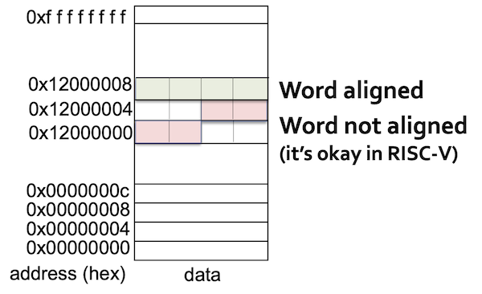
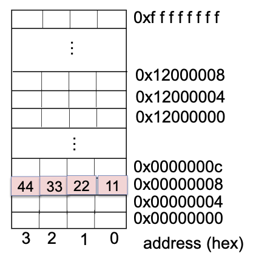

# 2 Instructions

이번 장에서는 instruction을 어떻게 represent하는지를 학습한다. 들어가기 앞서 몇 가지 RISC-V("리스크 파이브"로 발음)의 특징을 살펴보자.

- RISC-V의 **arithmetic instruction**(산술 연산자)들은 언제나 3개의 variables을 사용한다. (설계 원칙 1: 간단하게 설계하기 위해서는 규칙적인 것이 좋다.)

    > `Add`, `Subtract`, `Add immediate`

    > 만약 네 변수(b,c,d,e)의 합을 더해서 a에 넣어야 한다면, 위 법칙 때문에 instruction 3개가 필요하다.(1.a=b+c 2.a=a+d 3.a=a+e).

- RISC-V의 instruction set은 **register width에 따라 32, 64, 128 bit 버전이 있다.** 각각 RV32I, RV64I, RV128I라고 부른다. 모두 총 32개의 general purpose register를 갖는다는 점에서는 동일하다.

    > general purpose register를 절반(16개)으로 줄인 RV32E 같은 구현도 있다.

프로그래밍 단계에서 변수는 무한히 선언할 수 있는 것에 비해, register가 32개밖에 존재하지 않으므로 이 제약에 맞게 register가 사용되도록 처리하는 것이 중요하다. 그렇다면 왜 이러한 제약을 두었는지 의문이 생긴다. 이유는 다음과 같다. (설계 원칙 2: 작은 것이 더 빠르다.)

- register 수를 늘리면 그만큼 전기 신호가 멀리 전달되어야 하므로 **clock cycle**이 늘어나게 된다.

- register도 instruction 안에서는 숫자(0~31)로 표현되어야 하는데, 32개까지는 5bit( $2^5$ )로 표현할 수 있는 반면 이를 넘어가게 되면 instruction에서 bit를 더 잡아먹게 된다.

지금 정리에서는 <U>64bit register width를 갖는 RV64I로 가정</U>한다. 기본적으로 RV32I와 대부분의 instruction(35개)을 공유하지만 몇 가지 추가 instruction(12개)을 갖고 있다.

> 32bit instruction과 64bit instruction을 모두 처리할 수 있다.

> 64bit는 서버나 스마트폰용 processor에 더 적합하다.

---

## 2.1 CISC vs RISC

**RISC**(Reduced Instruction Set Computer)를 **CISC**(Complex Instruction Set Computer)와 비교하면 다음과 같은 차이를 갖는다.

- Reduced \# instructions

- simple, regular instructions의 조합으로 complex instruction을 표현한다.

  - pipelining을 이용해 비슷한 instruction은 한번에 처리(overlap)할 수 있다. 따라서 high throughput을 얻을 수 있다.

- **load**, **store**에서의 차이

   - CISC와 다르게 RISC는 register에서 memory operation으로 **Direct Memory Access**를 허락하지 않는다.

별개로 RISC-V를 사용하는 이점도 있는데, 보통 회사 소유의 ISA(ARM, MIPS, x86)는 (1) ISA 라이센스 (2) specific microarchitecture (3) warranty & indemnification 등으로 큰 비용이 든다. 이에 반해 RISC-V는 2010년 UC Berkeley에서 개발한 ISA로, RISC-V International이라는 기구에서 관리하는 개방형 구조이다.

RISC-V는 commercial 버전에서는 (2), (3)의 비용만 지불하면 되며, open source 버전에서는 비용 없이 무료로 사용할 수 있다.

---

## 2.2 Variables

잠시 C code에서 자주 볼 수 있는 **declaration**(선언) 예시를 살펴보자. 프로그래머가 다음과 같이 변수를 선언하면 compiler는 이를 RISC-V instruction으로 변환한다.

```c
// declaration을 위해서는 type, name이 필요하다.
// type는 size/interpretation, name은 address를 결정한다.
int a;      // type: integer
            // name: a
```

`name`이 갖는 정보는 다음과 같다.

- location: (start) **address** of memory

`type`이 갖는 정보는 다음과 같다.

- size: 

    > char: 1 Byte, short: 2 Bytes, int: 4 Bytes

- Interpretation:

    > "11..1111"을 signed int, unsigned int로 해석하면 서로 다르다.

---

## 2.3 RISC-V base ISA registers

앞서 언급한 것처럼 RISC-V(RV64I)는 총 32개의 64 bit register file을 갖고 있다. 이제 32개의 general purpose register가 각각 어떤 역할을 하는지 살펴보자. 참고로 관례상 RISC-V에서는 register를 `x{숫자}`(x0, x1, ... x31) 형태로 표현한다.

> [The RISC-V Architecture](https://dzone.com/articles/introduction-to-the-risc-v-architecture)



- `ra`: function return address

- `sp`: stack pointer

- `gp`: global data pointer

- `tp`: thread-local data pointer

- `t0`-`t6`: temporary storage

- `fp`: frame pointer(for function-local stack data)

- `s0`-`s11`: saved register

- `a0`-`a7`: function arguments

위 목적에 따라 64bit general purpose registers를 나누면 다음과 같다.

- x0: constant 0

    > 0은 자주 쓰는 constant이므로, 같은 값을 XOR해서 0을 만들기보다 아예 0을 할당해 두는 것이다.

- x1: return address

- x2: stack pointer

- x3: global pointer

- x4: thread pointer

- x5-x7, x28-x31: temporaries

- x8: frame pointer

- x9, x18-x27: saved registers

- x10-x11: function arguments/results

- x12-x17: function arguments

---

## 2.4 Register Operands

다음과 같은 C code가 있다고 하자. compiler는 이 C code의 variables를 register에 알맞게 할당한다.

```c
f = (g + h) - (i + j);
```

C compiler가 variable을 다음과 같이 할당했다고 하자. 

- f, g, h, i, j는 각각 x19, x20, x21, x22, x23 register(temporaries)에 위치.

- x5, x6 temporary registers를 추가로 사용해서 중간 결과를 저장할 것이다.

위 할당에 따라 C code를 RISC-V instruction(오직 arithmetic instruction)으로 바꾸면 다음과 같다.

```assembly
add x5 x20 x21    // g + h
add x6 x22 x23    // i + j
sub x19 x5 x6     // f = (g + h) - (i + j)
```

그런데 위 예제처럼 RISC-V instruction을 수행하기 위해서는, memory에서 variables의 값을 읽어서 temporaries에 담는 과정이 필요할 것이다. 이 과정을 **load instruction**으로 수행한다.

---

## 2.5 Data Alignment

> RISC에서는 덩어리로 제일 많이 처리하는 32bit와 64bit 묶음을 각각 **word**(워드), **doubleword**(더블 워드)라고 지칭한다.

load instruction을 살펴보기 전에, RISC-V에서 data를 memory에 어떻게 align하고 읽는지 살펴보자. 우선 **alignment restriction**(정렬제약)을 갖는 MIPS architecture를 살펴보고 RISC-V와 비교해 보자.

> [MIPS memory alignment](https://skills.microchip.com/pic32mx-core-architecture/699351)



> MIPS32 Little-Endian memory system

- 32bit(4byte)에 해당되는 **word**는, 4의 배수 address를 갖는다.

- MIPS는 alignment restriction을 강제한다.

이와 달리 현재 보고 있는 RV64I는 64bit(8byte)에 해당되는 **doubleword** 단위로 memory에 저장한다.

address는 8bit인 **byte**로 표현한다. MIPS에서는 address(byte)들이 word aligned되어야 하지만, RISC-V에서는 이를 강제하지 않는다.



MIPS와 ARM은 반드시 word의 address가 4(8)의 배수이어야 한다. 하지만 RISC-V는 이를 강제하지 않는다.

참고로 위에서 나온 Endian의 뜻은 다음과 같다. 아래과 같은 bit가 있다고 하면 **endianness**(엔디안)에 따라 memory에 bit가 저장되는 순서가 달라진다.

```
// MSB    LSB
   0x44332211
```

- Little-Endian: LSB is at the least address

- Big-Endian: MSB is at the least address

Little-Endian으로 저장 시 다음과 같이 저장된다. 잘 보면 word의 start address가 4의 배수인 것을 볼 수 있다.



그런데 이렇게 word 단위로 data를 채워넣을 때, word에 딱 맞지 않는 data는 어떻게 처리해야 할까? load instruction을 보며 이 문제를 해결하는 법을 살펴보자.

---
