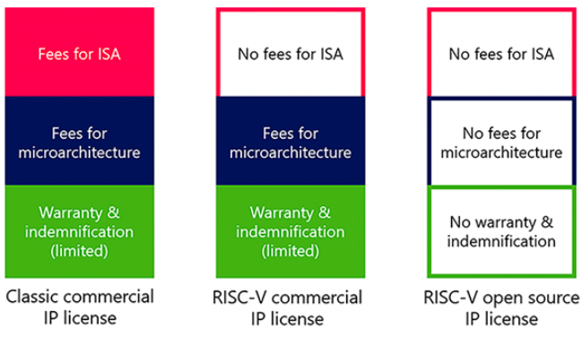
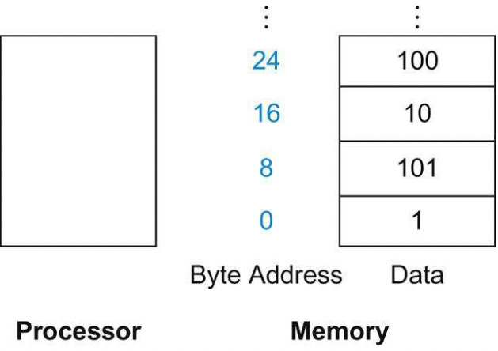
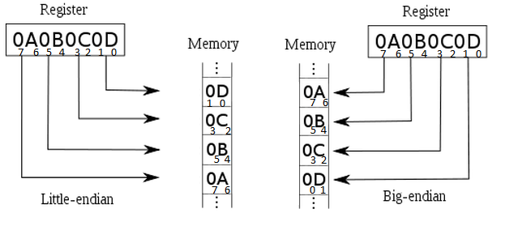
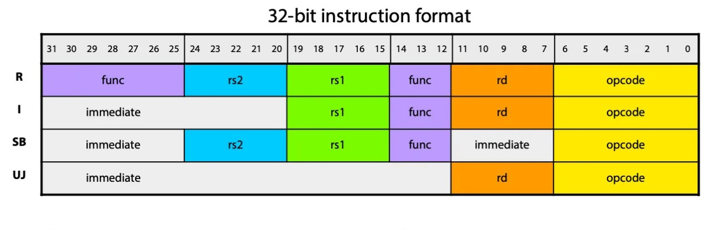
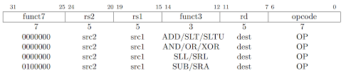
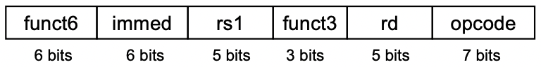
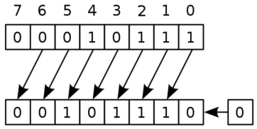
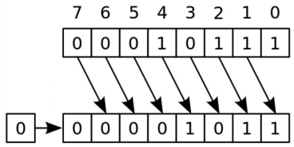

# 2 Instructions

이번 장에서는 instruction을 어떻게 represent하는지를 학습한다. 들어가기 앞서 몇 가지 RISC-V("리스크 파이브"로 발음)의 특징을 살펴보자.

- RISC-V의 **arithmetic instruction**(산술 연산자)들은 언제나 3개의 variables을 사용한다. (설계 원칙 1: 간단하게 설계하기 위해서는 규칙적인 것이 좋다.)

    > `Add`, `Subtract`, `Add immediate`가 있다.

    > 만약 네 변수(b,c,d,e)의 합을 더해서 a에 넣어야 한다면, 위 법칙 때문에 instruction 3개가 필요하다.(1.a=b+c 2.a=a+d 3.a=a+e).

- RISC-V의 instruction set은 **register width에 따라 32, 64, 128bit 버전이 있다.** 각각 RV32I, RV64I, RV128I라고 부른다. **모두 총 32개의 general purpose register를 갖는다**는 점은 동일하다.

    > 예외로 general purpose register를 절반(16개)으로 줄인 RV32E 같은 구현도 존재한다.

프로그래밍 단계에서 변수는 무한히 선언할 수 있는 것에 비해, register가 32개밖에 존재하지 않으므로 이 제약에 맞게 register가 사용되도록 처리하는 것이 중요하다. 그렇다면 왜 이러한 제약을 두었는지 의문이 생긴다. 이유는 다음과 같다. (설계 원칙 2: 작은 것이 더 빠르다.)

- register 수를 늘리면 그만큼 전기 신호가 멀리 전달되어야 하므로 **clock cycle**이 늘어나게 된다.

- register index는 register가 32개까지만 존재한다면 5bit( $2^5$ )로 표현할 수 있는 반면, 이를 넘어가게 되면 instruction에서 index를 나타내기 위해 bit를 더 많이 차지하게 된다.

현재 문서에서는 <U>64bit register width를 갖는 RV64I</U>를 살펴본다. 기본적으로 RV32I와 공통으로 instruction(35개)을 공유하지만 몇 가지 RV64I만의 추가 instruction(12개)을 갖고 있다.

> 32bit instruction과 64bit instruction을 모두 처리할 수 있다. 하지만 기본적으로 32bit instruction을 사용한다.

---

## 2.1 CISC vs RISC

**RISC**(Reduced Instruction Set Computer)를 **CISC**(Complex Instruction Set Computer)와 비교하면 다음과 같은 특성을 갖는다.

- Reduced \# instructions

- simple, regular instructions의 조합으로 complex instruction을 표현한다.

  - pipelining을 이용해 비슷한 instruction은 한번에 처리(overlap)할 수 있었다. 즉, pipelining을 통해 쉽게 high throughput을 얻을 수 있다.

- **load**, **store**에서의 차이

   - CISC와 다르게 RISC는 register에서 memory operation으로 **Direct Memory Access**를 허락하지 않는다.

또한 RISC-V를 사용하면서 얻는 비용적 이점도 있다. 



- 보통 회사 소유의 ISA(ARM, MIPS, x86)는 (1) ISA 라이센스 (2) specific microarchitecture (3) warranty & indemnification 등으로 큰 비용이 든다. 

- 반면 RISC-V는 2010년 UC Berkeley에서 개발한 ISA로, RISC-V International이라는 기구에서 관리하는 개방형 구조로 누구나 사용할 수 있다.

  - RISC-V는 commercial 버전에서는 (2), (3)의 비용만 지불하면 되며, open source 버전에서는 비용 없이 무료로 사용할 수 있다.

---

## 2.2 Variables

RISC-V ISA를 살펴보기 위한 기본 예시로, 간단히 C **declaration**(선언) code를 보자. 프로그래머가 다음과 같이 변수를 선언하면 compiler는 이를 RISC-V instruction으로 변환한다.

```c
// declaration을 위해서는 type, name이 필요하다.
// type는 size/interpretation, name은 address를 결정한다.
int a;      // type: integer
            // name: a
```

`name`이 갖는 정보는 다음과 같다.

- location: (start) **address** of memory

`type`이 갖는 정보는 다음과 같다.

- size: 

    > char: 1 Byte, short: 2 Bytes, int: 4 Bytes

- Interpretation:

    > "11..1111"을 signed int, unsigned int로 해석하면 서로 다르다.

참고로 variable에 간단한 정수를 담았다면 다음과 같이 초기화가 된다.

```assembly
// register x5가 해당 변수를 저장한다고 가정
// 0으로 초기화
add x5 x0 x0

// 7로 초기화
addi x5 x0 7
```

---

## 2.3 RISC-V base ISA registers

앞서 언급한 것처럼 RISC-V(RV64I)는 총 32개의 64bit register file을 갖고 있다. 이제 32개의 general purpose register가 각각 어떤 역할을 하는지 살펴보자. 참고로 관례상 RISC-V에서는 register를 `x{숫자}`(x0, x1, ... x31) 형태로 표현한다.

> [The RISC-V Architecture](https://dzone.com/articles/introduction-to-the-risc-v-architecture)


- `ra`: function return address

- `sp`: stack pointer

- `gp`: global data pointer

- `tp`: thread-local data pointer

- `t0`-`t6`: temporary storage

- `fp`: frame pointer(for function-local stack data)

- `s0`-`s11`: saved register

- `a0`-`a7`: function arguments

위 목적에 따라 64bit general purpose registers를 나누면 다음과 같다.

- x0: constant 0

    > 0은 자주 쓰는 constant이므로, 같은 값을 XOR해서 0을 만들기보다 아예 0을 할당해 두는 것이다.

- x1: return address

- x2: stack pointer

- x3: global pointer

- x4: thread pointer

- x5-x7, x28-x31: temporaries

- x8: frame pointer

- x9, x18-x27: saved registers

- x10-x11: function arguments/results

- x12-x17: function arguments

---

## 2.4 Register Operands

다음과 같은 C code가 있다고 하자. compiler는 이 C code의 variables를 register에 알맞게 할당한다.

```c
f = (g + h) - (i + j);
```

C compiler가 variable을 다음과 같이 할당했다고 하자. 

- f, g, h, i, j는 각각 x19, x20, x21, x22, x23 register(temporaries)에 위치.

- x5, x6 temporary registers를 추가로 사용해서 중간 결과를 저장할 것이다.

위 할당에 따라 C code를 RISC-V instruction(오직 arithmetic instruction)으로 바꾸면 다음과 같다.

```assembly
add x5 x20 x21    // g + h
add x6 x22 x23    // i + j
sub x19 x5 x6     // f = (g + h) - (i + j)
```

그런데 위 예제처럼 RISC-V instruction을 수행하기 위해서는, memory에서 variables의 값을 읽어서 temporaries에 담는 과정이 필요할 것이다. 이 과정은 **load instruction**가 수행한다.

---

## 2.5 Data Alignment

> RISC에서는 덩어리로 제일 많이 처리하는 32bit와 64bit 묶음을 각각 **word**(워드), **doubleword**(더블 워드)라고 지칭한다.

load instruction을 살펴보기 전에, RISC-V에서 data를 memory에 어떻게 align하고 읽는지 살펴보자. 우선 **alignment restriction**(정렬제약)을 갖는 MIPS architecture를 살펴보고 RISC-V와 비교해 보자.

> [MIPS memory alignment](https://skills.microchip.com/pic32mx-core-architecture/699351)

- **MIPS**(32bit register, 32bit memory case)

    

    > MIPS32 Little-Endian memory system. 그림의 왼쪽이 aligned, 오른쪽이 unaligned된 경우이다.

    - 4byte(32bits) 단위에 따라, address는 4의 배수를 갖게 된다.(0x00000004, 0x00000008, ...)

    - MIPS는 alignment restriction을 강제한다.

- **RISC-V**(64bit register, 64bit memory case)

    이와 달리 RV64I는 64bit(8byte)에 해당되는 **doubleword** 단위로 memory에 저장한다.

    

    또한 MIPS와 ARM은 반드시 word의 address가 4(8)의 배수(aligned)이어야 하지만, RISC-V는 이를 강제하지 않는다.(unaligned도 OK)

참고로 Endian의 뜻은 다음과 같다. 아래과 같은 bit가 있다고 하면 **endianness**(엔디안)에 따라 register에 저장된 bit들이 memory에 저장되는 순서가 달라진다.



- Little-Endian: LSB is at the least address

- Big-Endian: MSB is at the least address

```assembly
// MSB    LSB

// Little-Endian
   0x44332211

// Big-Endian
   0x11223344
```

---

## 2.7 Load instructions

다음은 load instruction의 예시다.

```
ld x9, 8(x22)
```

- x22: **base register**. (memory) word의 start address를 기억한다.

- 8: **offset**. start address에 더해서 읽어올 data의 location을 결정한다.

- x9: **temporary register**. 읽어 온 data를 저장할 register.

여기서 더 주목할 점은 doubleword를 load하는 `ld`(load doubleword)이다. `ld x9, 8(x22)`는 start address(x22)에서 offset 8을 더한 location에서, 8bytes를 읽어와서 x9에 저장하게 된다.

이와 비슷한 load instruction이 더 존재한다.

- `ld`, `lw`: load doubleword(8bytes), load word(4bytes)

- `lh`, `lb`: load halfword(2bytes), load byte

### <span style='background-color: #393E46; color: #F7F7F7'>&nbsp;&nbsp;&nbsp;📝 예제 1: long 타입 변수 불러오기&nbsp;&nbsp;&nbsp;</span>

다음 C code를 RISC-V code로 compile하라.

> C 언어에서 `long`은 운영체제와 플랫폼에 따라 bit수 정의가 다르니 주의. 지금은 8bytes(64bit)로 가정.

```c
long A[20];

g = h + A[8];
```

- g는 `x23`, h는 `x21`에 이미 load가 되었다고 가정

- long type 배열 A의 base address는 `x22`에 저장되어 있다.

- `x5`: temporary register

> 따라서 만약 `&A[0]=2000`이라면 2004, 2008, 2012 등이 `A[i]`의 address가 된다.

### <span style='background-color: #C2B2B2; color: #F7F7F7'>&nbsp;&nbsp;&nbsp;🔍 풀이&nbsp;&nbsp;&nbsp;</span>

RISC-V code로 compile하면 다음과 같은 instruction이 된다.

```assembly
ld x5 64(x22)       // base address + offset 64에 있는 data(A[8])를 x5에 load 
add x23, x21, x5    // h + A[8]를 x23에 저장
```

위 예제에서 A 배열은 8byte인 long type이기 때문에, doubleword를 load하는 ld를 사용했다. A[8]이므로 offset은 8*8.

> 만약 4byte에 해당되는 int type 배열이었다면 `lw`를 사용했을 것이다. A[8]이므로 offset은 8*4.

> 만약 이보다도 더 짧은 2byte의 short type로 선언했다면, `short A[8]`을 load하려면 다음과 같은 instruction이 사용되었을 것이다. offset은 8*2

```
lh x5 16(x22)
```

### <span style='background-color: #393E46; color: #F7F7F7'>&nbsp;&nbsp;&nbsp;📝 예제 2: long 타입 변수 연산 후 저장하기&nbsp;&nbsp;&nbsp;</span>

다음 C code를 RISC-V code로 compile하라.(long = 8bytes)

```c
long A[100];

A[12] = h + A[8];
```

- h는 `x21`, A의 base address는 `x22`에 저장.

- `x5`: temporary register

### <span style='background-color: #C2B2B2; color: #F7F7F7'>&nbsp;&nbsp;&nbsp;🔍 풀이&nbsp;&nbsp;&nbsp;</span>

RISC-V code로 compile한 결과는 다음과 같다.

```
ld    x5, 64(x22)    # reg x5 gets A[8]
add   x5, x21, x5    # reg x5 gets h+A[8]
sd    x5, 96(x22)    # Stores h+A[8] to A[12]
```

---

## 2.7.1 Register Spilling

현재 살펴보고 있는 RISC-V architecture는 32개 register밖에 가지고 있지 않다. 그렇다면 instruction을 load할 때, register의 빈 자리가 없는 경우도 생길 것이다.(단순히 overwrite하면 큰 문제가 생길 것이다.)

이러한 문제를 방지하기 위해 **register spilling** 기법을 사용할 수 있다.

- less frequently used variables를 memory stack에 옮긴다.(`sw`(`sd`)로 stack에 저장)

- 그 자리에 당장 필요한 variable을 불러와서 사용한다. 

- 연산이 끝나면 다시 memory(stack)에 옮긴 variable을 restore(pop)한다.(`lw`(`ld`)로 stack에서 불러온다)

---

## 2.7 bit extension

register는 값을 load할 때 register width인 8byte(64bit)만큼을 채워야 한다. 

> 참고로 연산을 수행하는 ALU도 언제나 8byte씩 입력을 받는다.

그런데 `ld`일 때는 문제가 없겠지만, `lw`, `lh`, `lb`라면 남은 자리는 어떻게 처리할까? 이 경우 unsigned, signed value에 따라 값을 채워 넣게 된다.

- unsigned values: (왼쪽으로) 0bit extend한다.

- signed values

    하지만 signed values는 sign bit로 부호를 나타내는 특유의 표현 방식 때문에 일괄적으로 0으로 채울 수는 없다. 대신 sign bit를 복제해서 채워주면 된다.

    - +2: **0**000 0010 => **0000 0000 0**000 0010

    - \-2: **1**111 1110 => **1111 1111 1**111 1110 
    
> 프로그래밍 시 자료형을 보고 signed/unsigned를 판단하는 습관을 갖는 편이 좋다. 예를 들어 `int 8`이라면 signed type이다.

---

## 2.8 Immediate Operands

> [RISC-V Assembly Overview](https://www.symmathics.com/index.php/risc-v-assembly-review/)

load instruction을 사용하지 않고 operand 자리에 constant를 넣는 instruction이 존재한다.

```
addi x22, x22, 4    # x22 = x22 + 4
```

- `add`와 `addi`의 차이는 말 그대로 constant(immediate)의 유무다.

> 특히 for loop에서 자주 볼 수 있다. 

그렇다면 어째서 immediate operand를 사용하는 걸까? 

- memory에서 data를 register로 load하는 과정(overhead)이 사라진다. 

  - 따라서 (1) register를 아끼면서 (2) 동시에 instruction을 더 빠르게 수행할 수 있게 된다. 

하지만 immediate operand를 사용하는 것으로 얻는 단점도 있다. 바로 <U>immediate operand를 사용하기 위해서는 multiplexer를 추가</U>해야 한다는 점이다.


> ALU의 op2로 immediate operand를 넣을지, register의 값을 넣을지를 결정할 수 있는 mux를 추가로 달아줘야 한다.

이외 immediate로 사용할 수 있는 immediate의 크기는 오직 12bits까지로 제한( $-2^{11} ~ 2^{11} -1$ )된다는 limitation도 있다. 이 점은 instruction format을 살펴보면 명확히 알 수 있다.

- R-format Instructions


- I-format Instructions


- immediate를 표현하기 위해 사용할 수 있는 bit는 12bits이다.

---

## 2.9 Representing Instructions

> [RISC-V Instruction-Set Cheatsheet](https://itnext.io/risc-v-instruction-set-cheatsheet-70961b4bbe8)

RISC-V instructions는 모든 instruction이 32bit로 이루어져 있다. RISC-V instruction에는 다양한 formats가 존재한다.



> func: 추가 opcode 필드를 의미한다.

- R-type: Arithmetic instructions

- I-type: Loads & immediate arithmetic

- S-type: Stores

- SB-type: Conditional branch format

- UJ-type: Unconditional jump format

- U-type: Upper immediate format

위 그림에 나오지 않은 S-type은 다음과 같다.


- 12bit immediate가 두 개의 필드에 나뉘어 들어가는 것을 볼 수 있다. imm[11:5]에 7bits를 넣고, 뒤에 imm[4:0]에 5bits를 쪼개서 넣는다.

  - 상위 7bits 필드/하위 5bits 필드에 나뉘어 들어가기 때문에, $2^5$ 로 나눠서 남는 나머지는 하위 5bits에 넣고, 몫은 상위 7bits에 넣는 방식으로 쪼갠다.

- 굳이 이렇게 두 필드로 나눈 이유는 `store`을 위해서는 rs1, rs2가 모두 필요하고, 모든 instruction에서 rs1, rs2 필드의 위치가 같기 위해서는 이러한 설계 방법밖에 방도가 없었기 때문이다.

### <span style='background-color: #393E46; color: #F7F7F7'>&nbsp;&nbsp;&nbsp;📝 예제 3: s-type&nbsp;&nbsp;&nbsp;</span>

`sd x5, 240(x10)`를 s-type format으로 표현하라.

### <span style='background-color: #C2B2B2; color: #F7F7F7'>&nbsp;&nbsp;&nbsp;🔍 풀이&nbsp;&nbsp;&nbsp;</span>

offset 240를 32( $2^5$ )로 나누면 몫은 7, 나머지는 16이다.

- 상위 7bits field: 몫 7이 들어간다.(0000111)

- 하위 5bits fieild: 나머지 16이 들어간다.(10000)

이를 종합하면 다음과 같다.(`x5`: 101, `x10`: 1010, `opcode`(35): 100011, `func3`(필드 값 2): 10)

| immediate[11:5] | rs2 | rs1 | func3 | immediate[4:0] | opcode |
| :---: | :---: | :---: | :---: | :---: | :---: |
| 0000111 | 01010 | 00101 | 010 | 10000 | 0100011 |

---

### 2.9.1 addressing mode

instruction에서 oprand의 address를 나타낼 수 있는 방법은 다양하게 있다.(아래 예시 외 다양한 addressing mode가 존재한다.)


- Immediate addressing

- Register addressing: operand가 저장된 register를 가리킨다.

- Base addressing: operand를 가리키는 pointer가 저장된 register를 가리키고, offset(immediate)을 이용해서 operand를 구한다.

- (PC-)relative addressing: PC register에서 offset을 더해 operand address를 얻는다.

   > rs2, rs1 필드 위치를 유지하기 위해, immediate가 상위, 하위 필드로 나뉘어 들어간다.

---

## 2.10 Logical Operations

bitwise manipulation을 위한 instruction인 logical operation을 살펴보자.

```c
// C code            // RISC-V instruction
<<  // shift left    // sll(Shift Left Logical), slli
>>  // shift right   // srl(Shift Right Logical), srli
&   // bitwise AND   // and, andi
|   // bitwise OR    // or, ori
^   // bitwise XOR   // xor, xori
~   // bitwise NOT   // xori
```

R-format일 경우, instruction은 다음과 같은 형태를 갖는다.



---

### 2.10.1 Shift Operations

R-format과 I-format 모두 shift operation을 지원한다. 

- I-format

    

    - immediate: 얼마나 position을 shift할지를 나타내는 값

    > immediate는 6bit로 제한을 두는데, 그보다 더 많이 shift하면 원래 있는 수를 모두 shifting해버리고 0만 남아버리기 때문.

- `slli`는 $2^{i}$ 만큼 곱하는 연산이다.

    

- `srli`는 $2^{i}$ 만큼 나누는 연산이다.

    

    `srl`은 오직 unsigned에서만 가능하다. 예를 들어 signed integer라면, 10000(-16)에 $2^{2}$ 만큼 나누면 00100(+4)가 되는 식으로 전혀 다른 값이 나오기 때문이다.

---

### 2.10.2 And Operations

(생략)

---

### 2.10.3 OR Operations

(생략)

---

### 2.10.4 XOR Operations

(생략)

---