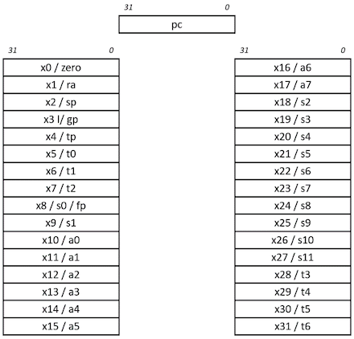
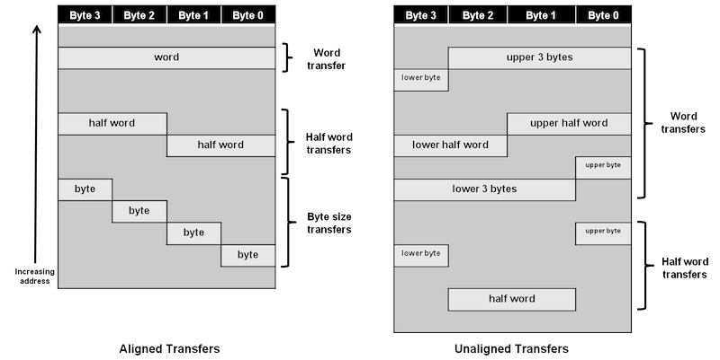
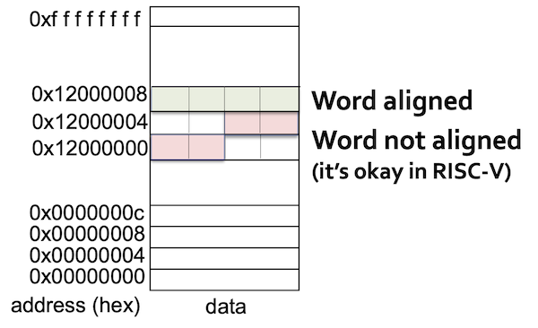
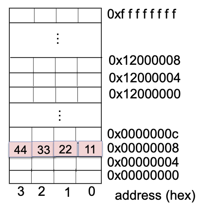
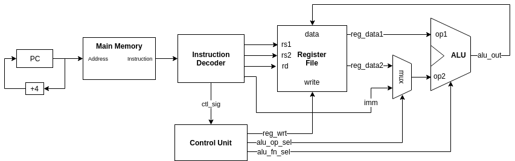
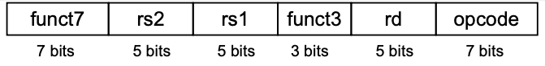
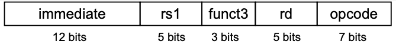
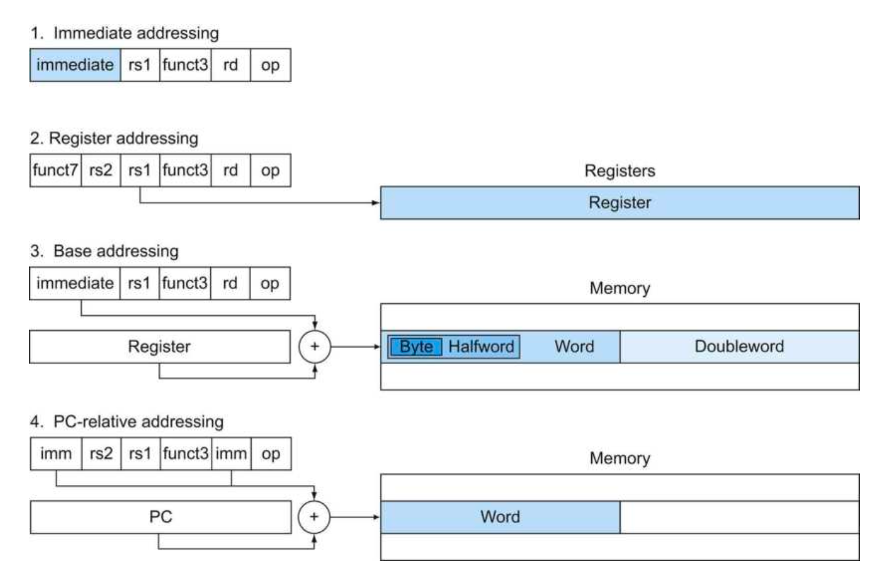
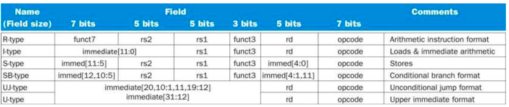

# 2 Instructions

이번 장에서는 instruction을 어떻게 represent하는지를 학습한다. 들어가기 앞서 몇 가지 RISC-V("리스크 파이브"로 발음)의 특징을 살펴보자.

- RISC-V의 **arithmetic instruction**(산술 연산자)들은 언제나 3개의 variables을 사용한다. (설계 원칙 1: 간단하게 설계하기 위해서는 규칙적인 것이 좋다.)

    > `Add`, `Subtract`, `Add immediate`

    > 만약 네 변수(b,c,d,e)의 합을 더해서 a에 넣어야 한다면, 위 법칙 때문에 instruction 3개가 필요하다.(1.a=b+c 2.a=a+d 3.a=a+e).

- RISC-V의 instruction set은 **register width에 따라 32, 64, 128 bit 버전이 있다.** 각각 RV32I, RV64I, RV128I라고 부른다. 모두 총 32개의 general purpose register를 갖는다는 점에서는 동일하다.

    > general purpose register를 절반(16개)으로 줄인 RV32E 같은 구현도 있다.

프로그래밍 단계에서 변수는 무한히 선언할 수 있는 것에 비해, register가 32개밖에 존재하지 않으므로 이 제약에 맞게 register가 사용되도록 처리하는 것이 중요하다. 그렇다면 왜 이러한 제약을 두었는지 의문이 생긴다. 이유는 다음과 같다. (설계 원칙 2: 작은 것이 더 빠르다.)

- register 수를 늘리면 그만큼 전기 신호가 멀리 전달되어야 하므로 **clock cycle**이 늘어나게 된다.

- register도 instruction 안에서는 숫자(0~31)로 표현되어야 하는데, 32개까지는 5bit( $2^5$ )로 표현할 수 있는 반면 이를 넘어가게 되면 instruction에서 bit를 더 잡아먹게 된다.

지금 정리에서는 <U>64bit register width를 갖는 RV64I로 가정</U>한다. 기본적으로 RV32I와 대부분의 instruction(35개)을 공유하지만 몇 가지 추가 instruction(12개)을 갖고 있다.

> 32bit instruction과 64bit instruction을 모두 처리할 수 있다. 하지만 기본적으로 32bit instruction을 사용한다.

> 64bit는 서버나 스마트폰용 processor에 더 적합하다.

---

## 2.1 CISC vs RISC

**RISC**(Reduced Instruction Set Computer)를 **CISC**(Complex Instruction Set Computer)와 비교하면 다음과 같은 차이를 갖는다.

- Reduced \# instructions

- simple, regular instructions의 조합으로 complex instruction을 표현한다.

  - pipelining을 이용해 비슷한 instruction은 한번에 처리(overlap)할 수 있다. 따라서 high throughput을 얻을 수 있다.

- **load**, **store**에서의 차이

   - CISC와 다르게 RISC는 register에서 memory operation으로 **Direct Memory Access**를 허락하지 않는다.

별개로 RISC-V를 사용하는 이점도 있는데, 보통 회사 소유의 ISA(ARM, MIPS, x86)는 (1) ISA 라이센스 (2) specific microarchitecture (3) warranty & indemnification 등으로 큰 비용이 든다. 이에 반해 RISC-V는 2010년 UC Berkeley에서 개발한 ISA로, RISC-V International이라는 기구에서 관리하는 개방형 구조이다.

RISC-V는 commercial 버전에서는 (2), (3)의 비용만 지불하면 되며, open source 버전에서는 비용 없이 무료로 사용할 수 있다.

---

## 2.2 Variables

잠시 C code에서 자주 볼 수 있는 **declaration**(선언) 예시를 살펴보자. 프로그래머가 다음과 같이 변수를 선언하면 compiler는 이를 RISC-V instruction으로 변환한다.

```c
// declaration을 위해서는 type, name이 필요하다.
// type는 size/interpretation, name은 address를 결정한다.
int a;      // type: integer
            // name: a
```

`name`이 갖는 정보는 다음과 같다.

- location: (start) **address** of memory

`type`이 갖는 정보는 다음과 같다.

- size: 

    > char: 1 Byte, short: 2 Bytes, int: 4 Bytes

- Interpretation:

    > "11..1111"을 signed int, unsigned int로 해석하면 서로 다르다.

---

## 2.3 RISC-V base ISA registers

앞서 언급한 것처럼 RISC-V(RV64I)는 총 32개의 64 bit register file을 갖고 있다. 이제 32개의 general purpose register가 각각 어떤 역할을 하는지 살펴보자. 참고로 관례상 RISC-V에서는 register를 `x{숫자}`(x0, x1, ... x31) 형태로 표현한다.

> [The RISC-V Architecture](https://dzone.com/articles/introduction-to-the-risc-v-architecture)



- `ra`: function return address

- `sp`: stack pointer

- `gp`: global data pointer

- `tp`: thread-local data pointer

- `t0`-`t6`: temporary storage

- `fp`: frame pointer(for function-local stack data)

- `s0`-`s11`: saved register

- `a0`-`a7`: function arguments

위 목적에 따라 64bit general purpose registers를 나누면 다음과 같다.

- x0: constant 0

    > 0은 자주 쓰는 constant이므로, 같은 값을 XOR해서 0을 만들기보다 아예 0을 할당해 두는 것이다.

- x1: return address

- x2: stack pointer

- x3: global pointer

- x4: thread pointer

- x5-x7, x28-x31: temporaries

- x8: frame pointer

- x9, x18-x27: saved registers

- x10-x11: function arguments/results

- x12-x17: function arguments

---

## 2.4 Register Operands

다음과 같은 C code가 있다고 하자. compiler는 이 C code의 variables를 register에 알맞게 할당한다.

```c
f = (g + h) - (i + j);
```

C compiler가 variable을 다음과 같이 할당했다고 하자. 

- f, g, h, i, j는 각각 x19, x20, x21, x22, x23 register(temporaries)에 위치.

- x5, x6 temporary registers를 추가로 사용해서 중간 결과를 저장할 것이다.

위 할당에 따라 C code를 RISC-V instruction(오직 arithmetic instruction)으로 바꾸면 다음과 같다.

```assembly
add x5 x20 x21    // g + h
add x6 x22 x23    // i + j
sub x19 x5 x6     // f = (g + h) - (i + j)
```

그런데 위 예제처럼 RISC-V instruction을 수행하기 위해서는, memory에서 variables의 값을 읽어서 temporaries에 담는 과정이 필요할 것이다. 이 과정을 **load instruction**으로 수행한다.

---

## 2.5 Data Alignment

> RISC에서는 덩어리로 제일 많이 처리하는 32bit와 64bit 묶음을 각각 **word**(워드), **doubleword**(더블 워드)라고 지칭한다.

load instruction을 살펴보기 전에, RISC-V에서 data를 memory에 어떻게 align하고 읽는지 살펴보자. 우선 **alignment restriction**(정렬제약)을 갖는 MIPS architecture를 살펴보고 RISC-V와 비교해 보자.

> [MIPS memory alignment](https://skills.microchip.com/pic32mx-core-architecture/699351)



> MIPS32 Little-Endian memory system

- 32bit(4byte)에 해당되는 **word**는, 4의 배수 address를 갖는다.

- MIPS는 alignment restriction을 강제한다.

이와 달리 현재 보고 있는 RV64I는 64bit(8byte)에 해당되는 **doubleword** 단위로 memory에 저장한다.

address는 8bit인 **byte**로 표현한다. MIPS에서는 address(byte)들이 word aligned되어야 하지만, RISC-V에서는 이를 강제하지 않는다.



MIPS와 ARM은 반드시 word의 address가 4(8)의 배수이어야 한다. 하지만 RISC-V는 이를 강제하지 않는다.

참고로 위에서 나온 Endian의 뜻은 다음과 같다. 아래과 같은 bit가 있다고 하면 **endianness**(엔디안)에 따라 memory에 bit가 저장되는 순서가 달라진다.

```
// MSB    LSB
   0x44332211
```

- Little-Endian: LSB is at the least address

- Big-Endian: MSB is at the least address

Little-Endian으로 저장 시 다음과 같이 저장된다. 잘 보면 word의 start address가 4의 배수인 것을 볼 수 있다.



그런데 이렇게 word 단위로 data를 채워넣을 때, word에 딱 맞지 않는 data는 어떻게 처리해야 할까? load instruction을 보며 이 문제를 해결하는 법을 살펴보자.

---


## 2.6 Load instructions

다음은 load instruction의 예시다.

```
ld x9, 8(x22)
```

- x22: (memory) word의 start address를 기억하는 **base register**

- 8: start address에 더할 **offset**(변위)

- x9: 읽어 온 data를 저장하는 temporary register

여기서 `ld`는 load doubleword를 의미한다.

- `ld`, `lw`: load doubleword(8bytes), load word(4bytes)

- `lh`, `lb`: load halfword(2bytes), load byte

즉, 위 예제는 (start) address부터 offset 8를 더한 location부터, doubleword(8Bytes)를 register x9에 load한다.

> `lw`였다면 word(4Bytes)를 load하게 된다.

### <span style='background-color: #393E46; color: #F7F7F7'>&nbsp;&nbsp;&nbsp;📝 예제 1: long 타입 변수 불러오기&nbsp;&nbsp;&nbsp;</span>

이번에는 C code 예시를 살펴보자.

> C 언어에서 `long`은 운영체제와 플랫폼에 따라 bit수 정의가 다르니 주의. 지금은 8bytes로 생각한다.

```c
long A[20];

g = h + A[8];
```

- g는 x23, h는 x21(이미 load가 된 상태)

- long type 배열 A의 base address는 x22에 저장되어 있다.

- x5: temporary register

만약 `&A[0]=2000`이라면 2004, 2008, 2012 등이 `A[i]`의 address가 된다.

```
&A[0]
```

RISC-V code로 compile하면 다음과 같은 instruction이 된다.

```
ld x5 64(x22)
add x23, x21, x5
```

위 예제에서는 `long A[20]`으로 선언했기 때문에 ld를 썼다. 만약 4byte에 해당되는 int type으로 선언했면 `lw`를 썼을 것이다.

만약 `short`로 선언했다면 다음과 같이 됐을 것이다.

```
lh x5 16(x22)
```

### <span style='background-color: #393E46; color: #F7F7F7'>&nbsp;&nbsp;&nbsp;📝 예제 2: long 타입 변수 연산 후 저장하기&nbsp;&nbsp;&nbsp;</span>

다음과 같은 C code가 있다고 하자.

```c
long A[100];

A[12] = h + A[8];
```

- h는 x21, A의 base address는 x22에 있다.

- x5: temporary register

이를 RISC-V code로 compile하면 결과는 다음과 같다.

```
ld    x5, 64(x22)    # reg x5 gets A[8]
add   x5, x21, x5    # reg x5 gets h+A[8]
sd    x5, 96(x22)    # Stores h+A[8] to A[12]
```

---

## 2.6.1 Register Spilling

현재 살펴보고 있는 RISC-V architecture에서 register 개수는 32개밖에 없다. 그렇다면 instruction을 load할 때, register 빈 자리가 없는 경우도 생길 것이다. 단순히 다른 register에 overwrite해서는 크나큰 문제가 생길 것이다. 

이런 상황에서는 policy에 따라 다를 수 있지만, 잘 쓰이지 않는 register 내 변수(less frequently used variables)를 memory에 stack 구조로 옮기고, 당장 필요한 variable을 불러와서 사용한다. 이를 **register spilling**이라고 한다.

그리고 연산이 끝나면 다시 memory(stack)에 옮긴 variable을 restore(pop)한다. 따라서 stack에 저장하는 `sw`(`sd`)와 다시 restore하는 `lw`(`ld`) 같은 instruction이 사용되게 된다.

> 변수 수명이 겹치지 않는데도 각각 register를 점유하고 있으면 낭비다.

---

## 2.7 Immediate Operands

> [RISC-V Assembly Overview](https://www.symmathics.com/index.php/risc-v-assembly-review/)

load instruction을 사용하지 않고 operand로 constant를 넣어서 연산을 할 수 있다. 아래 예시를 보자.

```
addi x22, x22, 4    # x22 = x22 + 4
```

- `add`와 `addi`의 차이는 말 그대로 constant(immediate)의 유무다.

참고로 위 예시와 같은 instruction은 특히 for loop에서 자주 볼 수 있다. 이렇게 immediate operand를 사용하면 memory에서 register로 load하는 overhead를 없애서, register를 아끼면서 동시에 instruction을 더 빠르게 수행할 수 있게 된다. 

하지만 immediate operand를 사용하는 것으로 얻는 단점도 있다. 아래는 instruction을 fetch, decode한 뒤 연산을 수행하는 hardware architecture를 나타낸 것이다.



그림을 잘 보면 ALU의 op2(operand2) 입력이 mux를 거치고 들어오는 것을 볼 수 있다. 이처럼 hardware적으로 immediate operand를 사용할 때를 위해, ALU의 op2에 immediate operand를 넣을지, register의 값을 넣을지를 결정할 수 있는 mux를 추가로 달아줘야 한다.

이러한 hardware적인 trade-off 외 limitation으로, immediate로 사용할 수 있는 상수의 크기가 12bits로 제한( $-2^{11} ~ 2^{11} -1$ )된다는 점이 있다.

- R-format Instructions



- I-format Instructions



---

## 2.8 representing instruction

항상 register에 값을 load할 때는, register width인 8byte(64bit)만큼을 채울 것이다.(참고로 ALU도 언제나 8byte씩 받는다.) `ld`일 때는 문제가 없겠지만, `lw`, `lh`, `lb`일 때 남은 자리는 어떻게 채울까? 

- unsigned values: 왼쪽을 0으로 extend한다.

하지만 signed values는 특유의 표현 방식 때문에 일괄적으로 0으로 채울 수는 없다. 한번 sign Extension 예시부터 보자.

- +2: **0**000 0010 => **0000 0000 0**000 0010

- \-2: **1**111 1110 => **1111 1111 1**111 1110 

이처럼 left sign bit를 복제해서 채워주면 된다. 참고로 data type을 보고 부호 여부를 판단하는 습관을 갖는 것이 좋다. 예를 들어 `int 8`이라면 signed type이다

> `signed int`로 선언해도 C compiler가 알아듣는다.

---

## 2.9 Representing Instructions



RISC-V instructions는 모든 instruction이 32bit로 이루어져 있다. RISC-V instruction에는 다양한 formats가 존재한다.



- R-format

| func7(7) | rs2(5) | rs1(5) | funct3(3) | rd(5) | opcode(7) |
| :---: | :---: | :---: | :---: | :---: | :---: |

> 괄호가 bits 수를 의미한다. 7+5+5+3+5+7=32

왜 register에 5bits를 썼을까? 그 이유는 단순하다. register 32개를 사용하기 때문이다. 오직 register index를 가리키기만 하면 된다.

> 여기에 register가 32bit인 이유도 숨겨져 있다. 만약 64bit처럼 크면 
**instruction fetching**에 overhead가 많아진다.(모든 instruction이 memory에서 fetch되는 만큼 차이가 굉장히 크다.)

> 다시 말해 1 instruction이 execution되기까지의 시간이 늘어나게 된다.

예를 들어 다음과 같은 assembly가 있다면

```
add x9, x20, x21
```

| 0 | 21 | 20 | 0 | 9 | 61 |
|  :---: | :---: | :---: | :---: | :---: | :---: |

- I-format

> `addi`, `ld`와 같은 유형. immediate가 addi에서는 constant이지만, ld에서는 address이다.

second operand를 필요로 하지 않는다.

- rs1: source or base address register number

- immediate: offset

`addi x5, x5, 1`

| 1 | 5 | 0 | 5 | 19 |
| :---: | :---: | :---: | :---: | :---: |

`ld x5, 240(x10)` <- offset으로 쓰임

| 240 | 10 | 3 | 5 | 3 |
| :---: | :---: | :---: | :---: | :---: |

- S-format

앞에 imm[11:5] 7bits를 넣고, 뒤에 imm[4:0] 5bits로 쪼개서 넣는다.

만약 `sd x5, 240(x10)`으로 240을 쪼개서 넣는다면(immediate = address)

| 7 | 5 | 10 | 3 | 16 | 35 |
|  :---: | :---: | :---: | :---: | :---: | :---: |

- 240를 32로 나누면 몫은 7이며 나머지는 16이다. 

- 몫 7(0000111)은 앞에 들어가고, 나머지 16(10000)은 뒤에 들어간다.

---
