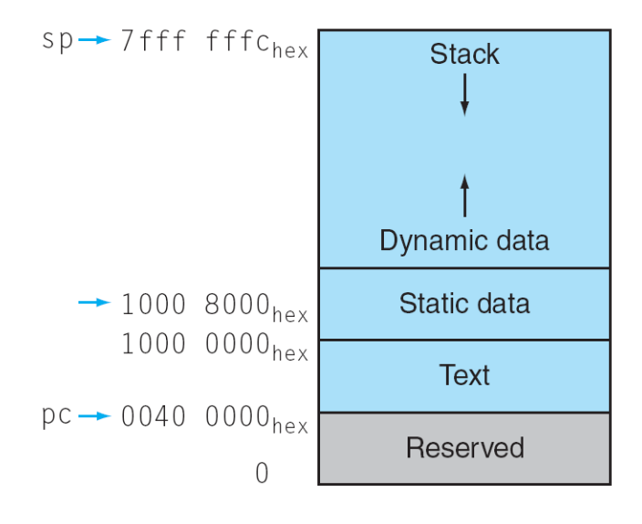
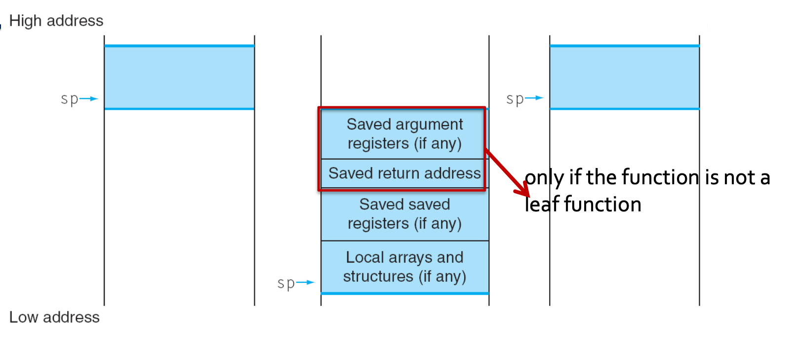
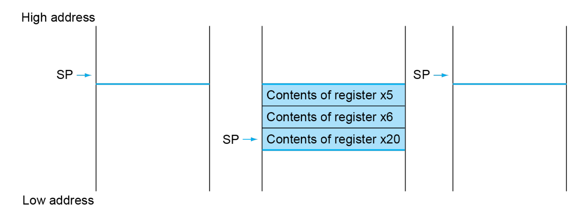

# 2 Instructions (Part II)

## 2.11 Conditional Operations

condition에 따라 다른 instruction을 실행하도록 code를 구현할 수 있다.

- true(**taken**): **branch**는 labeled instruction으로 jump한다.

- false(**not-taken**): sequential하게 continue한다.

가장 기본적인 branch instruction은 `beq`(branch if equal), `bne`(branch if not equal)이다.

### <span style='background-color: #393E46; color: #F7F7F7'>&nbsp;&nbsp;&nbsp;📝 예제 4: if문&nbsp;&nbsp;&nbsp;</span>

C code if문을 RISC-V instruction으로 compile하라.

```c
if (i==j) f = g + h;
else f = g - h;
```

### <span style='background-color: #C2B2B2; color: #F7F7F7'>&nbsp;&nbsp;&nbsp;🔍 풀이&nbsp;&nbsp;&nbsp;</span>

위 C code를 RISC-V instruction으로 compile하면 다음과 같다.

- i==j를 `beq`로 처리하지 않고 `bne`(not equal, i $\neq$ j)로 check하고 있는 점에 유의하자. 

```assembly
      bne x22, x23, Else     // x22, x23이 같지 않다면 Else(label)로 jump
      add x19, x20, x21
      beq x0, x0, Exit       // unconditional
Else: sub x19, x20, x21
Exit: ...
```

### <span style='background-color: #393E46; color: #F7F7F7'>&nbsp;&nbsp;&nbsp;📝 예제 5: while문&nbsp;&nbsp;&nbsp;</span>

C code while문을 RISC-V instruction으로 compile하라.

```c
// i(offset)는 x22
// k는 x24
// (long type) save[] base address는 x25 register에 저장되어 있다.
while (save[i] == k) i += 1;
```

여기서 offset이 immediate가 아니라는 점에 주목하자. 

- `ld x5 {}(x25)`에서 <U>offset({} 부분)은 반드시 constant(immediate)여야 하므로</U>, 먼저 offset을 구하는 과정이 필요하다.

### <span style='background-color: #C2B2B2; color: #F7F7F7'>&nbsp;&nbsp;&nbsp;🔍 풀이&nbsp;&nbsp;&nbsp;</span>

RISC-V code로 compile하면 다음과 같다.

```assembly
Loop:  slli x10, x22, 3     // shift left을 3 bit하여, offset에 8을 곱해준다.
       add  x10, x10, x25   // base address에 offset을 더해서 save[i] address를 얻는다.
       ld   x9, 0(x10)      // load save[i] value
       bne  x9, x24, Exit   // save[i] != k이면 Exit으로 jump
       addi x22, x22, 1     //         == k이면 while loop을 지속(i+=1)
       beq  x0, x0, Loop    // unconditional(다시 동일한 loop를 수행하도록.) 
                            // (x0를 보통 read only로 많이 써서 conventional하게 x0를 넣는데, 사실 꼭 x0일 필요는 없다.)
Exit: ...
```

---

### 2.11.1 more conditional operations

- `blt`: less than. 

  - `blt rs1, rs2, L1`: rs1 $<$ rs2라면 L1으로 jump한다.

- `bge`: greater than or equal.

  - `bge rs1, rs2, L1`: rs1 $\ge$ rs2라면 L1으로 jump한다.

> 순서대로 읽으면 된다. branch if rs1 less than rs2, jump to L1

> MIPS는 대소를 비교하는 branch instruction을 추가로 제공한다. datapath를 조금 더 단순하게 만들 수 있지만 더 많은 instruction을 표현해야 하므로 bit를 추가로 필요로 한다.

- unsigned를 다루는 instruction인 `bltu`, `bgeu`도 있는데, 이를 사용하면 signed도 unsigned처럼 다루게 된다. 

> 이러한 특성 때문에 주로 array index가 array bound를 넘어가는지 check할 때 사용한다.

### <span style='background-color: #393E46; color: #F7F7F7'>&nbsp;&nbsp;&nbsp;📝 예제 6: if문: a > b condition&nbsp;&nbsp;&nbsp;</span>

C code if문을 RISC-V instruction으로 compile하라.

```c
// a in x22, b in x23
if(a > b) a += 1
```

### <span style='background-color: #C2B2B2; color: #F7F7F7'>&nbsp;&nbsp;&nbsp;🔍 풀이&nbsp;&nbsp;&nbsp;</span>

RISC-V code로 compile하면 다음과 같다.

```assembly
bge  x23, x22, Exit    // b >= a이면 Exit으로 jump
addi x22, x22, 1       //       아니면 a += 1
```

---

### 2.11.2 Basic Block

**basic block**(기본 블록)이란 다음과 같은 특성을 갖는 block을 의미한다.

- 맨 처음 entry를 제외하고는, branch의 target(목적지)이 되지 않는다.

- block 내부에 branch를 갖지 않는다.

compiler는 basic block을 단위로 optimization을 수행한다. basic block에서는 코드 내부가 바뀌어도 결과만 같으면 상관이 없기 때문이다.

---

## 2.12 Procedure Calling

C program은 main에서 시작해서 다른 function 'foo'을 부를 것이다. 'foo'는 내부에서 또 'bar' 함수를 호출한다고 하자.

> 참고로 main은 program의 시작 지점이자, OS가 호출하는 function이다.

```
main
└───foo
    └───bar
```

- foo는 callee이면서 caller이다.

- bar는 callee이며, leaf에 해당된다.

C code를 작성할 때, function declaration만 먼저 오고, 뒤에 function definition이 뒤따르는 방식으로 작성해도 된다.

```c
int foo(int);    // function declaration(prototype)

int main() {
    ...
    c = foo(a);
    ...
}

int foo(int a){  // function definition
    ...
    bar(int a);
    ...
}

```

procedure calling 과정은 다음과 같이 이루어진다.

1. function parameter를 `x10`~`x17` register에 저장한다.

2. control을 proceduce로 옮긴다.

3. procedure를 위한 storage를 확보한다.

4. procedure의 operation들을 수행한다.

5. caller가 사용할 수 있도록 return value를 register에 저장한다.

6. control을 caller로 다시 옮긴다.(`x1` register에 있는 return address를 이용)

---

### 2.12.1 procedure call instructions

- `jal`: unconditional jump를 수행하면서, 동시에 return address를 register에 저장한다.

  - 일반적으로 return address를 저장하는 `x1`register에 저장된다.

- `jalr`: register에 명시된 address로 unconditional jump를 수행한다.(jump-and-link register)

따라서 다음과 같이 `x1` register에 저장된 address로 jump(branch)한 뒤, 이때 저장한 return address로 다시 돌아오도록 `jal`, `jalr`을 활용할 수 있다.

```assembly
jal x1, foo    // foo로 jump하면서, 
               // return address를 x1에 저장한다.
...
jalr x0, 0(x1) // x1에 저장된 return address로 jump한다.(복귀)
               // x0 자체는 크게 의미가 없다. 자리 채우기용
```

---

## 2.13 Memory Layout



- static data: global variables

- text: program code

- **stack**: automatic storage(function에 의해 자동으로 늘어나고 줄어드는 memory)

- dynamic data: **heap**(C의 `malloc()`이나 JAVA의 `new`을 통해 할당되는 memory)

> stack이 grow down 성격을 갖는다는 점에 유의하자. **stack pointer(sp)는 stack이 커지면서 점점 아래로 내려가게(줄어들게) 된다.**

global variables로 선언하지 않는다면, variable들은 stack에 쌓이게 된다. 예를 들어 만약 다음과 같은 C code가 있다면, variable 'a'는 main에서만 유효한 local variable이 된다.

```c
int main() {
    int a = 3;
}

int foo(int a){
    ...
    int c;    // 오직 foo가 있을 때만 유효한 variable
    ...
}
```

---

### 2.13.1 Stack



- 어떤 function이 끝나면, stack pointer(sp)는 다시 기존 위치(return address)로 돌아와야 한다.

### <span style='background-color: #393E46; color: #F7F7F7'>&nbsp;&nbsp;&nbsp;📝 예제 7: leaf procedure&nbsp;&nbsp;&nbsp;</span>

아래 leaf procedure(다른 procedure를 호출하지 않는 말단)을 RISC-V instruction으로 compile하라.

```c
long long int leaf_example (long long int g, long long int h, 
                       long long int i, long long int j) {
    long long int f;    // local variable이 stack에 위치하게 된다.
    f = (g + h) - (i + j);
    return f;
}
```

- argument g, h, i, j는 x10,...x13에 저장되어 있다.

- x20을 사용해서 f 값을 저장할 것이다.

- 중간 연산 값을 저장할 temporaries로 x5, x6을 사용한다.

### <span style='background-color: #C2B2B2; color: #F7F7F7'>&nbsp;&nbsp;&nbsp;🔍 풀이&nbsp;&nbsp;&nbsp;</span>

먼저 x5, x6, x20 register를 사용하기 위해, 원래 있던 값을 stack에 저장해야 한다.

> 마찬가지로 caller에 의해 이미 g, h, i, j가 저장되어 있다는 점에 유의.(x10, x11, x12, x13)

```assembly
leaf_example:
    addi  sp, sp, -24   // 24만큼 stack 공간을 만들며 sp를 위치시킨다.(make room on stack for 3 regs)
    sd    x5, 16(sp)    // stack에 x5 contents 저장
    sd    x6, 8(sp)     //        x6 contents 저장
    sd    x20, 0(sp)    //        x20 contents 저장
    add   x5, x10, x11    // x5 = g + h
    add   x6, x12, x1     // x6 = i + j
    sub   x20, x5, x6     // x20(f) = x5 - x6
    addi  x10, x20, 0   // copy f to return register
    ld    x20, 0(sp)       // restore x20(기존 caller가 원래 x20에 저장한 값을 이용할 수 있도록)
    ld    x6, 8(sp)        // restore x6
    ld    x5, 16(xp)       // restore x5
    addi  sp, sp, 24    // sp도 기존 위치로 돌려놓는다.
    jalr  x0, 0(x1)     // return to caller
```



---

## 2.14 Register Usage

callee, caller 관점에서 general-purpose register를 다시 살펴보자.

- x5-x7, x28-x31: temporary registers

   - callee가 보존할 필요가 없다.

- x8-x9, x18-x27: saved register

   - callee가 이를 사용하려면 기존에 저장된 값을 backup(save and restore)해야 한다.

- x10-x17: parameter와 function의 return values를 저장하는 register

- x1: return address register(i.e. link register)

    > 만약 procedure가 내부에서 또 다른 procedure call이 생긴다면, 현재 저장한 return address를 stack에 저장해서 보존해 둔 뒤, 돌아올 때 stack에 있는 값을 다시 restore해오면 된다.

```c
int main() {
    int a = 3;
    c = foo(a);    // 'foo'가 호출된 후 끝나면
    ...            // <= 바로 아래 instruction로 돌아오도록 return address을 저장해야 한다. 
}
```

---

## 2.15 non-leaf procedure

그렇다면 non-leaf procedure에서는 어떻게 다를까? 

### <span style='background-color: #393E46; color: #F7F7F7'>&nbsp;&nbsp;&nbsp;📝 예제 8: non-leaf procedure: factorial&nbsp;&nbsp;&nbsp;</span>

다음은 recursive 방식으로 팩토리얼을 구현한 예제다. `fact()`는 내부에서 자기 자신을 호출한다.

```c
long long int fact (long long int n)
{
    if (n < 1) return 1;
    else return n * fact(n - 1);
}
```

- argument n: `x10`에 저장.

- return value: `x10`에 저장.

여기서 중요한 점은 `fact(n - 1)`이 먼저 evaluation이 된 뒤, 그 다음 `n * fact(n - 1)`이 계산된다는 점이다. 

### <span style='background-color: #C2B2B2; color: #F7F7F7'>&nbsp;&nbsp;&nbsp;🔍 풀이&nbsp;&nbsp;&nbsp;</span>

```assembly
fact:
    addi  sp, sp, -16        // stack(room) 생성
    sd    x1, 8(sp)          // 해당 fact(n - 1)의 return address를 stack에 저장
    sd    x10, 0(sp)         // 해당 fact(n - 1)의 n을 stack에 저장
    addi  x5, x10, -1    // x5 = n - 1 
    bge   x5, x0, L1     // if n >= 1, go to L1(else문)
    addi  x10, x0, 1     // 만족하지 않으면 return 1이어야 한다.(if문) 따라서 x10에 1을 초기화
    addi  sp, sp, 16     // satck에 저장된 값을 pop
    jalr  x0, 0(x1)      // return to caller
L1: 
    addi  x10, x10, -1   // n = n - 1 (fact(n - 1)을 위해)
    jal   x1, fact       // """fact(n - 1)을 call""" 따라서 다시 위로 돌아간다. 
                         // **n과 n-1의 호출 시 제일 다른 점은, sp가 더 내려가 있다는 사실이다.**
    addi  x6, x10, 0     // fact(n - 1)의 result를 x6로 복사.(fact 함수의 return address에 해당)
    ld    x10, 0(sp)     // 본래 caller의 n을 restore한다. 
    ld    x1, 8(sp)      // 본래 caller의 return address를 restore한다.
    addi  sp, sp, 16     // pop stack
    mul   x10, x10, x6   // return n * fact(n-1)
    jalr  x0, 0(x1)      // return address로 return
                         // (stack에 쌓여있는 return address로 돌아가는데, 따라서 stack에 return address가 없을 때까지 위 addi  x6, x10, 0 지점으로 계속 돌아가게 된다.)
```

---

## 2.16 string copy

때로는 memory에서 byte 단위로 읽거나 저장해야 할 때가 있다. 이때를 위해 RISC-V는 `lbu`, `sb`와 같은 byte 단위 instruction을 따로 제공한다.

- `lbu`: memory에서 1byte을 읽어서, register의 오른쪽 8bit에 저장한다.(load byte unsigned)

- `sb`: register의 오른쪽 8it를 memory로 보낸다.(store byte)

주로 가변 길이의 data인 string을 다룰 때 사용하게 된다.

> C에서는 string의 끝에 null(ASCII에서 0)을 두는 방식으로 string의 끝을 구분한다. 예를 들어 "Cal"이라는 string은 67, 97, 108, 0까지 4byte로 저장된다.

### <span style='background-color: #393E46; color: #F7F7F7'>&nbsp;&nbsp;&nbsp;📝 예제 9: string copy&nbsp;&nbsp;&nbsp;</span>

다음 C code(string을 복사하는 strcpy function)를 RISC-V instruction으로 compile하라.

- variable i는 `x19`에 저장

- x, y base address는 각각 `x10`, `x11`에 저장.

```c
// null character('\0')를 만날 때까지 string을 복사한다.
void strcpy(unsigned char x[], unsigned char y[])
{
    size_t i;    // long long int로 가정
    i = 0;
    while ((x[i] = y[i])!='\0') i += 1;
}
```

### <span style='background-color: #C2B2B2; color: #F7F7F7'>&nbsp;&nbsp;&nbsp;🔍 풀이&nbsp;&nbsp;&nbsp;</span>

RISC-V assembly code는 다음과 같다.

```assembly
strcpy: 
    addi sp, sp, -8   // stack 생성
    sd   x19, 0(sp)   // 기존 x19 값을 stack에 저장(push)
    add  x19, x0, x0  // i = 0(초기화)
L1:                    // while문 시작
    add  x5, x19, x11  // y[i] address를 계산
    lbu  x6, 0(x5)     // x6 = y[i]
    add  x7, x19, x10  // x[i] address를 계산
    sb   x6, 0(x7)     // x[i] = y[i]
    beq  x6, x0, L2    // if y[i] == 0 then jump to L2
    addi x19, x19, 1   // i += 1
    beq  x0, x0, L1    // jump to L1
L2: 
    ld   x19, 0(sp)    // x19 값을 sp에서 load(pop)
    addi sp, sp, 8     // stack pop
    jalr x0, 0(x1)     // return to caller
```

---