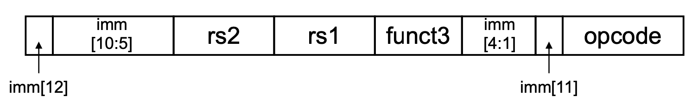
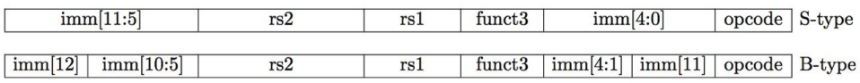
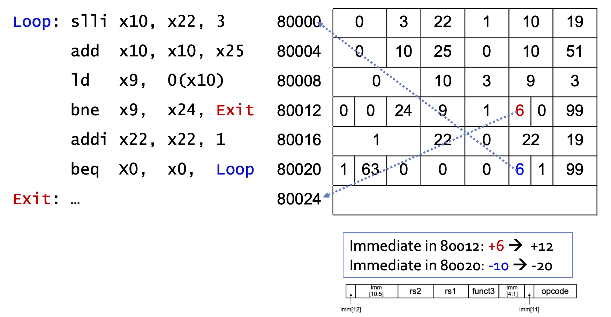

# 2 Instructions (Part III)

## 2.17 Wide immediate operands

보통 constant(immediate)는 12bits로 표현하고 대체로 충분할 때가 많다. 하지만 간혹 이보다 더 큰 immediate를 사용해야 할 때가 있다. 이럴 때를 위해 RISC-V는 `lui` instruction을 준비해 두었다.

- `lui`: register의 [31:12] bits(총 20bit)를 immediate로 채워 넣는다.(load upper immediate)

- 나머지 12bits는 `addi` instruction을 통해 채워 넣는다.

> 특별히 `lui`를 U-type instruction으로 부른다.

이처럼 큰 숫자는 몇 조각으로 나눠서 register 내에서 재조립해야 한다.

### <span style='background-color: #393E46; color: #F7F7F7'>&nbsp;&nbsp;&nbsp;📝 예제 10: x19에 32bit constant 채우기&nbsp;&nbsp;&nbsp;</span>

`x19`에 다음 32bit constant를 채워 넣어라.

```assembly
// 32bit constant
00000000 00111101 00000101 00000000

// register에 채워질 경우
00000000 00000000 00000000 00000000 00000000 00111101 00000101 00000000
//                              lui ^                    ^                        
```

### <span style='background-color: #C2B2B2; color: #F7F7F7'>&nbsp;&nbsp;&nbsp;🔍 풀이&nbsp;&nbsp;&nbsp;</span>

```assembly
// 상위 12~31bit를 채운다.
lui x19, 976    // 0000 0000 0011 1101 0000

// 하위 0~11bit를 채운다.
addi x19, x19, 1280    // 0101 0000 0000
```

---

## 2.18 branch addressing

**branch instruction**(분기 명령어)는 다음과 같은 특징을 갖는다.

- opcode(7), funct(3), 2 operand register(5, 5), target address(12)을 포함한다.

- 특성상 target address는 반드시 **2의 배수**가 된다.

- 거의 모든 경우 PC를 기준으로 $2^{10}$ words 이내로 branch하는 branch target의 특성을 이용해서, **PC-relative addressing**을 이용해서 효율적으로 처리하는 방식을 택했다. 

이때 <U>**2를 곱한 signed offset을 immediate으로 사용하며**</U>, 이를 PC에 더해 target address를 구하게 된다. possible target 범위를 포기하면서까지 굳이 instruction의 크기인 word(4byte)만큼 target address를 증가시키지 않는 이유는, 16bit(2byte, half-words) 길이의 **compressed instruction도 지원할 수 있도록** 처음부터 고려해서 설계되었기 때문이다.

> 2를 곱하는 과정은 1bit shift left 연산으로 구현한다. 어려운 연산은 아니지만 부가적인 장치를 필요로 하게 된다.

따라서 PC를 기준으로 $-2^{12}$ ~ $+2^{12} - 2$ 만큼의 address를 나타낼 수 있다. 이러한 branch instruction을 **SB-format**(B: branch)라고 지칭한다.

> unconditional branch와 구분할 것. `jal`과 같은 instruction은 20bit immediate를 사용하는 **UJ-format**에 해당된다. 

---

### 2.18.1 SB-format

> [RISC-V Immediate Encoding](https://inst.eecs.berkeley.edu//~cs61c/resources/su18_lec/Lecture7.pdf)

다음 그림은 **SB-format**을 나타낸 것이다.



> S-format이 imm[11:5], imm[4:0] 두 필드로 나뉘는 것과 다르게, SB-format은 imm[12], imm[10:5], imm[4:1], imm[11] 4개 chunk로 나뉘며, imm[0]을 사용하지 않는다.

branch instruction에서 immediate가 어떻게 encode되는지 살펴보자.

```assembly
beq  x19, x10, offset    // offset = 16byte 
```

offset 16byte에 2를 곱한(사실상 1bit shift left한) 13bit immediate는 다음과 같게 된다.

```
0000 0000 1000 0
^imm[12]       ^imm[0]
```

이때 마지막 0(imm[0])은 언제나 0이 되므로 무시하고, imm[12:1]만을 사용한다.

참고로 언뜻 SB-format을 보면 너무 복잡하게 immediate를 배치하는 것으로 보인다. 하지만 S-format과 비교하면 왜 이렇게 배치를 했는지 알 수 있다.



- **imm[10:1]은 S-type, SB-type 둘 다 동일한 위치에 배치된다.**

  - 따라서 다른 폭을 갖는 multiplexer나, 새로운 wire, control signal을 추가하지 않아도 된다.

### <span style='background-color: #393E46; color: #F7F7F7'>&nbsp;&nbsp;&nbsp;📝 예제 12: while문 branch instruction&nbsp;&nbsp;&nbsp;</span>

다음은 C code while문 및 이를 RISC-V assembly로 compile한 code이다. Loop의 address가 80000이라고 할 때, branch instruction에 해당되는 RISC-V machine code를 구하라.

```c
// i는 x22, k는 x24, 
// save[] bass address는 x25에 할당
while (save[i] == k)
    i += 1;
```

```assembly
Loop: slli x10, x22, 3     // x10 = i * 8
      add  x10, x10, x25   // x10 = save[i]의 address
      lw   x9, 0(x10)      // x9 = save[i]
      bne  x9, x24, Exit   // if (save[i] != k) go to Exit
      addi x22, x22, 1     // i += 1
      beq  x0, x0, Loop    // go to Loop
Exit:
```

### <span style='background-color: #C2B2B2; color: #F7F7F7'>&nbsp;&nbsp;&nbsp;🔍 풀이&nbsp;&nbsp;&nbsp;</span>



- `Loop`는 80000, `bne`는 80012, `beq`는 80020, `Exit`는 80024.

- `bne`에서 `Exit`까지는 12byte 차이가 나며, target address = PC + immediate * 2이므로, immediate에는 6이 들어간다.(0000 0000 0110)

| Address | imm[12] | imm[10:5] | rs2 | rs1 | funct3 | imm[4:1] | imm[11] | opcode |
| :---: | :---: | :---: | :---: | :---: | :---: | :---: | :---: | :---: |
| 80012(bne) | 0 | 000000 | 11000 | 01001 | 001 | 0110 | 0 | 1100011 |

- `beq`에서 `Loop`까지는 -20byte 차이가 나므로 immediate는 -10이 된다.(1111 1111 0110)

| Address | imm[12] | imm[10:5] | rs2 | rs1 | funct3 | imm[4:1] | imm[11] | opcode |
| :---: | :---: | :---: | :---: | :---: | :---: | :---: | :---: | :---: |
| 80020(beq) | 1 | 111111 | 00000 | 00000 | 000 | 0110 | 1 | 1100011 |

---

### 2.18.2 branching far away

12bit limitation을 넘어서 바로 target address로 jump할 수 없다면, unconditional branch를 거치는 multiple jump 방식으로 구현한다. 

```
lower address 
|    Loop   | <--
|           |   |
|           |   |
|           |   |
             ---
|   jump2   | <--
|           |   | 
|           |   |
|           |   |
|           |   |
|     |Loop | --
|           |
|           | 
higher address
```

### <span style='background-color: #393E46; color: #F7F7F7'>&nbsp;&nbsp;&nbsp;📝 예제 11: 아주 먼 거리 분기하기&nbsp;&nbsp;&nbsp;</span>

register x10이 0이면 branch하는 다음 instruction을, L1이 아주 멀더라도 branch가 가능하도록 2개의 instruction으로 구현하라.

```assembly
beq x10, x0, L1
```

### <span style='background-color: #C2B2B2; color: #F7F7F7'>&nbsp;&nbsp;&nbsp;🔍 풀이&nbsp;&nbsp;&nbsp;</span>

```
  bne x10, x0, L2    // x10 != 0 이면 L2로 branch
  jal x0, L1         // L1으로 unconditional branch
L2:
```

---

## 2.19 Data Race 

**data race**란 다른 두 threads가 동일한 memory에 access하면서, 동시에 적어도 하나는 write access를 하는 상황을 의미한다.

예를 들어 P1, P2 두 processor가 memory의 어느 영역을 sharing하고 있었다. 이때 동일한 영역에 다음과 같은 access 작업이 발생했다고 가정하자.

- P1: writes

- P2: reads

P1, P2 중 어느 event를 먼저 처리하는가에 따라서 result가 달라지게 된다.

코드 예시를 보자. 만약 thread1()이 5번 실행되고, thread2()가 3번 실행되면 cnt 값은 어떻게 될까?

```c
int cnt = 0;

thread1()           thread2()
{                   {
    cnt++;          cnt++;
}                   }
```

보통 cnt는 8이 될 것이라고 예상할 것이지만, load, write 순서에 따라 충분히 8보다 더 작은 값(unwanted result)읃 얻을 수도 있다.

---

### 2.19.1 synchronization

(1) parallel program 혹은 (2) 단일 processor에서 협력 관계를 갖는 thread들에서는 data race 상황이 발생할 수 있었다. 이때 hazard가 발생하는 것을 방지하려면, access를 막는 lock과 unlock **synchronization**이 필요하다. 실제로 이를 위한 instruction이 존재한다. 

- load: `lr.d`(load-reserved, load-link)

- store: `sc.d`(store-conditional)

   - `sc.d` 실행 전 lock을 한 값이 바뀌지 않는다면 succeed.

   - register를 3개 사용하는데, 하나는 succeed/fail 여부를 나타내기 위해 사용한다.

   > 가령 `sc.d rd,(rs1),rs2`라면 `rd`에 0(succeed) or non-zero(fail)을 return한다.

> word 단위인 `lr.w`, `sc.w` 같은 instruction도 있다.

```assembly
// load from access in rs1 to rd
lr.d rd,(rs1)

// store from rs2 to access in rs1
sc.d rd,(rs1),rs2
```

- **atomic swap**

> [atomic operation](https://casionwoo.tistory.com/29)

> atomic: unbreakable. 즉, 나눠서 수행할 수 없다.

아래 assembly는, instruction이 실패하면 again으로 다시 branch해서 instruction을 다시 수행하도록 작성한 code이다.

> 어떤 processor가 끼어들어서 memory 값을 바꿨다면 x11에 1이 들어갈 것이며, 결국 again부터 다시 연산을 실행하게 된다.

```assembly
again: lr.d x10,(x20)        // x20이 가리키는 memory data에 lock을 획득
       sc.d x11,(x20),x23    // x11 = status
       bne  x11,x0,again     // branch if store failed
       addi x23,x10,0        // x23 = loaded value
```

참고로 lock을 해제하려면, 해당 address에 0을 writing하면 된다.

```assembly
sw   x0, 0(x20)
```

- **mutex lock**

> mutex: **mutual exclusion**(상호 배제)

이번에는 기존 c 코드 예제에 mutex lock을 적용한 예시를 보자. 먼저 lock을 획득(acquire)하고, 연산이 끝나면 이를 반환(release)한다. 

```c
int cnt = 0;
int mutex = 0;

thread1()                   thread2()
{                           {
    mutex_lock(&mutex);     mutex_lock(&mutex);
    cnt++;                  cnt++;
    mutex_unlock(&mutex);   mutex_unlock(&mutex);
}                           }
```

이를 RISC-V instruction으로 compile하면 다음과 같다. 

- 마찬가지로 branch가 fail하면 again으로 branch해서 다시 작업을 수행하는 **busy waiting** 방식으로 수행한다.

```assembly
Lock:
        addi x12,x0,1        // copy locked value
again:  lr.d x10,(x20)       // read lock
        bne  x10,x0,again    // check if it is 0 yet
        sc.d x11,(x20),x12   // attempt to store
        bne  x11,x0,again    // branch if fails
Unlock:
        sd   x0,0(x20)       // free lock
```

> 여기서 더 나아가 동일한 코드의 thread3()가 있다면, data race는 thread3까지 고려해야 한다.

그렇다면 만약 여러 thread에서 거의 simultaneously하게 `lr.d`을 수행한다면(**intervention**) 위 code는 어떻게 동작할까? lock을 획득한 thread를 제외하고는 모두 fail이 되어서 다시 again을 수행하게 된다.(lock을 획득할 때까지 계속 busy loop을 돌게 된다.)

---
