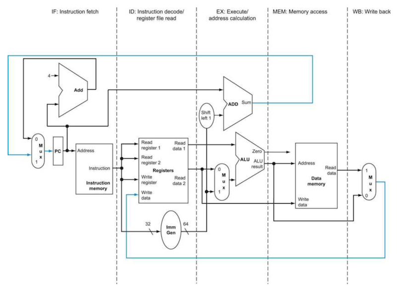
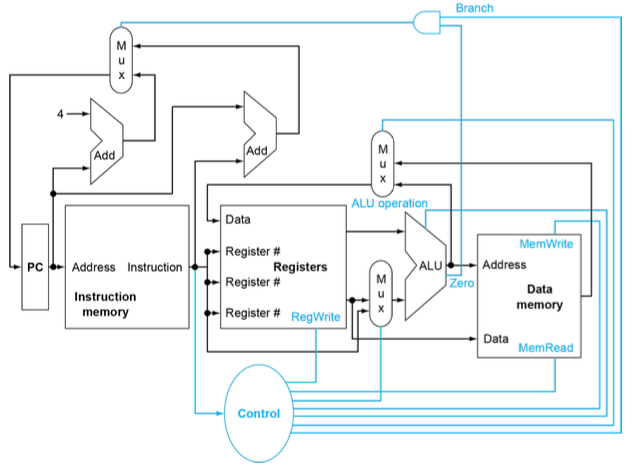
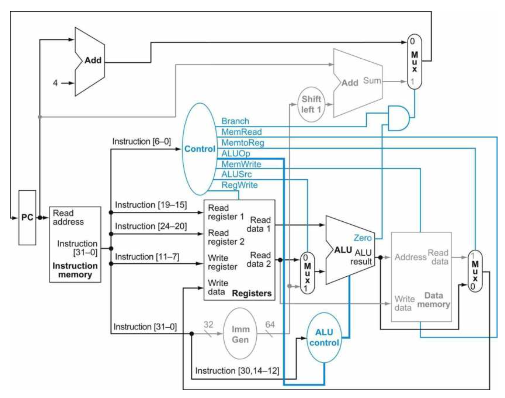

# 4 Processor

instruction은 processor 안에 **implemented**(구현)되어 있다. 프로그래머가 작성한 code들은 compile된 뒤, machine code(command)가 되어 processor의 direct input로 사용된다.

이 말은 즉, processor가 instruction의 의미를 이해하고 실행할 수 있다는 뜻이다. 가장 핵심이 되는 instruction은 다음과 같이 요약할 수 있다.

- memory instructions: `ld`, `sd`

- arithmetic/logical instructions: `add`, `sub`, `and`, `or`

- branch instruction: `beq`

> 여러 구현 전략이 cycle time과 CPI에 영향을 미친다.

---

## 4.1 instruction execution

모든 instruction의 첫 두 단계는 반드시 다음과 같이 수행된다.

> 여기서 memory로 지칭한 것은 SRAM인 **intruction cache**, **data cache**이다.
(DRAM memory chip은 processor의 바깥에 위치한다.)

> ImmGen(Immediate generation unit)

1. **PC**(Program Counter)를 **instruction memory**를 가리키도록 하고, **instruction fetch**를 수행한다.

2. 하나(예를 들면 `lw`) 또는 두 개(대부분의 instruction)의 register를 읽는다.

나머지는 instruction class에 따라 다르게 수행된다. 모든 instruction은 register를 읽은 후 ALU를 사용한다.

- memory instruction: address 계산을 위해 ALU를 사용

- arithmetic/logical instruction: 여러 산술/논리 연산을 위해 ALU를 사용

- branch instruction: condition을 비교하기 위해 사용

> 참고로 memory instruction, arithmetic/logical instruction, branch instruction은 instruction은 내부에서는 종류에 상관 없이 모두 동일한 절차로 수행된다.

ALU 사용이 끝나면, instruction마다 다른 동작을 취하게 된다.

- memory instruction: memory access(load or store)

- arithmetic/logical instruction: register에 결과를 write하기 위해 register file에 access한다.

- branch instruction: 결과에 따라 target address로 jump를 하거나, PC가 다음 instruction을 가리키도록 PC + 4를 해줄 수 있다.

따라서 다수의 근원지에서 하나를 선택해서 목적지로 보내는 소자가 필요하며 이 역할은 **multiplexer**(mux)가 수행한다. 

> 사실 multiplexer라는 이름보다도 data selector라는 이름이 더 적절하다.

---

## 4.2 Sequential elements

RISC-V implementation에 쓰이는 data path는 두 종류의 logic gate로 구성된다. 그리고 **state element**를 포함하는 logic component를 **sequential circuit**(순차 회로)라고 부른다.

- **combinational element**(조합 소자): 내부 기억 소자가 없으며, 주어진 input data에 의해 output이 결정된다.(같은 input이면 항상 같은 output이 나온다.) 

  - ALU와 같은 소자가 해당된다.

- **state element**(상태 소자): 내부 기억 소자가 있어서 **state**를 갖는다. 
  
  - instruction cache, data cache, register file, PC 등이 해당된다.

  > state element를 저장했다가 복원시키는 것으로, 컴퓨터가 꺼졌다 커져도 기존처럼 다시 시작할 수 있는 것이다.

  > 적어도 2개의 input과 1개의 output을 가지며, D Flip-flop이 대표적인 소자에 해당된다. clk edge가 state를 바꾸기 전까지 안정된 값을 갖는다.

  > **PC**(Program Counter)는 현재 instruction을 갖는 special register다.

---

## 4.3 control unit

**control unit**(제어 장치)은 function unit과 multiplexer의 control line을 제어하는 데 사용되는 소자이다.

> 그림은 단순화되어 있지만 실제로는 bit 수만큼 wire가 존재하고 이들이 concat되는 방식이다.

> 그림의 파란색 선이 control line

- data cache의 output이 곧바로 Registers(rd)에 fetch되는 경우가 있는데, 이것이 바로 **load**, **write** instruction에 해당된다.

- 그림에서 mux를 상, 중, 하 위치에서 3개를 발견할 수 있다.

  - 상단 mux: "PC+4"와 "Branch target address" 중 **어느 것을 PC에 write할지 결정**한다.(ALU의 0 output으로 제어된다. `beq` 등의 비교.)

  - 중간 mux: "ALU output"(산술/논리)과 "data cache output"(store) 중 **어느 것을 register file에 write할지 결정**한다.

  - 하단 mux: **ALU의 input으로** "register 값"과 "instruction의 offset field"(load, store) **중 어느 것을 받을지 결정**한다. 

---

## 4.4 R-format Instruction

111 + 222 = 333과 같은 연산을 수행한다고 가정하자.

> 상단 Add ALU에 Shift left 1이 있다. 이는 branch가 **compressed instruction** 형식이기 때문이다.(1bit만큼 shift left(2배 곱셈)을 해야 PC에 더해줄 수 있다.)

1. PC에서 다음 instruction address를 준비한다.

  > 왼쪽 상단의 ALU가 4를 더해서(PC + 4) 다음 instruction 값을 준비하도록 만든다.(ready to fetch)

2. instruction memory에 fetch한다.

3. instruction decoding. `add x9, x20, x21`임을 알아낸다.

> 그림에서 11-7, 24-20, 19-15, 6-0이 다른 wire로 구분되어 있는 것을 보자.

4. register를 읽고 ALU에 input을 준다.

5. ALU는 opcode에 따라서 operation을 수행한다.

6. (arithmetic instruction) ALU의 output을 register에 다시 write한다.

---
