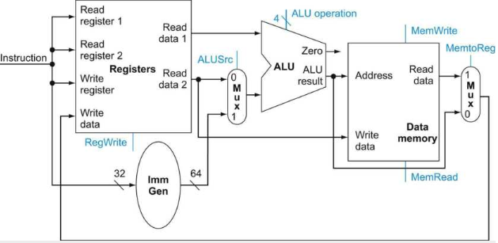
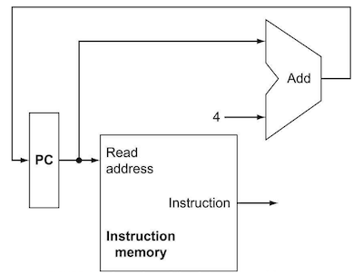
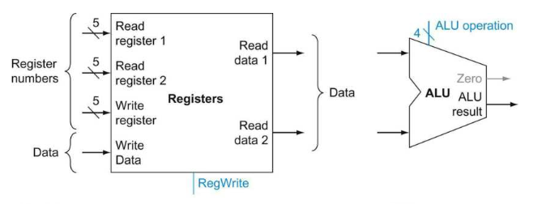
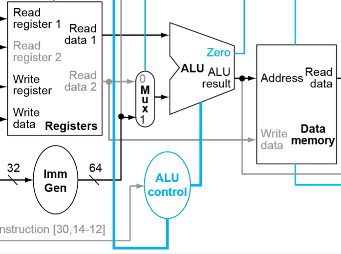
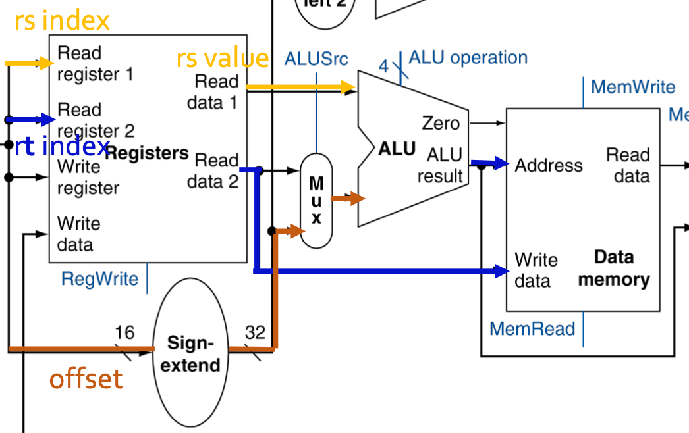
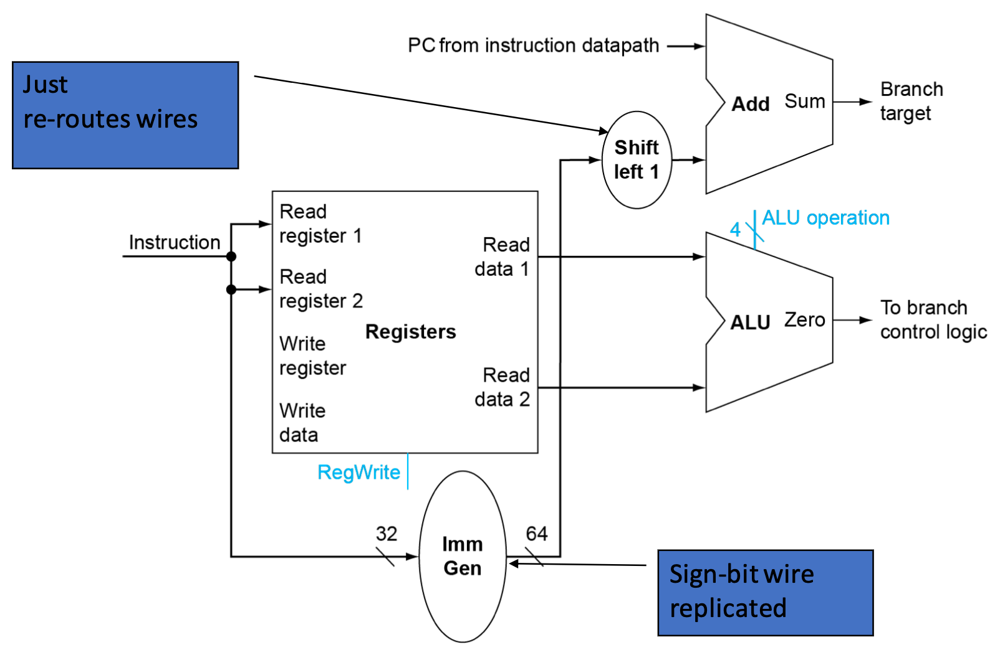

# 4 Processor (Part I)

잠시 앞서 정리한 개념을 복습하자.

- instruction은 processor 안에 **implemented**(구현)되어 있다. 

- 프로그래머가 작성한 code들은 compile된 뒤, machine code(command)가 되어 processor의 direct input로 사용된다.

이 말은 즉, processor가 instruction의 의미를 이해하고 실행할 수 있다는 뜻이다. 특히 핵심이 되는 instruction 세 가지 종류는 다음과 같다.

- memory instructions: `ld`, `sd`

- arithmetic/logical instructions: `add`, `sub`, `and`, `or`

- branch instruction: `beq`

---

## 4.1 datapath

이러한 instruction들은 **control unit**(제어 유닛)이 **function unit**(기능 유닛)과 **multiplexer**(멀티플렉서)를 조절하면서 datapath를 따라 실행되게 된다.

들어가기 앞서 예시 (R-type instructions) datapath를 한 번 살펴보자.

- **ALUSrc**: read register 2 / immediate 중 택 1

- **RegWrite**: 아무것도 하지 않음 / write register 중 택 1

- **PCSrc**: PC: PC + 4 / PC: branch target address 중 택 1

  > 만약 instruction 길이가 2bytes 단위로 저장된다면 PC + 4가 아니라 PC + 2가 되어야 한다.

- **MemRead**: 아무것도 하지 않음 / read data from memory 중 택 1

- **MemWrite**: 아무것도 하지 않음 / write data to memory 중 택 1

- **MemtoReg**: write data로 ALU output / data cache data 중 택 1

  - <U>RegWrite가 0이면 MemtoReg는 "don't care"</U>, 즉 아무런 의미가 없다.

> 모두 **state element**(상태 소자)이므로 **clock**을 input으로 가진다. 

PC를 제어하는 **PCSrc**를 제외하고는, instruction의 **opcode**에 따라서 **control signal**(제어 신호)가 달라진다.

---

### 4.1.1 ALU control

ALU는 instruction에 따라 다음과 같이 제어되어 쓰이게 된다.

- R-format instruction: 7bit func7(31:25), 3bit func3(14:12)에 따라 ALU 연산(AND, OR, add, subtract)를 결정한다.

- I-format, S-format: 오로지 address 계산을 위해 Adder로 사용한다.

  - func7, func3 field에 대해 **don't care**하다고 말한다.

control unit이 ALU를 제어하기 위한 2bit **ALUOp**(ALU operation)를 만들며, ("don't care"가 아닌 경우 func field와) ALUOp를 바탕으로 4bit **ALU control**을 만들어낸다.

| ALU control line | function |
| :---: | :---: |
| 0000 | AND |
| 0001 | OR |
| 0010 | add |
| 0110 | subtract |

### &nbsp;&nbsp;&nbsp;📝 예제 1: load instruction ALU control&nbsp;&nbsp;&nbsp;

- `sd x5, 240(x10)`

| immediate[11:5] | rs2 | rs1 | func3 | immediate[4:0] | opcode |
| :---: | :---: | :---: | :---: | :---: | :---: |
| 0000111 | 01010 | 00101 | 010 | 10000 | 0100011 |

### &nbsp;&nbsp;&nbsp;🔍 풀이&nbsp;&nbsp;&nbsp;

- `sd x5, 240(x10)`

S-format Instruction `sd`이므로 func7, func3 field에 "don't care"하다. "don't care"한 경우 아래와 같이 X로 표기한다.

| instruction opcode | ALUOp | func7 | func3 | ALU control input |
| :---: | :---: | :---: | :---: | :---: |
| sd | 00 | XXXXXXX | XXX | 0010(add) |

---

## 4.2 instruction execution

아래는 instruction이 실행되는 processor의 datapath 그림이다.

> memory = SRAM, 정확히는 **intruction cache**, **data cache**이다. (DRAM memory chip은 processor의 바깥에 위치한다.)

- ImmGen(Immediate generation unit)

  - 32bit instruction에서 12bit immediate를 추출, **sign-extend**하게 된다.

  - 예: memory instruction `ld`, `sd`, branch instruction `beq`

- **branch target address**(분기 목적지 주소)를 계산하기 위한 shift left 1: 자리이동 값이 1bit로 고정되어 있기 때문에 실제 hardware가 필요하지는 않다.

---

### 4.2.1 instruction execution: IF

모든 instruction는 공통적으로 반드시 두 단계 과정을 거치면서 시작한다.

1. **PC**(Program Counter)가 **instruction memory**를 가리키도록 하고 **instruction fetch**(IF)를 수행.

2. 하나(예를 들면 `lw`) 혹은 두 register를 읽는다.

  > **모든 instruction은 register를 읽고 ALU 연산을 거친다.**

  > 예를 들어 모든 R-type instructions는 register operand를 세 개 가진다. 두 개를 읽고 한 개에 쓴다. <U>write는 edge-triggered이기 때문에(D-flip flop), 한 clock cycle에 같은 register을 일찍 읽고 늦게 쓰는 것이 가능하다.</U>

> 참고로 PC와 연결된 ALU는 Add로 적혀 있는 모습을 볼 수 있다. 항상 PC가 다음 instruction을 가리키도록 4를 더하기만 하면 되므로 영구히 adder로 만들어 놓은 것이다.

또한 **register file**의 32개 general-purpose register은 $2^{5}$ (=32) bit로 지정되며, 64bit input 2개를 받고 64bit output 하나를 만든다.(결과가 0인지 아닌지를 나타내는 1bit 신호도 만든다.)

- register number는 5bit 길이로 지정한다.

- line들은 64bit data를 운반한다.

---

### 4.2.2 instruction execution: ID, EX

나머지는 instruction class에 따라 다른 방식으로 수행된다. 

- memory instruction: address 계산을 위해 ALU를 사용

- arithmetic/logical instruction: 여러 산술/논리 연산을 위해 ALU를 사용

- branch instruction: condition을 비교하기 위해 사용

> 참고로 memory instruction, arithmetic/logical instruction, branch instruction 각 세목에 포함된 instruction은 모두 동일한 unit을 사용해서 수행된다.

---

### 4.2.3 instruction execution: MEM, WB

ALU 사용이 끝나면, instruction마다 다른 동작을 취하게 된다.

- memory instruction: memory access(load or store)

- arithmetic/logical instruction: register에 결과를 write하기 위해 register file에 access한다.

- branch instruction: 결과에 따라 target address로 jump를 하거나, PC가 다음 instruction을 가리키도록 PC + 4를 더해준다.

따라서 다수의 근원지에서 하나를 선택해서 목적지로 보내는 소자가 필요하며 이 역할은 **multiplexer**(mux)가 수행한다. 

> 이러한 측면에서 사실 multiplexer라는 이름보다도 data selector라는 이름이 더 적절하다.

---

## 4.3 Sequential elements

RISC-V implementation의 datapath는 두 종류의 logic gate로 구성된다. 

- **combinational element**(조합 소자)

  - 내부 기억 소자가 없으며, 주어진 input data에 의해 output이 결정된다.

  - 같은 input이면 항상 같은 output이 나온다.

  - ALU 등

- **state element**(상태 소자)

  - 내부 기억 소자가 있어서 **state**를 갖는다. 
  
  - instruction cache, data cache, register file, PC 등이 해당된다. 대표적으로 **PC**(Program Counter)는 현재 instruction을 갖는 special register다.

  > 적어도 2개의 input과 1개의 output을 가지며, D Flip-flop이 대표적인 소자에 해당된다. clk edge가 state를 바꾸기 전까지 안정된 값을 갖는다.

**state element**를 포함하는 logic component를 **sequential circuit**(순차 회로)라고 부른다.

---

## 4.4 control unit

**control unit**(제어 장치)은 function unit과 multiplexer의 control line을 제어하는 데 사용되는 소자이다.

> 그림의 파란색 선이 control line

> data cache의 output이 곧바로 Registers(rd)로 fetch되는 경우가 있는데, 이것이 바로 **load**, **write** instruction에 해당된다.

mux의 역할은 다음과 같다.

- 상단 mux: "PC+4" / "Branch target address"

- 중간 mux: "ALU output"(arithmetic, logic) / "data cache output"(store)

- 하단 mux: "register output" / "instruction offset field"(load, store)

---

## 4.5 R-format Instruction

총 4단계로 구성된다.

0. 지난 IF가 끝나면서 PC + 4로 instruction address를 준비(**ready to fetch**)

   > [PC update, IF 세부 과정](https://github.com/erectbranch/Multicore_Basic/tree/master/ch06)

1. **Instruction Fetch**(IF): instruction을 가져오고, PC를 update(PC + 4)한다.

   

2. **Instruction Decoding**(ID): 예를 들어 `add x9, x20, x21`임을 알아낸다.

   

   > register file 11-7, 24-20, 19-15, 6-0이 다른 wire로 구분되어 있는 점에 주목.

3. **Execute**(EX): register를 읽고 ALU input으로 전달한다. ALU는 ALU cont

   > register를 읽는 과정을 OF(Operand Fetch) 단계로 구분해서 부르기도 한다.

4. **Write Back**(WB): ALU output을 register에 write한다.

---

## 4.6 I-format Instruction: load instructions

총 5단계로 구성된다.

0. ready to fetch

1. **Instruction Fetch**(IF): instruction을 가져오고, PC를 update(PC + 4)한다.

2. **Instruction Decoding**(ID): 예를 들어 `ld x1, offset(x2)`임을 알아낸다.

3. **Execute**(EX): ALU가 register(`x2`) 값과, sign-extended immediate를 합산하여 target address를 계산한다.

    > ALU: base address에 offset를 addition하기 위한 adder.

    - Immediate Generate: 32bit(정확히는 내부의 12bit immediate)가 64bit로 채워져서 나오게 된다.(extension)

    - Read register 2: opcode에 의해 생성된 **ALUSrc**에 의해 ignore된다.

4. **Memory access**(MEM): target address에 access한다.

5. **Write Back**(WB): memory에서 읽어온 값을 register(`x1`)에 write한다.

---

## 4.7 S-format Instruction: store instructions

0. ready to fetch

1. **Instruction Fetch**(IF): instruction을 가져오고, PC를 update(PC + 4)한다.

2. **Instruction Decoding**(ID): 예를 들어 `sd x1, offset(x2)`임을 알아낸다.

3. **Execute**(EX): ALU가 register(`x2`) 값과, sign-extended immediate를 합산하여 target address를 계산한다.

4. **Memory access**(MEM): target address에 access한다.

5. **Write Back**(WB): memory에 register(`x1`) 값을 write한다.

### &nbsp;&nbsp;&nbsp;📝 예제 2: load vs store control signal&nbsp;&nbsp;&nbsp;

load와 store는 control signal 비교를 통해 명확히 차이를 알 수 있다. `ld`와 `sd` instruction의 control signal을 작성하고 비교하라.

### &nbsp;&nbsp;&nbsp;🔍 풀이&nbsp;&nbsp;&nbsp;

| Instruction | ALUSrc | MemtoReg | RegWrite | MemRead | MemWrite | Branch | ALUOp |
| :---: | :---: | :---: | :---: | :---: | :---: | :---: | :---: |
| ld | 1 | 1 | 1 | 1 | 0 | 0 | 00 |
| sd | 1 | X | 0 | 0 | 1 | 0 | 00 |

> `sd`에서 RegWrite: 0이므로 MemtoReg: don't care가 되는 점에 주의하자.

---

### 4.7.1 store instruction: datapath(MIPS)

MIPS 버전 datapath를 보며 register 값이 어떻게 memory로 전달되는지 살펴보자.

- ALUSrc 1: offset으로 immediate 사용

- RegWrite 0

- MemtoReg: 'don't care'

주목할 부분은 `Read data 2`가 Data memory의 Write data로 이어지는 부분이다. MemWrite가 이를 제어한다.

> 참고로 no operation이지만 WB 단계를 거쳐서 instruction 수행이 끝난다.

---

## 4.8 SB-format instruction: branch instructions

- branch instruction은 시간을 줄이기 위해서 branch target address를 계산하는 별도의 ALU를 사용한다.

  > branch address를 쓰지 않는 상황(garbage)이 되더라도 MUX에 의해 제어되므로 크게 문제는 없다.

  > 덕분에 가장 빠른 instruction으로 실행될 수 있다.

총 4단계로 구성된다.

0. ready to fetch

1. **Instruction Fetch**(IF): instruction을 가져오고, PC를 update(PC + 4)한다.

2. **Instruction Decoding**(ID): 예를 들어 `beq x1, x2, offset`임을 알아낸다.

3. **Execute**(EX)

    - ALU1: 읽어들인 두 register(`x1`, `x2`) 값을 서로 빼서 값을 비교한다.

    - ALU2: immediate를 sign-extended한 값에 shift left 1한 값을 PC와 더해서 branch target address를 계산한다.

4. PC에 저장할 값을 ALU output을 통해 판단.

    - taken: PC에 branch target address를 저장.

    - not-taken: PC에 PC + 4를 저장.

---

## 4.9 summary: control signal

- R-format

  | | ALUSrc | ALUOp | MemRead | MemWrite | RegWrite | MemToReg |
  | :---: | :---: | :---: | :---: | :---: | :---: | :---: |
  | R-format | 0 | +/-/... | 0 | 0 | 1 | 0 |

  - ALUSrc 0: ALU input으로 Read register 2 사용

  - RegWrite 1: register에 값을 기록

- I-format(load instruction)

  | | ALUSrc | ALUOp | MemRead | MemWrite | RegWrite | MemToReg |
  | :---: | :---: | :---: | :---: | :---: | :---: | :---: |
  | Load | 1 | + | 1 | 0 | 1 | 1 |

  - ALUSrc 1: ALU input으로 immediate를 사용

  - ALUOp addition: base address + offset = memory address

  - RegWrite 1: data memory에서 읽은 값을 register에 기록.

- S-format(store instruction)

  | | ALUSrc | ALUOp | MemRead | MemWrite | RegWrite | MemToReg |
  | :---: | :---: | :---: | :---: | :---: | :---: | :---: |
  | Store | 1 | + | 0 | 1 | 0 | X |

  - ALUSrc 1: ALU input으로 immediate를 사용

  - ALUOp addition: base address + offset = memory address

  - MemToReg "don't care": RegWrite 0이기 때문

- BEQ instruction

  | | ALUSrc | ALUOp | MemRead | MemWrite | RegWrite | MemToReg |
  | :---: | :---: | :---: | :---: | :---: | :---: | :---: |
  | BEQ | 0 | - | 0 | 0 | 0 | X |

  - ALUSrc 0: register 1, 2 비교를 통해 taken/not-taken 판단

  - ALUOp subtraction: 두 register의 값이 같으면 0, 다르면 1

- I-format(add immediate instruction)

  | | ALUSrc | ALUOp | MemRead | MemWrite | RegWrite | MemToReg |
  | :---: | :---: | :---: | :---: | :---: | :---: | :---: |
  | addi | 1 | + | 0 | 0 | 1 | 0 |

  - ALUSrc 1: ALU input으로 immediate를 사용

  - ALUOp addition

이중에서 longest delay를 갖는 instruction은 load instruction이다. load instruction은 MEM(data memory)와 WB(register file) 과정을 추가로 거치기 때문이다.

> load instruction은 대부분의 program에서 not common한 instruction에 해당된다.

반면 branch는 ALU까지만 거치고 instruction이 사실상 마무리되는 가장 빠른 instruction에 해당된다.

> branch instruction은 common한 instruction이지만, branch target address 계산을 ALU가 각각 parallel하게 수행하기 때문에 빠르다. 

---