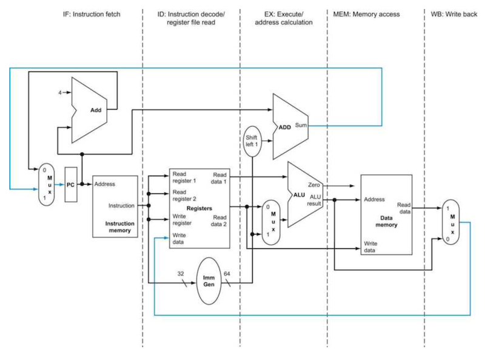
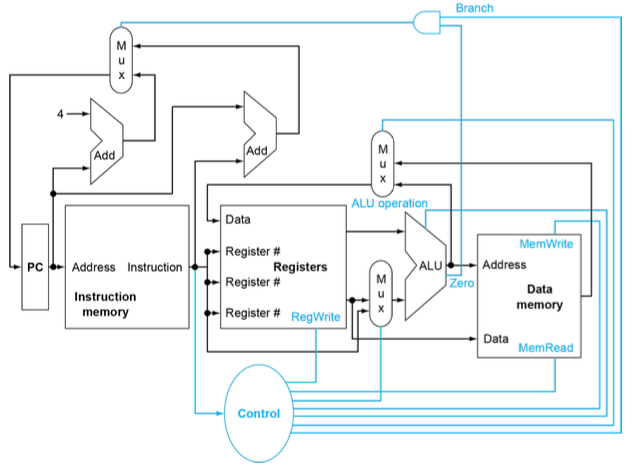
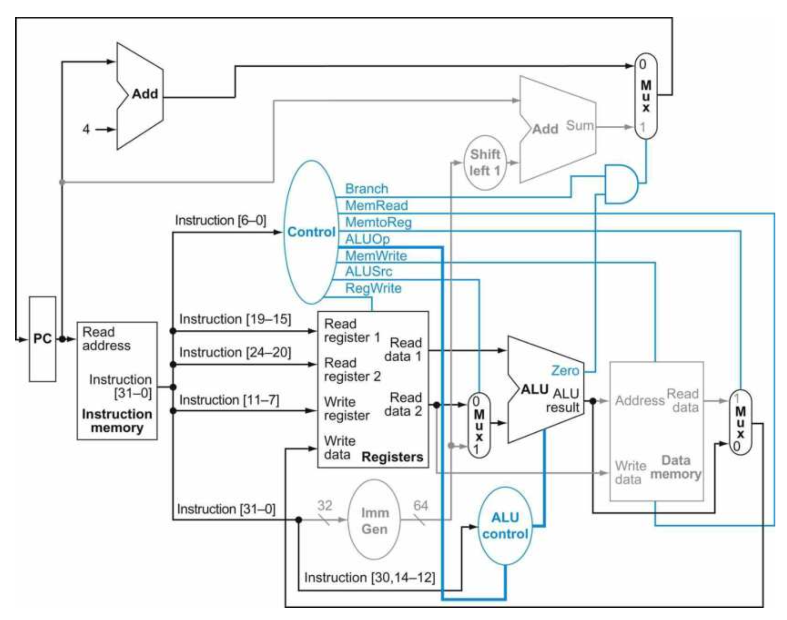
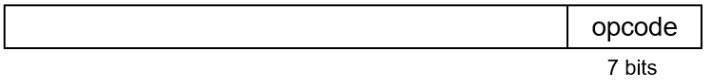
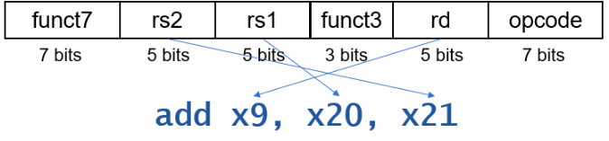
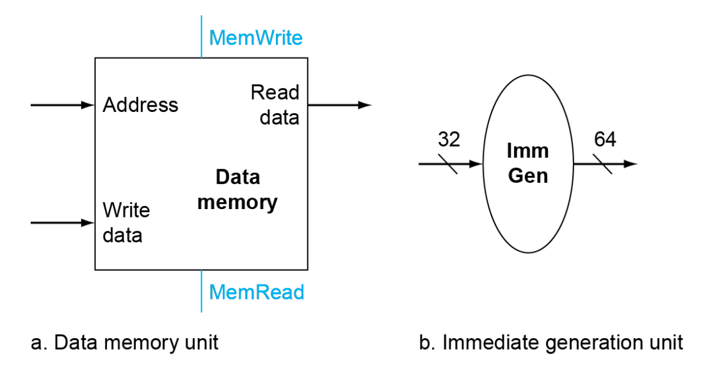
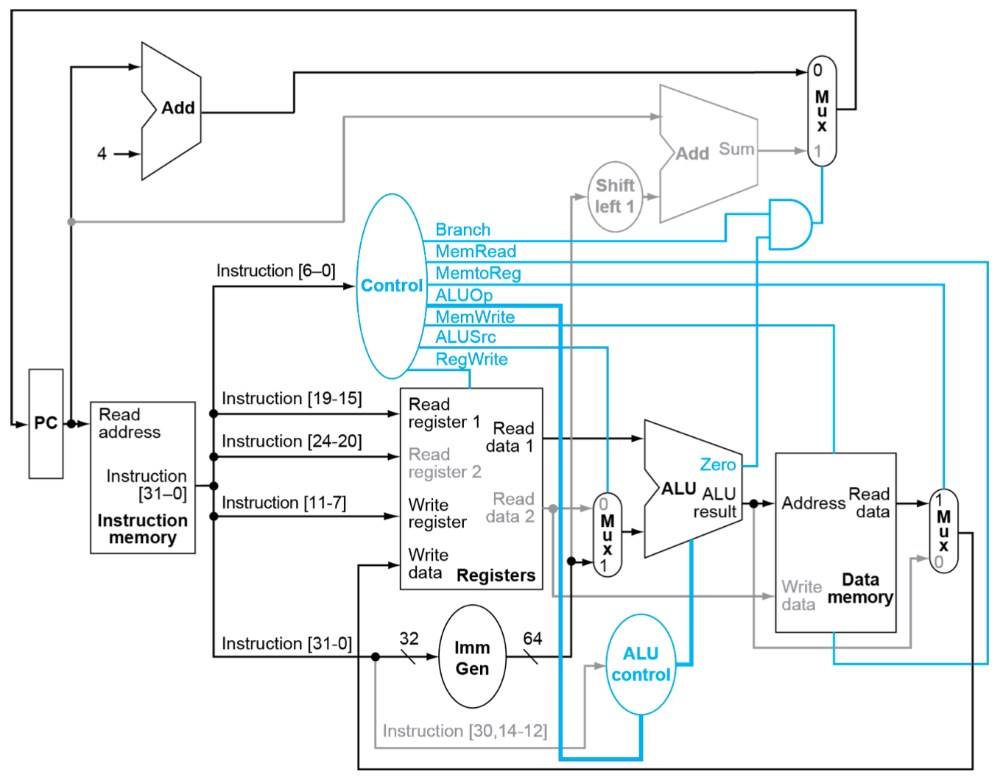

# 4 Processor (Part I)

잠시 앞서 정리한 개념을 복습하자.

- instruction은 processor 안에 **implemented**(구현)되어 있다. 

- 프로그래머가 작성한 code들은 compile된 뒤, machine code(command)가 되어 processor의 direct input로 사용된다.

이 말은 즉, processor가 instruction의 의미를 이해하고 실행할 수 있다는 뜻이다. 핵심이 되는 instruction 종류 세가지는 다음과 같다.

- memory instructions: `ld`, `sd`

- arithmetic/logical instructions: `add`, `sub`, `and`, `or`

- branch instruction: `beq`

---

## 4.1 instruction execution

아래는 instruction이 실행되는 processor의 data path 그림이다.

> memory = SRAM, 정확히는 **intruction cache**, **data cache**이다. (DRAM memory chip은 processor의 바깥에 위치한다.)

> ImmGen(Immediate generation unit)

---

### 4.1.1 instruction execution: IF

모든 instruction는 공통적으로 반드시 두 단계 과정을 거치면서 시작한다.

1. **PC**(Program Counter)가 **instruction memory**를 가리키도록 하고 **instruction fetch**를 수행.

2. 하나(예를 들면 `lw`) 혹은 두 register를 읽는다.

---

### 4.1.2 instruction execution: ID, EX

나머지는 instruction class에 따라 다른 방식으로 수행된다. 공통점이 있다면 **모든 instruction은 register를 읽고 ALU 연산을 거친다.**

- memory instruction: address 계산을 위해 ALU를 사용

- arithmetic/logical instruction: 여러 산술/논리 연산을 위해 ALU를 사용

- branch instruction: condition을 비교하기 위해 사용

> 참고로 memory instruction, arithmetic/logical instruction, branch instruction은 instruction은 내부에서는 종류에 상관 없이 모두 동일한 절차로 수행된다.

---

### 4.1.3 instruction execution: MEM, WB

ALU 사용이 끝나면, instruction마다 다른 동작을 취하게 된다.

- memory instruction: memory access(load or store)

- arithmetic/logical instruction: register에 결과를 write하기 위해 register file에 access한다.

- branch instruction: 결과에 따라 target address로 jump를 하거나, PC가 다음 instruction을 가리키도록 PC + 4를 더해준다.

따라서 다수의 근원지에서 하나를 선택해서 목적지로 보내는 소자가 필요하며 이 역할은 **multiplexer**(mux)가 수행한다. 

> 이러한 측면에서 사실 multiplexer라는 이름보다도 data selector라는 이름이 더 적절하다.

---

## 4.2 Sequential elements

RISC-V implementation의 data path는 두 종류의 logic gate로 구성된다. 

- **combinational element**(조합 소자)

  - 내부 기억 소자가 없으며, 주어진 input data에 의해 output이 결정된다.

  - 같은 input이면 항상 같은 output이 나온다.

  - ALU 등

- **state element**(상태 소자)

  - 내부 기억 소자가 있어서 **state**를 갖는다. 
  
  - instruction cache, data cache, register file, PC 등이 해당된다. 대표적으로 **PC**(Program Counter)는 현재 instruction을 갖는 special register다.

  > 적어도 2개의 input과 1개의 output을 가지며, D Flip-flop이 대표적인 소자에 해당된다. clk edge가 state를 바꾸기 전까지 안정된 값을 갖는다.

**state element**를 포함하는 logic component를 **sequential circuit**(순차 회로)라고 부른다.

---

## 4.3 control unit

**control unit**(제어 장치)은 function unit과 multiplexer의 control line을 제어하는 데 사용되는 소자이다.

> 그림의 파란색 선이 control line

> data cache의 output이 곧바로 Registers(rd)로 fetch되는 경우가 있는데, 이것이 바로 **load**, **write** instruction에 해당된다.

- mux의 역할

  - 상단 mux: "PC+4"와 "Branch target address" 중 **어느 것을 PC에 write할지 결정**한다.(ALU의 0 output으로 제어된다. `beq` 등의 비교.)

  - 중간 mux: "ALU output"(산술/논리)과 "data cache output"(store) 중 **어느 것을 register file에 write할지 결정**한다.

  - 하단 mux: **ALU의 input으로** "register 값"과 "instruction의 offset field"(load, store) **중 어느 것을 받을지 결정**한다. 

---

## 4.4 R-format Instruction

111 + 222 = 333과 같은 덧셈 연산을 수행한다고 가정하자.

> 상단 Add ALU에 Shift left 1이 있다. branch instruction: **compressed instruction** 형식이기 때문.

1. PC + 4: instruction address를 준비한다.(**ready to fetch**)

2. **Instruction Fetch**

   

3. **Instruction Decoding**: `add x9, x20, x21`임을 알아낸다.

   

   > register file의 11-7, 24-20, 19-15, 6-0이 다른 wire로 구분되어 있는 점에 주목.

4. **Execute**: register를 읽고 ALU에 input을 준다.

  > **RegWrite** 신호를 주면 register에 write data가 가능하다.(processor의 state를 바꿀 수 있다.)

  - ALU는 opcode에 따라서 operation을 수행한다.

5. (arithmetic instruction) **Write Back**: ALU의 output을 register에 다시 write한다.

---

## 4.5 load instructions

- Immediate Generate: 32bit(정확히는 내부의 12bit immediate)가 64bit로 채워져서 나오게 된다.(extension)

- (register file) read register 2: immediate를 사용하므로 ignore된다. (예: `ld`)

  - **ALUSrc**이 조절한다. (0): read register 2 사용, (1): immediate 사용

  > 이외 branch instruction의 경우가 immediate를 사용하는 대표적인 예시

- ALU: base address에 offset를 addition하기 위한 adder.

---