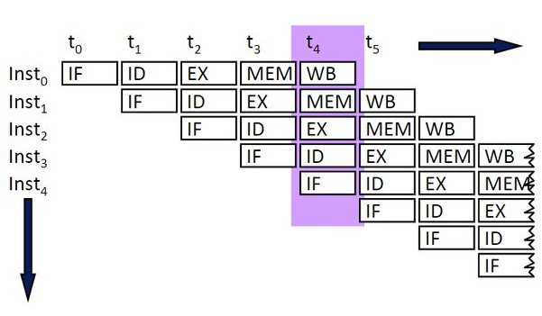
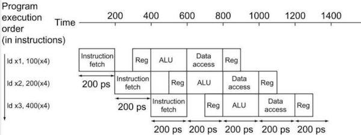
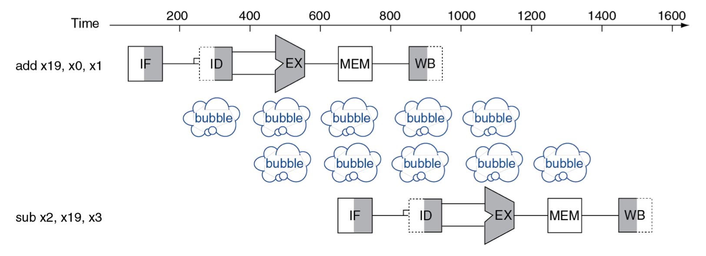
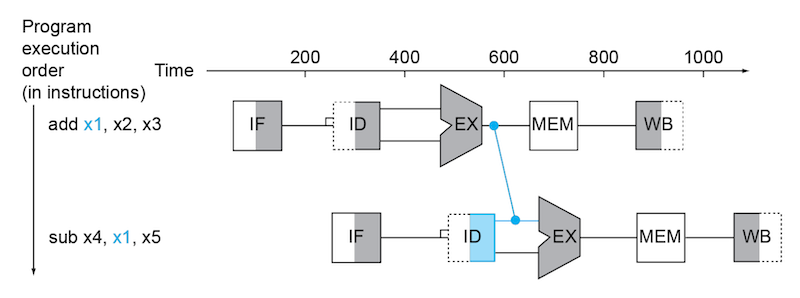
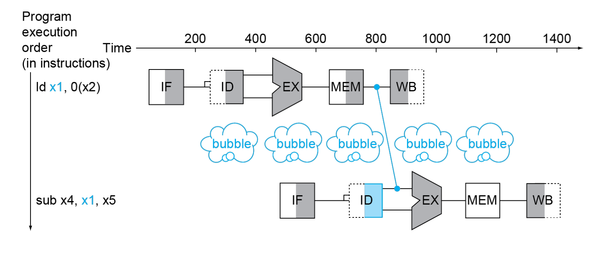
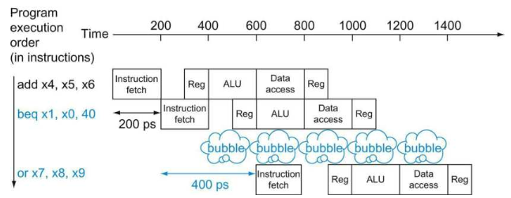
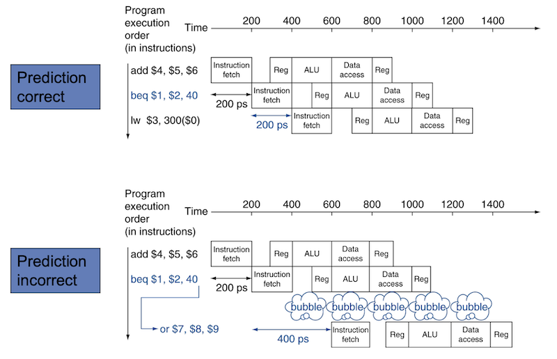
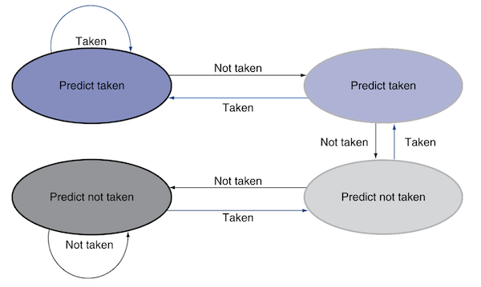

# 4 Processor (Part II)

instruction이 수행되는 five stages을 복습하면 다음과 같다.

- IF: Instruction Fetch

- ID: Instruction Decode & register read

- EX: Execute(ALU)

- MEM: Memory Access

- WB: Write Back

아래는 5 stage를 시간별로 표기한 도표이다. total time을 비교하면 다음과 같다.(single-cycle 기준)

| instr | IF | register read | ALU op | memory access | Register write | total time |
|:-----:|:--:|:-------------:|:------:|:-------------:|:--------------:|:---:|
| ld | 200ps | 100ps | 200ps | 200ps | 100ps | **800ps** |
| sd | 200ps | 100ps | 200ps | 200ps |  | **700ps** |
| R-format (add, sub, ...) | 200ps | 100ps | 200ps |  | 100ps | **600ps** |
| branch (beq) | 200ps | 100ps | 200ps |  |  | **500ps** |

하지만 실제로는 한 instruction이 끝나는 모든 시간을 기다린 뒤, 다음 instruction을 수행할 필요는 없다. 여러 instruction을 동시에 수행하는 **pipelining**을 적용하면 된다.

> 실제 pipelined processor는 보통 12~20개 이상의 stage 수를 가진다.

---

## 4.10 single-cycle vs pipelined performance

---

### 4.10.1 single-cycle performance

우선 pipeline을 적용하지 않은 단일 사이클 구현을 보자.(**nonpipelined**)

- **모든 instruction 수행되는 시간 = 한 clock cycle**

  - 따라서 한 clock cycle = 가장 오랜 시간이 걸리는 instruction의 수행 시간(예: 800ps)가 되어야 한다.

만약 4번째 instruction이 시작하기 전까지 걸린 total time이라면 단순히 800 \* 3 = 2400ps가 된다.

요약하자면 단순히 CPI만을 봤을 때는 CPI = 1이지만, single-cycle path에서는 clock cycle이 가장 긴 instruction(거의 확실하게 store instruction)에 의해 결정되므로 비효율적이다.

---

### 4.10.2 pipelined performance

**pipelining**(파이프라이닝)이란 여러 instruction을 동시에 중첩되어 수행하는 구현 기술이다. 

single-cycle(단일 사이클)에서 pipeline 방식의 clock cycle의 길이는 pipeline stage 하나를 수행하는 시간에 따라 결정된다.

- **pipeline stage 하나가 수행되는 시간 = 한 clock cycle**

  - 따라서 한 clock cycle = 가장 오랜 시간이 걸리는 stage의 수행 시간(예: 200ps)에 의해 결정된다.

만약 worst-case가 별도로 존재하지 않고 모든 stage가 완벽히 균형이 맞춰져 있다고 가정하면, pipelined processor에서의 instruction 수행 시간은 다음과 같이 계산된다.

$$ T_{p} = {{T_{n}} \over {n}} $$

- $T_{p}$: pipelined processor에서의 한 instruction 수행 시간

- $T_{n}$: non-pipelined processor에서의 한 instruction 수행 시간

- $n$: pipeline stage의 개수

즉, 이상적인 가정 하에서는 pipeline stage가 많으면 많을수록, instruction 수행 시간이 더 짧아지게 된다. 예를 들어 5개의 pipeline stage가 있다면, pipelined processor에서의 한 instruction은 800ps / 5 = 160ps만에 수행될 수 있다.

### <span style='background-color: #393E46; color: #F7F7F7'>&nbsp;&nbsp;&nbsp;📝 예제 1: single-cycle vs pipelined &nbsp;&nbsp;&nbsp;</span>

아래 그림과 같은 instruction 3개가 있다. 현재 3개가 있는 instruction에서 1,000,000개를 늘려서, instruction 1,000,003개가 있다고 가정했을 때 single-cycle와 pipelined 구현의 total time을 비교하라.


> 기본적으로 ID의 Reg, WB의 Reg가 cycle 절반 시간으로 수행된다고 가정한다. 서로 다른 instrucion의 WB와 ID가 동일한 하나의 cycle에 처리될 수 있는 것이다.

pipelining 중에는 ALU가 어떤 input을 처리하고 있던 도중에 다음 input이 들어오면 안 되므로,  clock에 의해 guard하고 있다가 끝나면 다음 input을 받는다.(sequential하게 수행된다)

### <span style='background-color: #C2B2B2; color: #F7F7F7'>&nbsp;&nbsp;&nbsp;🔍 풀이&nbsp;&nbsp;&nbsp;</span>

우선 instruction 3개만 있을 때의 total time은 다음과 같다.

- single-cycle: 2400ps

- pipelined: 1400ps

> 잘 보면 pipeline stage 수가 5개이지만, 이상적인 case와 달리 5배의 speedup를 얻지 못한 것을 알 수 있다.

그 다음 instruction 1,000,003개가 있을 때의 total time은 다음과 같다.

- single-cycle: 1,000,000 \* 800ps + 2400ps = 800,002,400ps

- pipelined: 1,000,000 \* 200ps + 1400ps = 200,001,400ps

speedup을 계산하면 800,002,400/200,001,400으로 약 4.00을 얻을 수 있다. 

---

## 4.11 RISC-V instruction sets for pipelining

RISC-V는 처음부터 pipelining을 고려하며 설계되었다.

1. RISC-V instruction은 모두 **32bit** 길이를 갖는다.

    따라서 IF, ID 과정을 훨씬 간단하게 수행할 수 있다.

    > x86 같은 경우 instruction 길이가 1~17byte까지 다양하게 변하기 때문에, IF, ID 과정에서 pipelining을 구현하기 매우 힘들다. 한 차례 instruction을 더 단순한 연산으로 변환하여 pipelining을 적용한다.

2. RISC-V instruction format은 몇 가지 종류밖에 없으며, 모든 instruction field에서 destination register와 첫 번째 source register가 동일한 위치로 통일되어 있다.

    따라서 ID, read register 과정을 훨씬 간단하게 수행할 수 있다.

3. RISC-V instruction에서 memory access는 오직 load, store instruction에서만 수행된다.

     따라서 EX 단계에서 target address를 계산하고 MEM 단계에서 memory access를 수행하게 된다.

    > x86은 operand로 register를 강요하지 않는다. 따라서 ALU가 연산을 할 때부터 memory access를 수행해야 하며, 이는 pipelining을 매우 어렵게 만든다.

4. memory access가 오직 한 cycle만을 차지한다.

    > x86은 memory access가 여러 cycle을 차지한다.

---

## 4.12 pipeline bubble

pipeline에서 모종의 이유로 stage 수행이 지연되는 경우를 **pipeline stall** 혹은 **pipeline bubble**이라고 지칭한다. 아래는 pipeline 초기 단계의 snapshot이다.



- Instruction 0이 수행되는 시간: $t_{0} + t_{1} + t_{2} + t_{3} + t_{4}$

  - 한 cycle이 200ps라고 하면 1000ps가 걸린 것이다.

  - single-cycle에서는 800ps가 걸렸다.(register read/write = 100ps) 따라서 하나의 instruction을 수행하는 latency 자체는 늘어난 셈이다.

- fully pipelined되지 않은 $t_{3}$ 까지는 pipeline bubble이 존재한다.(**initial delay**)

하지만 fully pipelined된 $t_{5}$ 부터는 pipeline bubble이 존재하지 않게 된다. 이러한 상태를 **steady state**라고 한다.

> pipelined processor에서 한 instruction의 total time 자체는 늘어났지만, 전체 throughput을 보면 single-cycle 구현을 쉽게 상회한다.

> 전체 instruction을 처리하는 데 드는 시간은, initial delay부터 나머지 instruction 개수에 cycle period를 곱한 값을 합산하면 구할 수 있다.

---

## 4.13 Pipeline Hazard

하지만 다음 instruction을 다음 cycle에 이어서 수행할 수 없는 경우가 있다. 이를 **pipeline hazard**라고 하며 총 세 가지 종류가 있다.

- structural hazards

- data hazards

- control hazards

---

### 4.13.1 structural hazard

**structural hazard**(구조적 해저드)란 기본적으로 당장 가용할 수 있는 hardware resource 부족(**busy**)해서 발생하는 hazard이다.

> 세탁기 예시에서는 빨래가 끝나고 건조기에 돌려야 하는데, 이전 사람의 빨래가 늦게 끝나고 건조기도 늦게 돌린 탓(conflict)에 pipeline stall이 발생하게 된 것이다.

가령 세 instruction으로 구성된 pipeline에 네 번째 instruction을 추가한다고 가정하자. memory는 하나(data path가 한 개)라고 생각한다.



- 첫 번째 instruction: stage 4에서 MEM(Data access)를 수행한다.

- 추가된 네 번째 instruction: stage 1에서 IF를 위해 memory에서 instruction을 읽어온다.

가정대로 memory가 하나만 있다면 memory access가 겹치게 되어 pipeline stall이 발생할 것이다.

---

### 4.13.2 data hazard

**data hazard**(데이터 해저드)란 다음 instruction이 현재 instruction의 결과를 필요로 할 때 발생하는 hazard이다. 요약하면 **instruction dependence**에 의해 발생한다.

```assembly
add  "x19", x0, x1    # x19를 write
sub  x2, "x19", x3    # x19를 read   (WAR dependence)
```

- `add`: stage 5인 WB에서 write register 수행

- `sub`: stage 2인 ID에서 instrucion decoding 후 read register 수행

따라서 `sub`가 stage 5를 모두 기다리게 두면 긴 pipeline stall이 발생하게 된다.



> 색칠: `add`의 경우 오직 4 stage를 수행하며 MEM(memory access)를 거치지 않으므로 흰색으로 둔다.

> 왼쪽 색칠: write register(WB) or write memory(WB)

> 오른쪽 색칠: read register(IF, ID) or read memory(MEM)

하지만 EX 단계가 끝난 값을 바로 다음 ID 과정에 전달할 수 있다면 이러한 pipeline stall을 겪을 필요가 없다. 이러한 기법을 **forwarding**(전방전달) 혹은 **bypassing**(우회전달)이라고 한다.



---

#### 4.13.2.1 load-use data hazard

하지만 언제나 forwarding으로 모든 pipeline bubble을 피할 수 있는 것은 아니다. 예를 들어서 아래와 같이 load instruction 바로 다음으로 값을 읽는 instruction이 있을 수 있다.(**load-use data hazard**)

```assembly
ld  "x1", 0(x2)       // x1 load
sub  x4, "x1", x5     // x1 read
```

forwarding을 하더라도, `ld` instruction의 MEM(memory access)까지는 `sub` instruction에서 `x1` 값을 읽을 수 없다.



---

#### 4.13.2.2 code scheduling

하지만 dependence가 없는 다른 instruction을 그 사이에 먼저 수행한다면 pipeline stall을 방지할 수 있다. 다음과 같은 C code가 있다고 하자.

```C
a = b + e;    // b,e: memory에서 읽어온다.
c = b + f;    //
```

이를 RISC-V로 순서대로 compile할 경우 다음과 같다. 

> initial delay 계산 시 load-use data hazard로 인한 pipeline bubble을 더해야 한다.

```assembly
ld   x1, 0(x0)     # x1: load b
ld   x2, 8(x0)     # x2: load e
add  x3, x1, x2    # x3(a) = b + e    <- load-use data hazard
sd   x3, 24(x0)    # a를 memory에 저장
ld   x4, 16(x0)    # x4: load f
add  x5, x1, x4    # x5(c) = b + f    <- load-use data hazard
sd   x5, 32(x0)    # c를 memory에 저장
```

하지만 code를 scheduling(**reorder**)하여 stall을 막을 수 있다.(주로 **compiler**가 이 작업을 수행한다.)

```assembly
ld   x1, 0(x0)     # x1: load b
ld   x2, 8(x0)     # x2: load e
ld   x4, 16(x0)    # x4: load f
add  x3, x1, x2    # x3(a) = b + e
sd   x3, 24(x0)    # a를 memory에 저장
add  x5, x1, x4    # x5(c) = b + f 
sd   x5, 32(x0)    # c를 memory에 저장
```

### <span style='background-color: #393E46; color: #F7F7F7'>&nbsp;&nbsp;&nbsp;📝 예제 2: code scheduling &nbsp;&nbsp;&nbsp;</span>

아래 예시에서 두 instruction 사이에 얼마나 많은 instruction을 reorder해서 채워야 bubble을 막을 수 있을까?(forwarding은 고려하지 않는다.)

```assembly
add x3, x1, x2    // x3 write
sub x4, x3, x1    // x3 read
```

### <span style='background-color: #C2B2B2; color: #F7F7F7'>&nbsp;&nbsp;&nbsp;🔍 풀이&nbsp;&nbsp;&nbsp;</span>

forwarding이 없다면 `add` WB 단계가 끝난 뒤, `sub`의 ID 단계로 전달되어야 한다. 이는 2 cycle이 걸린다. 따라서 2개의 instruction을 채워야 한다.(instruction distance: 3)

```
      1   2   3   4    5
add   IF  ID  EX  Mem  WB
Inst1     IF  
Inst2         IF 
sub               IF   ID
```

---

### 4.13.3 control hazard

**control hazard**(제어 해저드)란 conditional branch instruction의 outcome에 따라 fetching해야 하는 instruction이 달라지게 되어 생기는 hazard다.

- 단순히 branch의 taken/not-taken 결과를 기다린다면, 2cycle 동안 pipeline stall로 인한 손해를 보게 된다. 

설령 hardware를 추가해서 stage 2에서 이미 branch outcome을 알 수 있다고 하더라도 최소 pipeline stall이 1 cycle은 발생한다.



따라서 control hazard를 방지하는 방법으로 branch outcome을 **predict**(예측)을 하는 해결책을 선택하게 됐다. 이 경우 pipeline이 언제나 올바른 instruction을 fetch할 수 없지만, 예측만 잘하면 branch는 pipeline stall 없이 계속 busy할 수 있게 된다.

> MIPS에서는 data hazard를 해결하기 위해 code scheduling을 한 것처럼, 마찬가지로 관련이 없는 다른 instruction을 먼저 수행하는 **delayed decision**(지연결정) 방법을 같이 사용하기도 한다.

---

#### 4.13.3.1 branch prediction

> [자세한 branch prediction 정리](https://github.com/erectbranch/Multicore_Basic/tree/master/ch13)

branch prediction은 특성상 다음 두 가지 결과가 발생하게 된다.



- correct: stall이 일어나지 않는다.

- incorrect: instruction canceling. **flush** out pipeline

branch prediction은 **static**, **dynamic** branch prediction 두 가지 분류로 나눌 수 있다.

> 대체로 static: not runtime이란 의미. 주로 compiling 단계에서 일어난다.

- **static branch prediction**

  branch가 갖는 특성을 바탕으로 정한 규칙을 따르는 방식.

  > 예시로 loop and if-statement의 BRFNT(Backward Taken, Forward Not Taken)가 있다. for문에서 i가 0부터 10까지 증가하는 경우, i = 10을 제외하고는 항상 같은 instruction 묶음을 fetch해서 수행한다. 

- **dynamic branch prediction**

  실제 program의 branch behavior를 측정(각 branch의 recent history를 record)한 뒤 그에 따라 예측하는 방식. static 방식보다 정확도가 더 높지만 더 많은 resource가 필요하다.

  - history는 **branch prediction buffer**(BPB, branch history table)에 기록한다.

  - ALU가 계산한 branch target address는 **branch target buffer**에 기록된다.

---

#### 4.13.3.2 dynamic branch prediction: 1-bit predictor

branch history를 바로 직전의 taken, not-taken만 기록하는 **1-bit predictor**을 예시를 통해 살펴보자. 아래는 자주 볼 수 있는 형태의 중첩된 for loop를 C로 작성한 코드이다.

- 2번의 branch prediction 실패가 연속으로 발생한다.

  - inner loop이 끝날 때(1), outer loop가 다음 iteration으로 넘어갈 때(2)

- outer loop가 끝날 때, branch prediction이 실패한다.

```C code
for (i = 0; i < m; i++) {
    for (j = 0; j < 100; j++) {
        //...
    }
}
```

---

#### 4.13.3.3 dynamic branch prediction: 2-bit predictor

> [2bits counter based](https://github.com/erectbranch/Multicore_Basic/tree/master/ch13)



(생략)

---
