# 4 Processor (Part III)

## 4.14 RISC-V pipelined datapath

> [RISC-V impl pipeline](https://passlab.github.io/CSCE513/notes/lecture08_RISCV_Impl_pipeline.pdf)

기존에 살펴본 datapath에서 (single-cycle instruction과 달리) pipelined processor에서 특히 주의해야 하는 흐름이 있다. 보통 한 instruction이 수행되는 과정은 datapath의 왼쪽에서 오른쪽으로 진행되었지만, 단 두 가지 예외가 있었다.

- WB: ALU output 혹은 memory에서 읽은 값을 datapath 중앙에 위치한 register에 쓴다.

- PC: (branch instruction) PC+4 혹은 branch target address 중 하나를 PC에 쓴다.

이 두 예외가 pipeline의 다음 instruction에 영향을 주게 되며, 각각 data hazard, control hazard를 일으키게 된다.

---

### 4.14.1 Pipeline Register

결국 pipelined processor에서는 "data dependence가 해결될 때까지 값을 저장(forwarding)"하거나, "branch outcome이 결정될 때까지 PC를 저장"하는 등, 각 단계별 state를 저장해 두기 위한 pipeline register를 구축했다.

> PC도 IF stage를 위한 pipeline register로 볼 수 있다. 대신 다른 pipeline register와 다르게 visible한 특징을 가진다.

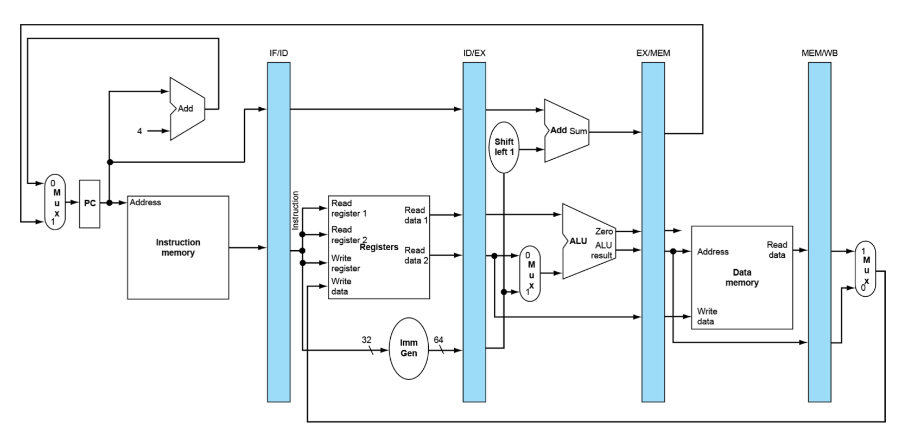

- IF/ID: 96bit register = 32bit instruction + PC register가 담은 확장된 64bit address

- ID/EX: 256bit register

- EX/MEM: 193bit register

- MEM/WB: 128bit register

> WB 다음으로는 pipeline register가 없다. WB 단계를 거치는 load instruction은 register file에 기록하기 때문에, 필요하면 register file을 다시 읽으면 되기 때문이다.

가령 data hazard 상황에서 pipeline register를 사용하여 해결하는 **forwarding** 예시를 보자.

- 바로 전 instruction 결과가 필요: EX/MEM register에서 연산 결과를 가져온다.

  > 하지만 바로 앞 instruction이 load instruction이라면, memory read가 끝나지 않았을 것이기 때문에 forwarding을 해서는 안 된다. 이를 **load-use-data hazard**라고 한다.

- 두 번째 전 instruction 결과가 필요: MEM/WB register에서 연산 결과를 가져온다.

> 3 cycle이 넘어가면 data hazard는 일어나지 않는다.

---

### 4.14.2 pipelined datapath: load instruction

`ld` instruction을 수행한다고 가정하고 datapath를 따라가 보자.

1. IF: instruction을 fetch한 뒤, instruction 값을 IF/ID register에 저장한다.

   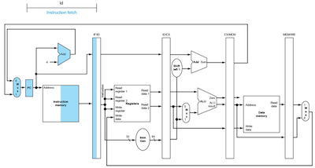

2. ID: IF/ID register에에서 immediate, 두 register 값을 읽은 뒤, IF/ID register에 해당 값을 저장한다.

   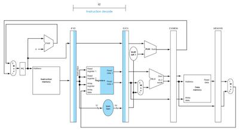

3. EX: IF/ID register를 읽고 ALU로 target address를 계산한 뒤, EX/MEM register에 address를 저장한다.

   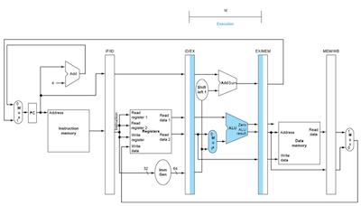

4. MEM: EX/MEM register를 읽고 memory address를 파악한 뒤, memory에서 읽은 값을 MEM/WB register에 저장한다.

   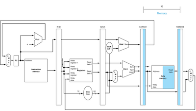

5. WB은 pipeline register에서 값을 읽고 register file에 저장한다.

  - 주의: mux에서 이어지는 line이 아니라, MEM/WB pipeline register에서 이어지는 line으로 Write register의 값이 쓰이게 된다.

    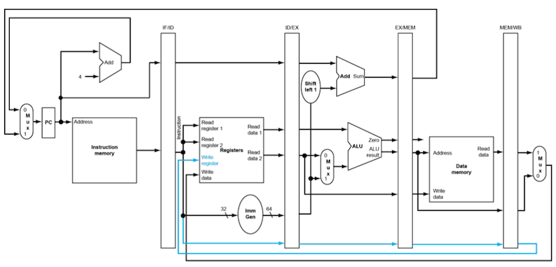

---

## 4.15 forwarding

pipeline에서는 **forwarding**을 통해 data hazard를 막을 수 있었다. 다음은 forwarding을 구현하지 않은 datapath와 구현한 datapath의 그림이다.

- forwarding이 없는 path

  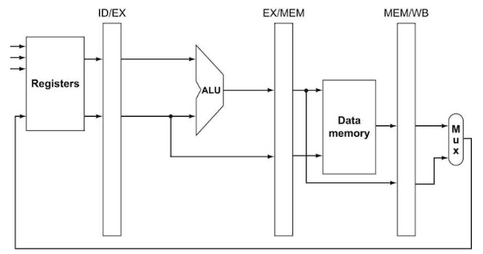

- forwarding을 추가한 datapath

  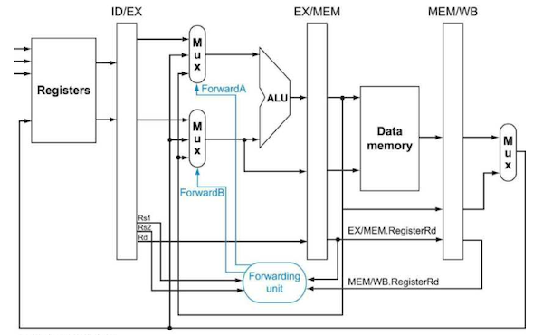

   총 네 가지 입력을 받는다. 이 네 가지 입력을 비교해서 (3 cycle 미만에서만 존재할 수 있는) data hazard를 발견하는 것이다.

   - register file: Rs1, Rs2, Rd

     > Rs1, Rs2: operand, Rd: destination

   - EX/MEM.RegisterRd

   - MEM/WB.RegisterRd

   출력은 ForwardA, ForwardB 두 가지로, 3x1 MUX를 control한다.(각각 첫 번째, 두 번째 operand를 선택)

   - 3x1 MUX이므로 2bit control signal이 필요하다.

   - `00`이면 ID/EX를, `10`이면 EX/MEM(1 cycle 전)을, `01`이면 MEM/WB(data memory 혹은 더 이전의 ALU result)을 선택한다.

---

### 4.15.1 data hazard example

아래 dependency를 가지는 코드를 보자.

```assembly
sub   x2, x1, x3 
and   x12, x2, x5
or    x13, x6, x2
add   x14, x2, x2
sd    x15, 100(X2)
```

- 모든 instruction이 공통적으로 `x2` register를 사용한다.(data hazard)

- 본래 `x2` register가 10이라는 값을 가지고 있었으며, `sub` instruction 이후 -20이 되었다고 가정하자.

  - 따라서 forwarding을 통해 10이 아닌 -20 값이 전달되어야 할 것이다.

위 프로그램이 어떻게 pipeline에서 수행될까? 아래 그림을 보자.

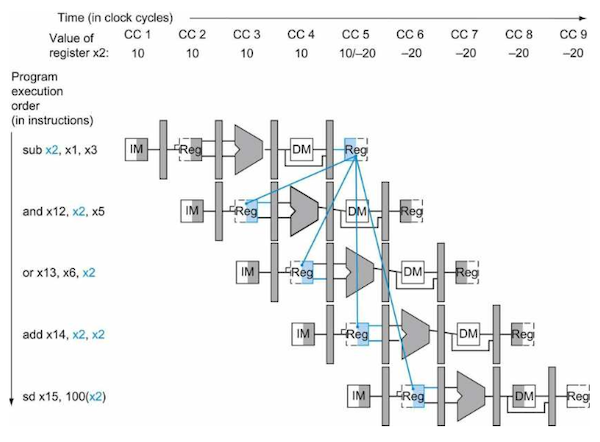

> `x2` 값에 주목하자. 그림에서 'Value of register x2'라고 적힌 부분이다. 

- 1번 `sub`와 4번 `add`는 각각 clock cycle의 앞부분(쓰기), 뒷부분(읽기)를 나눠서 수행하도록 hardware를 구현함으로써 hazard를 피했다.

   - 이는 다시 말해 5 cycle 이상에서 읽기만 한다면 1번 `sub`로 인한 data hazard는 발생하지 않는다는 의미다.

- 2번 `and`, 3번 `or`은 -20이 아닌 10이라는 틀린 값을 forwarding받고 있다.

여기서 2번 `and`, 3번 `or` instruction에서 실제로 `x2`가 쓰이는 cycle은 각각 4, 5 cycle이라는 점에 주목하자.(EX 단계의 시작 부분)

- 따라서 1번 `sub`의 결과가 ALU에서 계산되자마자 바로 2번, 3번의 EX 단계의 시작 부분으로 forwarding을 하면 hazard를 해결할 수 있다.

pipeline register field에 이름을 붙여서 data hazard의 종류를 세부적으로 구분해 보자.

- 1a. EX/MEM.RegisterRd = ID/EX.RegisterRs1

- 1b. EX/MEM.RegisterRd = ID/EX.RegisterRs2

- 2a. MEM/WB.RegisterRd = ID/EX.RegisterRs1

- 2b. MEM/WB.RegisterRd = ID/EX.RegisterRs2

앞서 2번 `and` instruction은 조건 1a를 만족한다

---

### 4.15.2 Double Data Hazard

> [Doubld data hazard, Load-use data hazard](https://velog.io/@embeddedjune/%EC%BB%B4%ED%93%A8%ED%84%B0%EA%B5%AC%EC%A1%B0-%EC%9A%94%EC%95%BD-%EC%A0%95%EB%A6%AC-9.-Pipelined-Architecture-3)

아래 예시 코드를 보자.

```assembly
add x1, x1, x2    // x1
add x1, x1, x3    // x1 data hazard 
add x1, x1, x4    // x1 data hazard
```

- 두 번째 instruction, 세 번째 instruction 모두 `x1`을 읽어야 한다. 

이러한 경우 forwarding을 어떻게 해야 할까? 정답은 더 최근의 결과값인 MEM 단계의 값을 forwarding해야 한다.

> **hazard detection unit**(해저드 검출 유닛)이 이러한 hazard를 판단해 준다.

---

## 4.16 branch taken example

전체적인 datapath를 나타낸 그림은 다음과 같다.

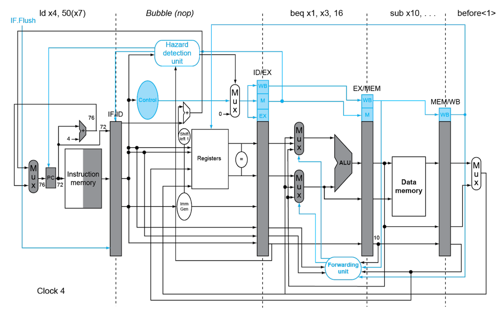

---

## 4.17 Instruction-Level Parallelism

pipelining은 기본적으로 **ILP**(Instruction-Level Parallelism)을 사용한다. ILP를 증가시키는 방법은 크게 두 가지가 있다.

1. pipeline depth를 늘린다.

    pipeline depth를 늘리면, cycle이 오래 걸리는 단계를 쪼갤 수 있다. 따라서 단계별 cycle이 줄어서 성능이 향상될 가능성이 크다.

2. **multiple issue** 방식을 사용한다.

    instruction을 여러 개 동시에 수행하도록 한다.

    > 이 경우 CPI가 1보다 작아질 수 있다.

### <span style='background-color: #393E46; color: #F7F7F7'>&nbsp;&nbsp;&nbsp;📝 예제 1: multiple issue pipeline performance&nbsp;&nbsp;&nbsp;</span>

4GHz 4-way multiple-issue microprocessor에서 IPS, peak CPI, peak IPC를 구하라

### <span style='background-color: #C2B2B2; color: #F7F7F7'>&nbsp;&nbsp;&nbsp;🔍 풀이&nbsp;&nbsp;&nbsp;</span>

> $1G = 10^9$ = 10억 = 1 Billion

- IPS: 초당 instruction을 $4 \times 10^9 \times 4 = 16 \times 10^9$ 개(16B) 수행할 수 있다.

- peak CPI: 1/4 = 0.25

- peak IPC: 4/1 = 4

---

### 4.17.1 Multiple Issue Processor Implement

우선 두 가지 문제를 해결해야 multiple issue를 구현할 수 있다.

- issue slot에 instruction을 채우는 문제

- data hazard, control hazard를 해결하는 문제

이러한 문제를 multiple issue processor은 크게 두 가지 방법으로 해결하여 구현한다.

- **static multiple issue**

   **compiler**가 수행한다. 즉, 'instruction stream 나누기/hazard 해결'을 compile 시 수행한다. 동시에 hazard를 찾아서 해결한다.

- **dynamic multiple issue**

   hardware(**CPU**)가 수행한다. 즉, 'instruction stream 나누기/hazard 해결'을 runtime에 수행한다. 

   > 여전히 compiler도 instruction reordering 등으로 도움을 준다.

---

### 4.17.2 Speculation

ILP를 잘 활용하기 위한 기법으로 **speculation**(추정)이 있다. 몇 가지 예시를 보자.

- branch instruction의 결과를 추정

- load instruction을 store instruction 뒤로 reorder할 수 있다.

speculation은 compiler가 할 수도, hardware가 할 수도 있다. 하지만 speculation이 틀렸을 때 **rollback**하는 과정은 서로 다르다.

- compiler
   
   추정 정확도를 check하기 위한 instructions을 추가한다. 또한 fix-up instructions 루틴도 추가한다.

- hardware

   추정 결과가 틀린 것을 알 때까지 **buffer**에 저장해 둔다. 그리고 틀린 것을 알게 되면, buffer에 담긴 추정 결과를 flush하고 올바른 순서를 다시 실행한다.

하지만 speculation이 잘못되면, performance 저하뿐만 아니라 exception까지 일어날 수 있다.

- 예를 들어 null-pointer check 전에 speculatively load instruction을 실행했다면, null-pointer exception이 발생할 수 있다.

- static speculation: exception이 꼭 필요한지 확실할 때까지 무시할 수 있는 ISA support를 추가한다.

- dynamic speculation: exception을 buffer에 담아두었다가, 추정이 끝나고 instruction이 실행할 시점에 exception을 발생시키고 처리한다.

---

## 4.18 Static Multiple Issue Processor

compiler는 같은 cycle에 처리할 instructions을 **issue packets**라는 묶음으로 나눈다. packets로 만들 수 있는 instruction 조합은 제한이 있기 때문에, 이를 **VLIW**(Very Long Instruction Word)라는 하나의 단위로 보기도 한다.

이때 compiler는 대부분의 data hazard, control hazard를 해결하고, reorder한 instruction을 issue packets에 담는다.

> 조합이 성립하지 않는 상황(nop)은 Pad를 넣어서 대신한다.

다음은 (64bit aligned) two-issue packets 예시다.

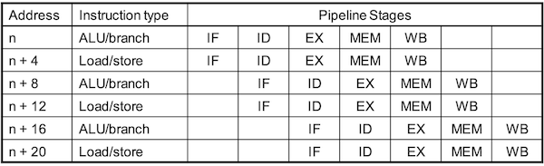

- ALU/branch instruction 묶음. Load/store instruction 묶음으로 나누었다.

이 경우 datapath는 다음과 같다.

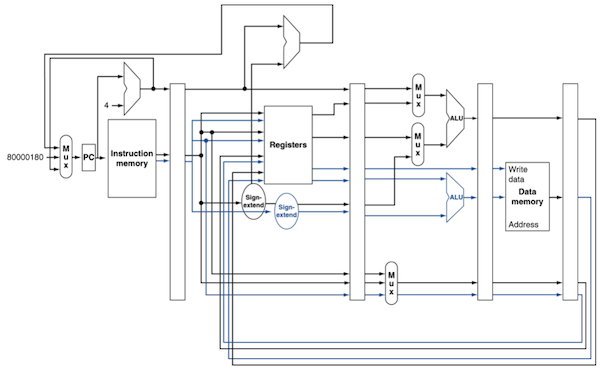

- instruction memory에서 32bit씩 두 갈래가 나온다.

- register file의 추가 read port 2개, 추가 write port 1개가 필요하다.

- 이 밖에도 load/store의 address 계산을 위해 추가 ALU가 필요하다.

---

### 4.18.1 hazards in the dual-issue RISC-V

- EX data hazard

- Load-use hazard

### <span style='background-color: #393E46; color: #F7F7F7'>&nbsp;&nbsp;&nbsp;📝 예제 2: scheduling for dual-issue RISC-V&nbsp;&nbsp;&nbsp;</span>

다음과 같은 assembly code가 있을 때, 이를 dual-issue RISC-V로 scheduling하라. 그리고 IPC를 구하여라.

```assembly
Loop: ld   x31, 0(x20)       // x31 = array element
      add  x31, x31, x21     // x21의 scalar 값을 더한다.
      sd   x31, 0(x20)
      addi x20, x20, -8      // decrease pointer(ex: &A[i])
      blt  x22, x20, Loop
```

### <span style='background-color: #C2B2B2; color: #F7F7F7'>&nbsp;&nbsp;&nbsp;🔍 풀이&nbsp;&nbsp;&nbsp;</span>

예제에서 dependency를 찾아보자.

- 첫 3줄은 `x31`에 따른 data dependency가 있다.

- 나머지 2줄은 `x20`에 따른 data dependency가 있다.

따라서 ALU/branch instruction과 load/store instruction으로 scheduling하면 다음과 같은 결과가 된다.

- `addi` instruction이 앞으로 reorder됐기 때문에, `sd`의 offset도 0에서 8로 조정됐다.

| | ALU/branch | load/store | cycle |
| --- | --- | --- | --- |
| Loop | nop | ld x31, 0(x20) | 1 |
| | addi x20, x20, -8 | nop | 2 |
| | add x31, x31, x21 | nop | 3 |
| | blt x22, x20, Loop | sd x31, 8(x20) | 4 |

IPC는 5/4 = 1.25이다.(CPI = 4/5 = 0.8)

---

### 4.18.2 Loop Unrolling

추가로 loop문의 성능을 높일 수 있는, 다시 말해 ILP를 높일 수 있는 compiler 기법으로 **loop unrolling**(=loop unwinding)이 있다.

예를 들어 다음과 같은 C code가 있다고 하자.

```c
for(int i=N; i>0; i--) {    
    a = A[i];              
    a += b;                 
    A[i] = a;               
}
```

위 code에 loop unrolling을 적용하면 다음과 같이 바뀐다.

- loop condition 검사 횟수(`blt`)만 해도 N에서 N/2로 절반이 줄어든다.(loop-control overhead 감소)

- **regitser renaming**을 통해 data hazard를 없앨 수 있다.

```c
for (int i=N; i>0; i-=2) {
    a = A[i];
    a += b;
    A[i] = a;      // 
    a = A[i-1];    // dependence
    a += b;
    A[i-1] = a;
}
```

위와 같은 WAR dependence를 **register renaming** 기법을 통해 없애면 다음과 같이 바뀐다.

> 이렇게 바꿀 수 있는 dependence(WAR, WAW)를 **antidependence** 혹은 **name dependence**라고 지칭한다.

```c
for (int i=N; i>0; i-=2) {
    a = A[i];
    c = a + b;
    A[i] = c;     
    a2 = A[i-1]; 
    c2 = a2 + b;
    A[i-1] = c2;
}
```

### <span style='background-color: #393E46; color: #F7F7F7'>&nbsp;&nbsp;&nbsp;📝 예제 3: loop unrolling&nbsp;&nbsp;&nbsp;</span>

예제 2 코드를 loop unrolling한 dual-issue RISC-V code를 작성하라. 그리고 IPC를 구하여라.

```assembly
Loop: ld   x31, 0(x20)       // x31 = array element
      add  x31, x31, x21     // x21의 scalar 값을 더한다.
      sd   x31, 0(x20)
      addi x20, x20, -8      // decrease pointer(ex: &A[i])
      blt  x22, x20, Loop
```

### <span style='background-color: #C2B2B2; color: #F7F7F7'>&nbsp;&nbsp;&nbsp;🔍 풀이&nbsp;&nbsp;&nbsp;</span>

- 처음 `x20`에서 -32만큼 room을 만들고, `x20`의 원래 주소, -8, -16, -24한 주소에 값을 store한다.

| | ALU/branch | load/store | cycle |
| --- | --- | --- | --- |
| Loop | addi x20, x20, -32 | ld x28, 0(x20) | 1 |
| | nop | ld x29, 24(x20) | 2 |
| | add x28, x28, x21 | ld x30, 16(x20) | 3 |
| | add x29, x29, x21 | ld x31, 8(x20) | 4 |
| | add x30, x30, x21 | sd x28, 32(x20) | 5 |
| | add x31, x31, x21 | sd x29, 24(x20) | 6 |
| | nop | sd x30, 16(x20) | 7 |
| | blt x22, x20, Loop | sd x31, 8(x20) | 8 |

IPC는 14/8 = 1.75이다.(CPI = 8/14 = 0.57)

> 예제 2의 IPC가 0.8이었으므로 약 2배 가량의 성능 향상을 보인다.

> 하지만 그 대가로 temporary register를 네 개(`x28, x29, x30, x31`)나 사용하였으며 코드 크기도 증가했다.

---

## 4.19 Dynamic Multiple Issue Processor

dynamic multiple issue processor는 다른 말로 **superscalar processor**(수퍼스칼라 프로세서)라고도 불린다. 

- CPU가 각 cycle에 어떤 instruction을 issue할지를 dynamic하게 결정한다.

  > structural, data hazard를 피해서 결정한다.

- 대부분의 superscalar processor는 dynamic pipeline scheduling을 포함한다.

---

### 4.19.1 Dynamic Pipeline Scheduling

CPU가 stall을 막기 위해 **OOO**(out of order)로 instruction을 실행하도록 한다.

- 하지만 register에 결과를 commit하는 순서는 in-order로 해야 한다.

예를 들어 다음과 같은 코드가 있다고 하자.

```assembly
ld   x31, 0(x21)     // x31
add  x1, x31, x2     // x31 data hazard
sub  x23, x23, x3
andi x5, x23, 20
```

`sub` instruction은 실행할 준비가 되어도 `ld`와 `add`가 끝나기를 기다려야 한다. 따라서 dynamic pipeline scheduling을 통해 `sub` instruction을 먼저 실행하도록 하여 hazard를 최대한 피한다.

아래는 dynamic scheduled pipeline의 세 가지 유닛을 나타낸 그림이다.

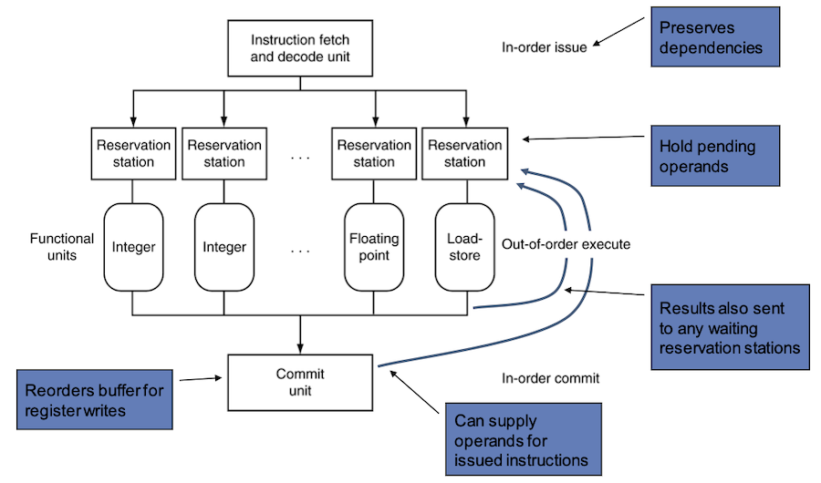

- Instruction fetch and decode unit

   instruction을 fetch/decode한 뒤, 각각의 instruction을 해당 functional units로 보낸다.

- functional units

   **reservation station**(대기 영역)이라는 buffer에 opcode, operand를 담고 있다가, functional unit이 준비되면 계산하여 결과를 도출한다.

- commit unit

   **reorder buffer**(재정렬 버퍼)에 결과를 저장해 두었다가, register file이나 (load instruction의 경우) memory에 작성한다.(commit)

   - commit 전까지도 결과값을 operand로 제공할 수 있다.

이러한 reservation station과 reorder buffer를 이용해서도 register renaming이 가능하다.

- instruction이 function unit의 reservation station으로 복사될 때, 조건에 따라 다음 과정을 거친다.

  > copy가 완료된 후부터는 기존 register가 overwrite되어도 상관이 없어진다.

  - operand가 register file이나 reorder buffer에 있다면, 즉시 reservation station으로 복사한다. 
  
    - 모든 operand와 function unit이 사용 가능해질 때까지 register station에 버퍼링된다. 

  - 하지만 operand가 register file, reorder buffer 양쪽에 없다면, function unit에 의해 생성되기를 기다려야 한다.

    - 이 경우, function unit이 산출한 결과값이 register를 거치지 않고 바로 reservation station으로 직접 복사된다.

> cache miss와 같이 예측할 수 없는 stall, branch instruction과 같이 결과가 dynamically하게 결정되는 경우가 있기 때문에 dynamic pipeline scheduling이 필요하다.

---

### 4.19.2 speculative execution

superscalar processor는 speculative execution을 통해 성능을 향상시킨다.

- **branch prediction**을 통해 멈추지 않고 issuing한다.

  이때 branch outcome이 나올 때까지 commit하지 않는다.

- **load spedulation**

  load, cache miss delay를 피한다. 이때 speculation이 성공했는지 알기 전까지 commit하지 않는다.

  - effective address(operand가 참조하는 address)를 예측한다.

  - loaded value를 예측한다.

---

### 4.19.3 Power Efficiency

하지만 이러한 dynamic scheduling과 speculation은 power efficiency를 떨어뜨린다.

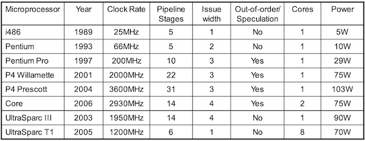

> 예를 들어 P4 Prescott은 compiler가 31 \* 3 = 93 instructions을 한 cycle에 issue한다.

> server와 같이 power efficiency가 중요한 환경에서는, 보다 power efficiency가 높은 multiple simpler core를 사용한다.

---
