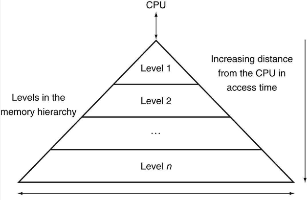
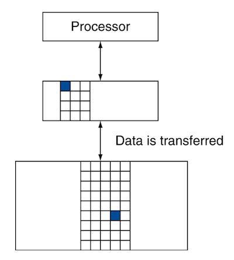
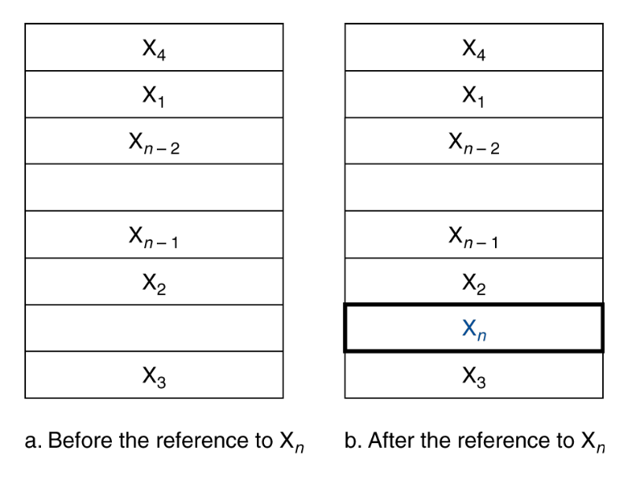
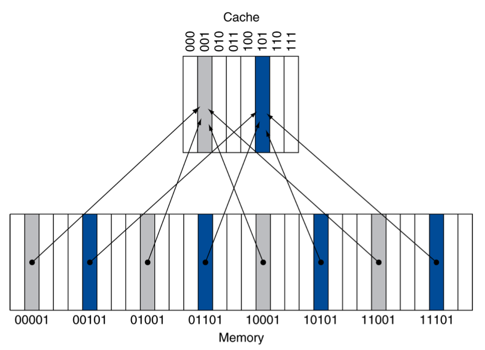
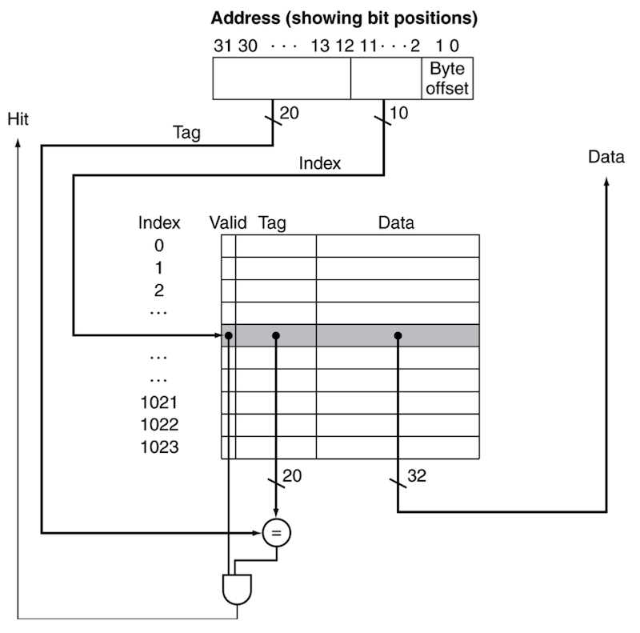
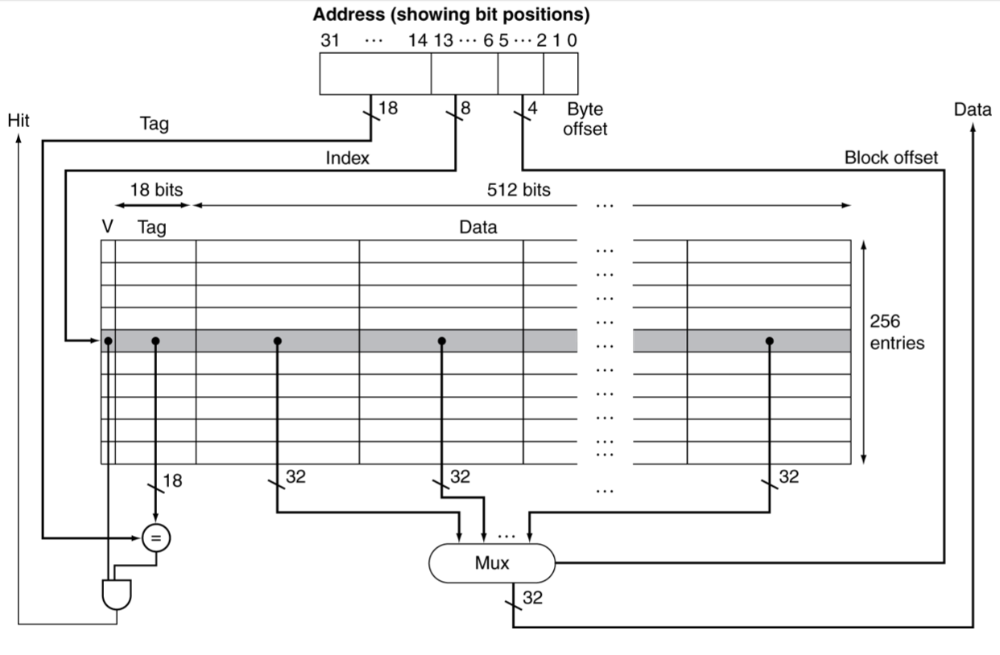

# 5 cache (Part I)

Amdahl's law에 따라 multiprocessor로 얻을 수 있는 speedup은 제한적이다. 하지만 performance를 더 향상시키기 위한 다른 접근법도 존재한다. 바로 memory system을 더욱 효율적으로 만드는 방식이다.

---

## 5.1 Memory Technology

- Static RAM(SRAM): cache. access time이 cycle time과 거의 동일하다.

  - 정보가 바뀌지 않도록 bit당 6개에서 8개의 capacitor를 사용한다.

- Dynamic RAM(DRAM): main memory

  - bit당 1개의 capacitor를 사용한다.(따라서 SRAM보다 집적도가 더 높다.)

따라서 RAM은 SRAM에 비해 훨씬 느려도, 동일한 density라면 DRAM이 더 많은 bit를 저장할 수 있다. 하지만 전하 형태로 data를 저장하기 때문에 data를 유지하기 위한 refresh가 필요하다는 단점이 있다.(그럼에도 전력 소모는 SRAM보다 효율적이다.)

> refresh는 단순히 셀에 있는 값을 읽고 다시 쓰는 작업이다. word 단위로 한번에 읽고 다시 쓰는 과정을 거친다.

> 모바일 장치가 갖는 DRAM은 4GB이지만, 실제로는 이보다도 더 큰 용량의 application을 실행하는 것을 볼 수 있다. 이는 OS가 앱의 필요한 부분만 storage에서 load하기 때문이다. 이 과정에서 **virtual memory**(가상 메모리) system을 통해 효율적으로 memory를 관리한다.

모든 data와 instruction의 original location은 storage(hard disk, SSD 등)이다. 전원이 꺼지면 SRAM과 DRAM에 저장된 내용은 사라진다. memory hierarchy에 따라 disk에서 main memory인 DRAM memory으로 items가 복사되고, DRAM에서 그보다도 더 작은 SRAM memory로 복사된다.

---

## 5.2 Principle of Locality

- Temporal locality

    같은 항목에 반복적으로 접근하는 경향.
    
    > 예를 들어 loop문의 경우 동일한 변수와 instruction에 계속 접근하는 경우가 많다. 변수의 값은 바뀔 수 있으나 location 자체는 동일하다.

- Spatial locality

    참조된 항목의 근처에 있는 항목들에 접근하는 경향. 
    
    > array나 sequential instruction access 같은 경우 순차적으로 접근하는 경우가 많다.(1000, 1008, 1016...)

---

## 5.3 Memory Hierarchy Levels

컴퓨터는 memory를 **memory hierarchy**(메모리 계층 구조)로 memory를 구성함으로써 locality를 활용한다.

- 계층 사이 정보 전송의 최소 단위를 **block** 또는 **line**이라고 지칭한다.(주로 multiple words 단위)

- 최근에 접근한 data는 processor에 가까이 적재한다.(temporary locality 활용)

- 필요한 data뿐만 아니라, 인접한 다량의 data를 block 단위로 상위 계층으로 가져온다.(spatial locality 활용)

---

### 5.3.1 hit ratio, miss ratio

이처럼 processor가 upper level(상위 계층)의 어떤 block에 data를 요구했을 때, data가 있거나 없는 경우를 다음과 같은 용어로 지칭한다.

> 그림은 processor, cache, DRAM 순서

- **hit**: upper level에 data가 있어서 성공적으로 access한 경우

  - hit ratio: hit 수 / access 수

- **miss**: upper level에 data가 없어서, lower level에서 block을 가져와 upper level block과 교체하는 경우

  - miss ratio: miss 수 / access 수 = 1 - hit ratio

---

## 5.4 cache mapping

그런데 cache를 이용하기 위해서는 두 가지 의문을 해결해야 한다.

1. data를 cache 내에 가져왔는가?

2. data를 가져왔다면 어디에 가져왔는가?

> 예를 들어 내가 도서관(DRAM)에서 집(cache)로 책을 1000권 대출해 왔다면, 무슨 책을 빌렸고 어디에 있는지 알기 힘들 것이다.

processor가 item $X_1, \cdots , X_{n-1}, X_{n}$ 가 필요한데, 현재 $X_{n}$ 이 없다고 하자. 그러면 $X_{n}$ 을 cache에서 가져오려고 시도할 것이다.

그런데 data가 규칙 없이 보관되어 있다면, cache에서 data를 찾는 시간까지 감수해야 한다. 따라서 설계자들은 data가 cache 어디에 위치하는지 알 수 있도록 하는 규칙을 정했다.

---

### 5.4.1 Direct Mapped Cache

> data를 가져왔다면 어디에 가져왔는가?

우선 가장 간단한 방법으로 word의 memory address를 cache의 딱 한 장소에 mapping할 수 있다. 아래와 같이 DRAM에서 cache로 mapping하는 modulo 함수가 있다고 하자.

- 예시의 cache entry는 8개이다. 따라서 $\log_{2}{8} = 3$ bits를 cache index로 사용한다.

- block 주소의 하위 3bit만 취하면 어느 cache index에 위치할지 알 수 있다.(low-order address bits)

- mapping: (block address) modulo (\#blocks in cache)

   - 예: '01000 modulo 8'

그림 8block cache 예시를 더 살펴보자. 

- 01000: 하위 3bit에 따라 cache index 000에 mapping

- 01100: 하위 3bit에 따라 cache index 100에 mapping

---

#### 5.4.1.1 tags

하지만 여러 block address가 같은 memory address에 mapping되므로, processor가 찾는 data인지 바로 구분하기 위해서는 추가 정보가 더 필요할 것이다. 이를 위해 cache에 **tag**를 저장해서, 내가 원하는 정보인지 식별할 수 있는 정보를 파악한다.

위 예시에서 5bit address 중 하위 3bit는 cache index로 사용되었다. 반대로 tag는 사용되지 않은 상위 bits를 이용해 구성한다. 

---

#### 5.4.1.2 valid bits

> data를 cache 내에 가져왔는가?

그런데 컴퓨터를 처음 켰을 때 cache는 비어있을 것이고, 이러한 tag field 정보는 아무런 의미가 없을 것이다. 또한 direct mapped cache의 특성상, 일부 cache entry는 많은 instruction을 수행한 뒤에도 비어있을 수 있다.(**Ping-Pong problem**)

그렇다면 cache block이 valid한지(empty한지 아닌지)를 어떻게 알 수 있을까? 이를 나타내는 indicator가 바로 **valid bits**이다. valid bit가 0이라면 해당 cache entry는 비어있는 것이다.

### &nbsp;&nbsp;&nbsp;📝 예제 1: cache example&nbsp;&nbsp;&nbsp;

8개 block을 갖는 cache가 있다고 하자. block 하나당 1 word(32bit)를 저장한다.

- initial snapshot은 다음과 같다.

  | Index | V | Tag | Data | 
  | :---: | :---: | :---: | :---: |
  | 000 | N | | |
  | 001 | N | | |
  | 010 | N | | |
  | 011 | N | | |
  | 100 | N | | |
  | 101 | N | | |
  | 110 | N | | |
  | 111 | N | | |

다음 word를 순차적으로 가져왔다고 할 때, hit/miss 여부, cache block과 cache의 snapshot을 적어보자.

- 1

  | Word addr | Binary addr | Hit/Miss | Cache block |
  | :---: | :---: | :---: | :---: |
  | 22 | 10 110 | - | - |  

- 2

  | Word addr | Binary addr | Hit/Miss | Cache block |
  | :---: | :---: | :---: | :---: |
  | 26 | 11 010 | - | - |  

- 3

  | Word addr | Binary addr | Hit/Miss | Cache block |
  | :---: | :---: | :---: | :---: |
  | 22 | 10 110 | - | - |
  | 26 | 11 010 | - | - |

- 4

  | Word addr | Binary addr | Hit/Miss | Cache block |
  | :---: | :---: | :---: | :---: |
  | 16 | 10 000 | - | - |
  | 3 | 00 011 | - | - |
  | 16 | 10 000 | - | - |

- 5

  | Word addr | Binary addr | Hit/Miss | Cache block |
  | :---: | :---: | :---: | :---: |
  | 18 | 10 010 | - | - |

### &nbsp;&nbsp;&nbsp;🔍 풀이&nbsp;&nbsp;&nbsp;

- 1: cache miss가 일어난다.

  | Word addr | Binary addr | Hit/Miss | Cache block |
  | :---: | :---: | :---: | :---: |
  | 22 | 10 110 | Miss | 110 |  

  | Index | V | Tag | Data | 
  | :---: | :---: | :---: | :---: |
  | 000 | N | | |
  | 001 | N | | |
  | 010 | N | | |
  | 011 | N | | |
  | 100 | N | | |
  | 101 | N | | |
  | 110 | Y | 10 | Mem[10110] |
  | 111 | N | | |

- 2: cache miss가 일어난다.

  | Word addr | Binary addr | Hit/Miss | Cache block |
  | :---: | :---: | :---: | :---: |
  | 26 | 11 010 | Miss | 010 |  

  | Index | V | Tag | Data | 
  | :---: | :---: | :---: | :---: |
  | 000 | N | | |
  | 001 | N | | |
  | 010 | Y | 11 | Mem[11010] |
  | 011 | N | | |
  | 100 | N | | |
  | 101 | N | | |
  | 110 | Y | 10 | Mem[10110] |
  | 111 | N | | |

- 3: cache hit이 일어난다.

  | Word addr | Binary addr | Hit/Miss | Cache block |
  | :---: | :---: | :---: | :---: |
  | 22 | 10 110 | Hit | 110 |
  | 26 | 11 010 | Hit | 010 |

  | Index | V | Tag | Data | 
  | :---: | :---: | :---: | :---: |
  | 000 | N | | |
  | 001 | N | | |
  | 010 | Y | 11 | Mem[11010] |
  | 011 | N | | |
  | 100 | N | | |
  | 101 | N | | |
  | 110 | Y | 10 | Mem[10110] |
  | 111 | N | | |

- 4: cache miss, hit 모두 일어난다.

  | Word addr | Binary addr | Hit/Miss | Cache block |
  | :---: | :---: | :---: | :---: |
  | 16 | 10 000 | Miss | 000 |
  | 3 | 00 011 | Miss | 011 |
  | 16 | 10 000 | Hit | 000 |

  | Index | V | Tag | Data | 
  | :---: | :---: | :---: | :---: |
  | 000 | Y | 10 | Mem[10000] |
  | 001 | N | | |
  | 010 | Y | 11 | Mem[11010] |
  | 011 | Y | 00 | Mem[00011] |
  | 100 | N | | |
  | 101 | N | | |
  | 110 | Y | 10 | Mem[10110] |
  | 111 | N | | |

- 5: cache miss 및 overwrite가 일어난다.

  | Word addr | Binary addr | Hit/Miss | Cache block |
  | :---: | :---: | :---: | :---: |
  | 18 | 10 010 | Miss | 010 |

  | Index | V | Tag | Data | 
  | :---: | :---: | :---: | :---: |
  | 000 | Y | 10 | Mem[10000] |
  | 001 | N | | |
  | **010** | **Y** | **10** | **Mem[11010]** |
  | 011 | Y | 00 | Mem[00011] |
  | 100 | N | | |
  | 101 | N | | |
  | 110 | Y | 10 | Mem[10110] |
  | 111 | N | | |

---

### 5.4.2 address subdivision

이제 memory address가 주어졌을 때, cache에서 data를 찾는 과정을 세분화하여 살펴보자.

> 지금까지의 예시처럼 word 단위의 memory address가 주어진다고 하자.

> =: comparator

- 예시에서 cache는 1block당 1word를 저장하며, $2^{10}=1024$ 개 word까지 저장할 수 있다.

  - memory alignment에 따라 memory address는 4의 배수로 주어진다. 그리고 memory address의 하위 2bit는 해당 word 내에서 byte 순서를 나타낸다. **따라서 최하위 2bit는 cache에서 사용하지 않는다.**

- word의 32bit에서 $\log_{2}{1024}= 10$ 즉, 하위 10bit를 cache index(byte offset)로 사용한다.

- 나머지 20bit를 그대로 tag로 사용/비교한다.

위 시스템에서는 memory address에서 상위 20bit가 tag와 같고, valid bit가 1이면 cache hit가 일어난다.

---

### 5.4.3 address subdivision: larger block size

그런데 방금 예시에서는 cache block의 크기가 1word(4bytes)였지만, 일반적으로 cache는 한 block이 multiple words를 저장한다.

- block 내 word를 구분하는 역할을 하는 bit가 추가로 필요하다.

- Mux가 추가되며 extra delay가 발생한다. 더 커지는 fetch time과 더불어 block size가 클 때 발생하는 단점이다.

### &nbsp;&nbsp;&nbsp;📝 예제 2: larger block size&nbsp;&nbsp;&nbsp;

1word보다 큰 단위를 저장하는 larger block을 생각해 보자. cache는 총 64 blocks으로 구성되어 있으며, 16 bytes(4 words)/block 단위로 저장하는 direct mapped cache라고 하자.

memory address가 주어졌을 때, cache에서 data를 찾는 과정을 세분화하라.

### &nbsp;&nbsp;&nbsp;🔍 풀이&nbsp;&nbsp;&nbsp;

1. 우선 cache가 총 64 block으로 저장되어 있으므로, index bit로 $\log_{2}{64} = 6$  bit를 사용할 것이다.

2. 한 block이 4개 words로 구성되어 있으므로, word를 구분하기 위한 offset으로 $\log_{2}{4} = 2$ 를 사용할 것이다.

3. word 단위 내 byte offset $\log_{2}{4} = 2$ 은 무시한다.

4. 따라서 tag로 저장하는 bit는 32 - 6 - 4 = 22bits가 된다.

cache의 전체 bit 수를 계산해 보자.

- \#blocks(64개) x {block size(4 words * 32 bits) + tag size(22 bits) + valid bit(1 bit)} = 64 x (128 + 22 + 1) = 9664 bits

> total bits를 구하는 문제에서는 tag bit와 valid bit까지 고려해서 size를 계산했지만, 실제 cache size는 items size만을 취급한다.

---

### &nbsp;&nbsp;&nbsp;📝 예제 3: larger block의 cache index 구하기&nbsp;&nbsp;&nbsp;

다음 조건의 cache가 있다고 하자. 

- block size: 16 bytes

- \#blocks: 64

byte address 1200은 몇 번 block에 mapping되는가?

### &nbsp;&nbsp;&nbsp;🔍 풀이&nbsp;&nbsp;&nbsp;

한 block이 16bytes씩 저장하므로, byte address의 block address는 다음과 같은 연산으로 구할 수 있다.

- block address = $\frac{1200}{16} = 75$

- block mapping 공식에 따라 75 modulo 64 = 11번 block에 mapping된다.

> 조건이 byte address인지, word address인지를 명확히 구분해서 연산해야 한다. 

> 예를 들어 만약 문제에서 byte address가 아닌 words address 300가 주어졌다면 $\frac{300}{4} = 75$ 으로 계산해야 한다.

---

## 5.5 block size considerations

cache의 block이 커지면 어떤 장단점이 있을까? 예를 들어 cache가 data를 16개씩 묶어서 가져온다고 하자. 그러면 processor가 $x_0$ 만 요청했어도, cache는 DRAM에서 $x_1, x_2, ..., x_{15}$ 까지 모두 가져오게 된다.

- 장점

  - block이 크면 spatial locality를 더 잘 활용할 수 있다.

- 단점

  - fetch time이 늘어나면서, cache miss 때 발생하는 penalty가 커진다.

    > fetch time: (1) 첫 word를 가져오는 데 드는 latency (2) 나머지 부분을 가져오는 데 드는 latency 

    > (2)는 **early restart**(조기 재시작, block 내 요청한 word가 도착하면 곧바로 실행하는 방식)를 통해 latency를 줄일 수 있다.

  - block size가 커지면 그만큼 cache block 개수가 적어진다. 따라서 같은 block 위치에 대한 data들의 경쟁이 심해진다. 
  
     > 결과적으로 locality를 충분히 활용하지 못하고, 계속 다른 data로 overwrite되는 일이 발생할 수 있다.

아래 그림을 보자. 그림은 cache size와 block size에 따른 miss rate를 나타낸다.

> cache size는 valid bit나 tag field는 제외하고, 오직 저장하는 data의 bits 수만을 고려한다.

> 서버급 CPU에서 사용하는 **LLC**(Large-Level Cache)의 경우 M 단위가 넘는 cache size를 갖기도 한다.

- cache size에 비해 상대적으로 block size가 너무 크면 miss rate가 커진다.

  > cache size 4K에서는 block size가 64가 넘는 구간부터 overshoot가 발생했다.

cache에서 block size는 width, \#blocks는 height로 생각하자. 

- width가 256이며 height가 16일 때 256 x 16 = $2^8$ x $2^4$ = $2^{12}$ = 4K가 된다.

- 반대로 4K cache size에서는 \#blocks(cache lines)가 겨우 16개밖에 없다는 것을 알 수 있다.

이처럼 <U>block size를 늘리면 spatial locality는 커지지만</U>, <U>blocks 수가 적어지면서 temporal locality는 줄어드는</U> **trade-off**가 있다.

### &nbsp;&nbsp;&nbsp;📝 예제 4: larger block의 cache index 구하기&nbsp;&nbsp;&nbsp;

다음과 같은 cache size, block size를 갖는 cache에서 (1) block 수와 (2) 전체 bit 수를 구하여라.

- cache size 32KB

- 1 block(=cache line) = 16 words

### &nbsp;&nbsp;&nbsp;🔍 풀이&nbsp;&nbsp;&nbsp;

우선 16 words는 16 x 4 bytes = 64 bytes이다. 이를 바탕으로 cache가 얼만큼 \#blocks를 갖는지 계산해 보자.

32KB / 64B = $2^9$ = 512 \#blocks

32 bits address는 다음과 같이 구분된다.

- byte offset: 2 bits

- word offset: 1 cache line이 16( $=2^4$ ) words를 저장하므로 4 bits

- index: \#blocks 512( $=2^9$ ) 이므로 9 bits

- tag: 32 - (2 + 4 + 9) = 17 bits

- valid bit: 1bit

따라서 cache에서 쓰는 전체 bits 수는 다음과 같다.

- \#blocks x (block size(data) + tag size + valid bit)

  - 512 * (64*8 + 17 + 1) bits = 271,360 bits

---