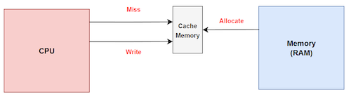
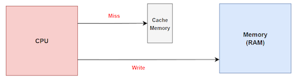
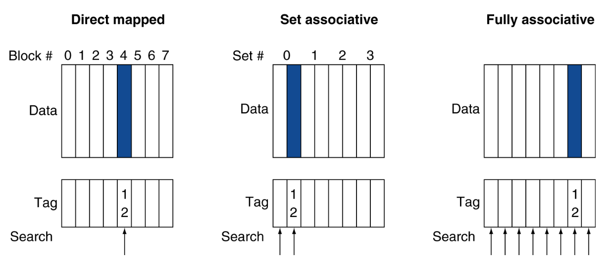
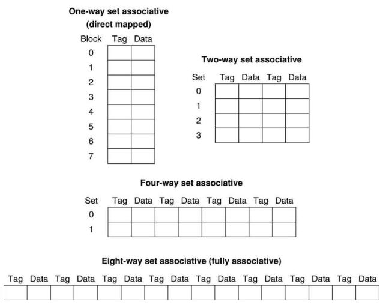
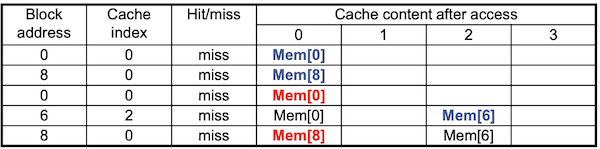
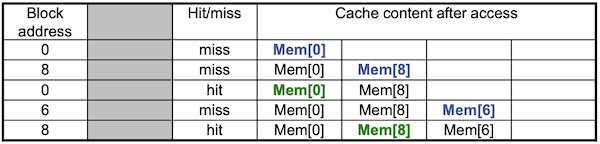
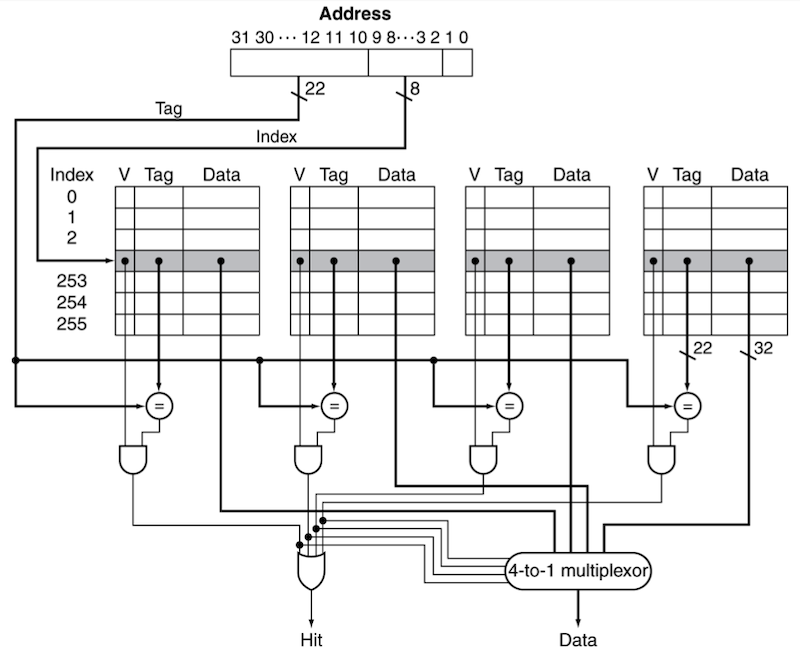
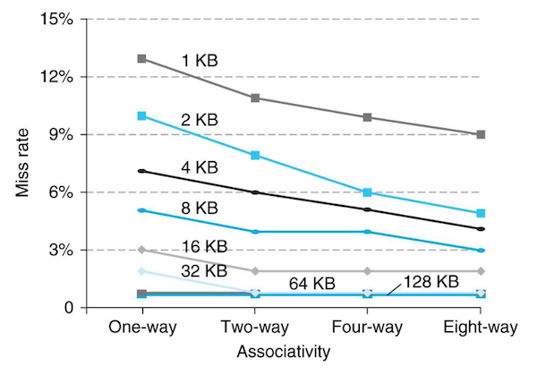

# 5 cache (Part II)

## 5.6 Cache Misses

cache hit의 경우 CPU는 평소대로 동작한다. 하지만 cache miss가 일어나면 item을 **refill**해야 한다.

> 예외나 인터럽트와 다르게, cache miss는 penalty로 pipeline stall만 발생한다.

1. cache miss가 일어난 instruction address(원래의 PC 값)를 가져온다.

   - (멀티사이클 CPU의 경우) 맨 처음 clock cycle에서 PC가 PC+4로 증가하기 때문에, PC-4를 가져와야 cache miss를 발생시킨 instruction을 가져오게 된다.

   - 단일사이클 CPU의 경우 PC가 증가하기 이전이므로, PC 값을 그대로 가져오면 된다.

2. memory hierarchy의 lower level에서 data를 읽는다.

   - memry access에 여러 clock이 걸리므로 CPU pipeline을 **stall**한다.

3. cache entry에 작성한다.(data, tag, valid bit별로 작성)

4. instruction 수행을 첫 단계부터 다시 시작한다.

   - instruction cache miss: instruction을 restart한다.

   - data cache miss: data access를 complete한다.

     > data cache miss는 load instruction에서 발생한다.

---

## 5.7 Cache Write

cache에 data를 쓸 때, 고려해야 하는 여러가지 문제가 있다. 예를 들어 store instruction에 따라 어떠한 data를 저장할 때, data cache에만 data를 저장하고 memory에는 저장하지 않는다면(**data-write hit** 방식) **inconsistent**(불일치)가 발생한다.

---

### 5.7.1 Write-Through

cache와 memory에 data를 항상 동시에 update하는 **Write-through**(즉시 쓰기) 방식을 고려할 수 있다. 그런데 이 방식은 write에 너무 긴 시간이 필요하다.

### &nbsp;&nbsp;&nbsp;📝 예제 2: Write-Through 방식의 성능 저하&nbsp;&nbsp;&nbsp;

다음 조건에서 write-through 방식에 따른 성능 저하를 계산하라.

- base CPI = 1.0

  > base CPI란 **cache hit**만 일어날 때의 CPI를 뜻한다.
  
- instruction rate: 전체 instruction에서 store instruction가 차지하는 비율은 10%

- penalty: 모든 write에서 100개의 clock cycle이 추기로 필요하다.

### &nbsp;&nbsp;&nbsp;🔍 풀이&nbsp;&nbsp;&nbsp;

- Effective CPI = base CPI + miss penalty x miss rate

   - 1.0 + 100 * 10% = 11

따라서 10배 이상의 성능 저하가 발생한다.

---

### 5.7.2 write buffer

Write-Through의 문제를 해결하는 방안으로 **write buffer**를 사용할 수 있다. processor는 data를 cache와 write buffer에 동시에 쓴다.

- write buffer: memory에 written되기를 wating하는 data를 hold한다.

- CPU는 immediate하게 continue할 수 있다.

- 하지만 write buffer가 가득찼다면(full), buffer에 빈 공간이 생길 때까지 stall이 발생한다.

그러나 buffer가 memory에 쓰는 시간이, processor가 buffer에 쓰는 시간보다 느리면 stall이 발생할 수 있다. 혹은 buffer의 쓰기 속도가 memory system이 받아들이는 속도보다 stall이 발생할 수 있다. 따라서 보통 buffer entry를 2개 이상으로 둔다.

---

### 5.7.3 Write Back

**Write Back**이란 data-write hit 때, 오직 cache block만을 update하고 main memory는 늦게 update하는 방식이다.(**lazy write**)

그렇다면 언제까지 main memory에 update하는 일을 미룰 수 있을까? 바로 cache block 단위로 update(replace)하는 상황이 발생할 때다. cache block이 overwriten될 때 main memory를 update한다.

Write Back의 구현을 위해서 **dirty bit**를 둔다. dirty bit(status bit)란 해당 data가 새로운 값으로 수정이 되었다는 사실을 나타낸다. update 때 dirty bit를 참고하여, 새로운 값만 main memory에 update하게 된다.

---

### 5.7.4 Write Allocation

cache write를 시도했을 때, cache miss까지 일어나는 경우의 정책도 생각해야 한다. write하려는 memory address data가 cache에 존재하지 않는다면, cache에 data를 가져와서 write를 수행할지 말지를 결정해야 한다.

- **write allocate**: block을 fetch하고 cache에 write한다.

  

- no write allocate: 오직 main memory에만 write한다.

  

> Write Back의 경우, 주로 write allocate를 사용한다.

---

## 5.8 Split Cache

대부분의 processor는 pipelining의 효율적인 구현을 위해, instruction cache, data cache를 나누는 **split cache**(분할 캐시) 기법을 사용한다. 

일반적으로 split cache를 합친 크기와 동일한 크기의 combined cache(통합 캐시)가 살짝 더 좋은 hit rate를 보이지만, 그럼에도 split cache를 사용함으로써 **cache bandwidth**(캐시 대역폭)이 두 배로 늘어나게 된다.

> split cache의 또 다른 장점으로 conflict miss가 줄어드는 이점도 있다.

> 이러한 점 때문에 cache performance는 단순히 miss rate만으로 측정하지 않는다.

---

## 5.9 Measuring Cache Performance

cache가 가진 성능은 CPU time으로 비교할 수 있다. cache 관점에서 CPU time은 크게 두 종류로 나눌 수 있다.

- **CPU execution clock cycles**: 프로그램이 실행되는데 걸리는 clock cycle 수

  - 일반적으로 cache hit time을 정상적인 CPU 수행 사이클로 간주한다.

- **memory stall clock cycles**: memory access 때 stall되는 clock cycle 수

  - 대부분의 비중이 cache miss penalty이다.

  - load, store instruction에서 발생한다.

따라서 전체 CPU time은 다음과 같이 계산할 수 있다.

- CPU time = (CPU execution clock cycles + memory stall clock cycles) x clock cycle time

---

### 5.9.1 Memory Stall Cycles

**memory stall clock cycles**(메모리 지연 클럭 사이클)은 Read-stall cycles, Write-stall cycles의 합으로 나타낼 수 있다.

- Read-stall cycles

  - {Read 접근 수/Program 수} x Read miss rate x Read miss penalty

- Write-stall cycles

  - (Write-Through 방식) write buffer에 빈 자리가 없을 때 발생하는 write buffer stalls도 고려해야 한다.

    - [{Write 접근 수/Program 수} x Write miss rate x Write miss penalty] + Write buffer stalls

  - (Write-Back 방식) update 때 main memory에 쓰는 추가적인 latency를 고려해야 한다.

대부분의 Write-Through 방식 cache에서 write buffer stalls가 충분히 작다면, Read-stall cycles와 Write-stall cycles는 같다고 볼 수 있다. 이 경우 memory stall clock cycles는 다음과 같이 나타낼 수 있다.

- memory stall clock cycles = {Memory access 수/Program 수} x miss rate x miss penalty

  - = {instructions/programs 수} x {miss 수/instructions 수} x miss penalty

### &nbsp;&nbsp;&nbsp;📝 예제 3: I-cache, D-cache miss cycles, Actual CPI 구하기&nbsp;&nbsp;&nbsp;

일반적으로 I-cache(instruction cache), D-cache(Data cache)의 miss rate를 비교하면, data cache의 miss rate가 더 높다. instruction이 data보다 locality를 더 많이 갖기 때문이다.

I-cache, D-cache의 miss rate는 다음과 같이 가정한다. 

- I-cache miss rate = 2%

- D-cache miss rate = 4%

두 cache의 miss penalty는 동일하게 100 cycles이라고 가정한다.

- Miss penalty = 100 cycles

base CPI 및 load, store instructions이 차지하는 비중은 다음과 같다.

- Base CPI(ideal cache): 2 cycles

- Load & stores: 36% of instructions

이때 다음 두 가지를 구하라.

1. memory-stall miss cycles을 구하라.

2. Actual CPI를 구하라.

### &nbsp;&nbsp;&nbsp;🔍 풀이&nbsp;&nbsp;&nbsp;

우선 I-cache에서 instruction miss cycles를 구해보자.

- Instruction miss cycles = \#Instructions x 2% x 100 cycles = \#Instructions x 2 cycles

다음은 D-cache에서 data miss cycles를 구해보자.

- Data miss cycles = \#Instructions x **36%** x 4% x 100 cycles = \#Instructions x 1.44 cycles

  > 언뜻 D-cache의 miss rate가 0.04로 더 높아보이지만, 0.36이라는 비율 때문에 penalty는 D-cache가 더 낮다.

따라서 전체 <U>memory-stall miss cycles = 2I + 1.44I = 3.44I cycles</U>이다.

이제 Actual CPI를 구해보자.

- Actual CPI = Base CPI + I-cache miss cycle + D-cache miss cycle = 2 + 2 + 1.44 = 5.44

- ideal CPU는 이와 비교했을 떄 5.44/2 = 2.72 times 빠르다.

> 만약 pipeline을 개선해서 base CPI를 1 cycles까지 줄였다면 Actual CPI는 1+ 3.44 = 4.44가 된다. memory -stall으로 듣는 시간의 비중을 계산하면 3.44/5.44 = 63%에서 3.44/4.44 = 77%이 된다.

> 이러한 사실이 memory system의 개선이 얼마나 중요한지를 보여준다.

---

### 5.9.2 Average Memory Access Time

그런데 cache가 어느 정도 큰 사이즈를 갖는 경우, cache hit 상황에서 fetch time이 오래 걸릴 수 있다. 특히 hit rate가 클수록 hit time이 cache performance에서 차지하는 비중이 커진다.

따라서 cache hit, cache miss 양쪽을 모두 고려하는 cache performance 지표로 **AMAT**(Average Memory Access Time)을 사용한다.

- AMAT = hit time + miss rate x miss penalty

### &nbsp;&nbsp;&nbsp;📝 예제 4: AMAT 구하기&nbsp;&nbsp;&nbsp;

다음과 같은 조건에서 AMAT를 구하라.

- clock cycle time: 1ns

- miss penalty: 20 clocks

- miss rate per instruction: 0.05

- cache access time(hit detection time 포함): 1 clock cycle

### &nbsp;&nbsp;&nbsp;🔍 풀이&nbsp;&nbsp;&nbsp;

- AMAT = (1 + 0.05 * 20) = 2 clock cycles 혹은 2ns

---

## 5.10 Associate Caches

memory block을 cache에 mapping하는 더 다양한 방법을 살펴보자.

---

### 5.10.1 Fully Associative Cache

**fully associative**(완전 연관) 방식은 memory block을 어떠한 cache entry와도 연관시킬 수 있다. 따라서 indexing이라는 개념이 없다.

- 장점

  - 다른 방식에 비해 miss rate를 크게 줄일 수 있다.

- 단점

  - 원하는 block이 어디에 있는지 모든 cache entry을 검색(비교)해야 한다. 따라서 각 cache entry마다 **comparator**(비교기)를 장착해야 하므로 hardware cost가 크다.

    > 반면 direct mapped cache는 오직 하나의 comparator(`=`)가 tag bits를 비교하여 block을 찾아냈다.

    > 따라서 block이 몇 개 안 되는 작은 cache에서 쓴다.

---

### 5.10.2 N-way Set Associative Cache

**n-way set associative cache**(n-way 집합 연관 캐시)에서는, n개 entries(entries)를 포함하는 **set** 단위를 도입한다. cache block 수가 총 8개 있을 때, 다양한 N-way set 예시를 살펴보자.

> 1-way set은 direct mapped, 8-way set은 fully-associative와 동일하다.

그렇다면 memory block은 어디로 mapping이 되는 것일까? 다음과 같은 계산으로 구할 수 있다.

- (block number) modulo (\#sets in caches)

  - tag comparisions에 \#sets만큼의 comparators가 필요하다.

> 반면 direct mapped cache는 (block number) modulo (\#blocks in cache)였다.

### &nbsp;&nbsp;&nbsp;📝 예제 5: direct mapped, 2-way set associative, fully associative&nbsp;&nbsp;&nbsp;

block address 0, 8, 0, 6, 8를 순서대로 참조한다고 하자. 1 word 크기의 cache block이 4개 있을 때, direct mapped, 2-way set associative, fully associative 방식에서 각각 cache miss가 얼마나 일어나는지 구하라.

> 이진수 형태: 0000, 1000, 0000, 0110, 1000

### &nbsp;&nbsp;&nbsp;🔍 풀이&nbsp;&nbsp;&nbsp;

1. direct mapped cache

- 0 modulo 4 = 0(miss)

- 8 modulo 4 = 0(miss)

- 0 modulo 4 = 0(miss)

- 6 modulo 4 = 2(miss)

- 8 modulo 4 = 0(miss)

2. 2-way set associative

- 0 modulo 2 = 0(miss)

- 8 modulo 2 = 0(miss)

- 0 modulo 2 = 0(hit)

- 6 modulo 2 = 0(miss)

  > **Least Recently Used**(LRU) policy를 통해, Mem[8]이 Mem[6]로 replacement되었다.

- 8 modulo 2 = 0(miss)

3. Fully associative

- 0: miss

- 8: miss

- 0: hit

- 6: miss

- 8: hit

---

### 5.10.3 Set Associative Cache address subdivision

다음은 4-way set associative cache을 구현한 그림이다. memory address가 주어졌을 때, cache entry를 찾는 과정을 자세히 살펴보자.

- 각 set는 entry 256개( $2^8$ )를 가진다. 따라서 index bits로 8 bits가 필요하다.

  > 각 set를 sheet라고도 지칭한다. 

  > set가 늘어날수록(associativity가 높아질수록), index bits 수는 줄고 comparator 수, tag bits 수는 늘어난다.

- hardware로 4개의 comparator와, 4개의 set에서 data 하나를 선택하기 위한 4:1 MUX가 필요하다.

- block size가 1 word를 저장하므로, tag bits는 32 - (8 + 2) = 22가 된다.

- 전체 cache bits는 4 x 256 x ({1 x 32 bits} + 22 bits + 1 bit) = 56,320 bits이다.

---

### 5.10.4 Miss Rate and Associativity

다음은 **associativity**(연관 정도)에 따라 miss rate가 얼마나 줄어드는지를 나타낸 예시다. 각 그래프를 구분하는 숫자는 data cache의 크기를 나타낸다. 대체로 associativity가 클수록 miss rate가 낮아지는 것을 확인할 수 있다.

---

## 5.11 Replacement Policy

direct mapped에서는 무조건 replacement가 일어나므로 정책이 필요하지 않다. 하지만 set associative에서는 block을 어디에 넣을지 선택해야 하고, 동시에 어떤 block을 교체할 것인지 선택해야 한다.

- **LRU**(Least-Recently Used)

  - 가장 널리 쓰이는 방식

  - set마다 가장 먼저 쓰인 원소와 가장 나중에 쓰인 원소를 기록한다.

    - 단점으로 associativity가 높을수록 complex, costly hardware가 필요하다.

- **Random**

  - 구현이 쉽다.

---

## 5.12 Sources of Misses

cache misses의 종류는 크게 세 가지로 나눌 수 있다.

- **compulsory misses**(=**cold start misses**)

  - 해당 data에 first access 때 발생하는 cache miss

- **capacity misses**

  - cache size가 한정되어 있기 때문에 발생

  - 예: cache size보다 더 큰 array data에 접근

- **conflict misses**(=**collision misses**)

  - non-fully associative cache에서 발생한다.

  - set entries에서 competition하는 경우 발생한다.

지난 예제의 direct mapped cache에서 cache miss 종류를 구분해 보자.

- 0 modulo 4 = 0: cold miss. Mem[0]이 cache로 옮겨진 적이 한 번도 없으므로 cold miss

- 8 modulo 4 = 0: cold miss. Mem[8]이 cache로 옮겨진 적이 한 번도 없으므로 cold miss

- 0 modulo 4 = 0: conflict miss. entry에 Mem[8]이 저장되어 있으므로 conflict miss

- 6 modulo 4 = 2: cold miss. Mem[6]이 cache로 옮겨진 적이 한 번도 없으므로 cold miss 

- 8 modulo 4 = 0: conflict miss. entry에 Mem[0]이 저장되어 있으므로 conflict miss

---

## 5.13 cache design trade-offs

cache design에 따른 trade-offs를 정리하면 다음과 같다.

| design | miss rate 영향 | 단점 |
| :---: | :---: | :---: |
| cache size ↑ | capacity misses ↓ | access time ↑ |
| associativity ↑ | conflict misses ↓ | access time ↑(MUX에서 소모되는 시간도 증가: 4-to-1 -> 8-to-1 -> ...) |
| block size ↑ | compulsory misses ↓ | miss penalty ↑ |

---

## 5.14 Multilevel Caches

현대 microprocessor는 **Multilevel**(다단계) cache를 사용한다. primary cache(1차 캐시, L1 cache)에서 실패를 하면 secondary cache(2차 캐시, L2 cache)에 접근하는 방식이다. 

- L2 cache의 목적은 L1 cache의 miss rate을 줄이는 것이다. 

- L2 cache는 보통 L1보다 크지만 느리다. 하지만 여전히 main memory와 비교하면 훨씬 빠르다.

### &nbsp;&nbsp;&nbsp;📝 예제 6: Multilevel caches performance&nbsp;&nbsp;&nbsp;

다음 조건에서 L1 cache만 있을 때, L2 cache가 있을 때, (1) 각각의 miss penalty와 effective CPI와 (2) L2 cache 추가에 따른 speedup을 구하라.

- base CPI = 1, clock rate = 4GHz

  > base CPI: 모든 참조(reference)가 L1 cache에 hit할 때의 CPI

- main memory access time(penalty) = 100ns

- L1 cache

  - Miss rate/instruction = 2%

- L2 cache

  - access time = 5ns

  - 추가 시 global miss rate to main memory = 0.5%

### &nbsp;&nbsp;&nbsp;🔍 풀이&nbsp;&nbsp;&nbsp;

우선 오직 L1 cache(primary cache)만 있을 때, miss penalty와 effective CPI는 다음과 같이 구할 수 있다.

- miss penalty = 100ns/0.25ns = 400 cycles

  > clock rate = 4GHz이므로, 1 clock cycle = 1/4GHz = 0.25ns

- Effective CPI = 1 cycle(base CPI) + {0.02 x 400 cycles}(memory-stalls miss cycles) = 9

반면 L2 cache가 있을 때, miss penalty와 effective CPI는 다음과 같이 구할 수 있다.

- L1 miss, L2 hit

  - miss penalty = 5ns/0.25ns = 20 cycles

- L1 miss, L2 miss

  - extra penalty = 100ns/0.25ns = 400 cycles

- Effective CPI = 1 cycle(base CPI) + {0.02 x 20}(L1 miss, L2 hit) + {0.005 x 400}(L1, L2 miss) = 3.4

따라서 L2 cache를 추가하면서 2.6배 speedup을 얻었다.(performance ratio = 9/3.4 = 2.6)

---