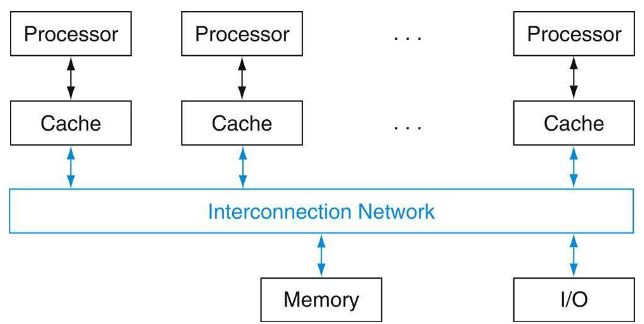
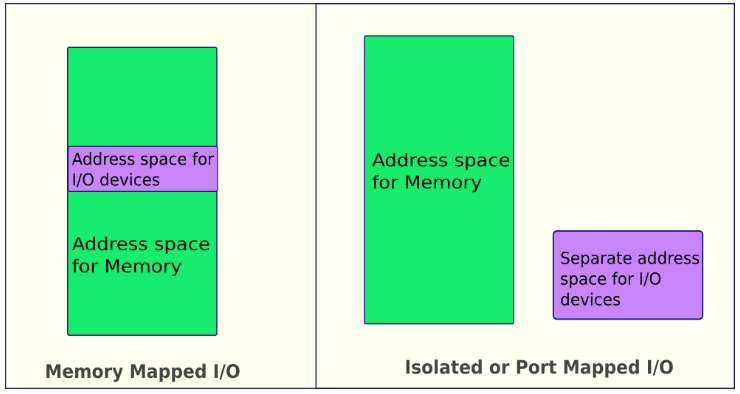
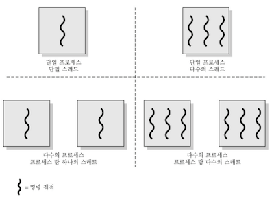
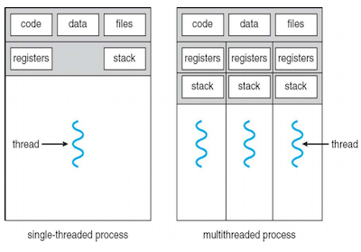
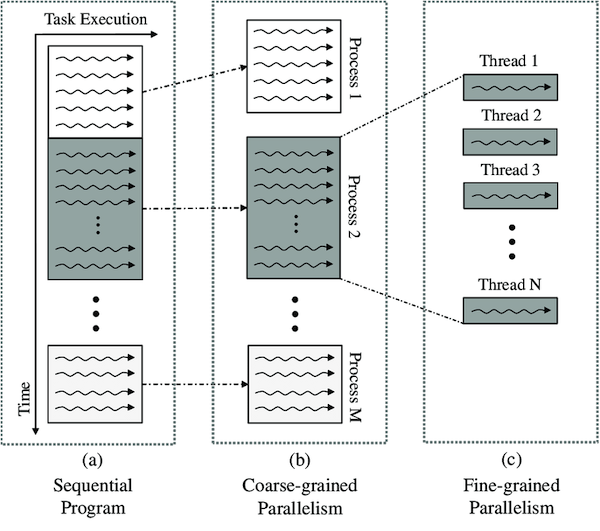
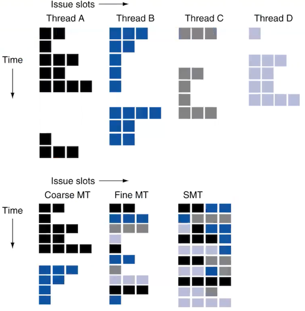
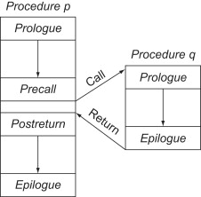
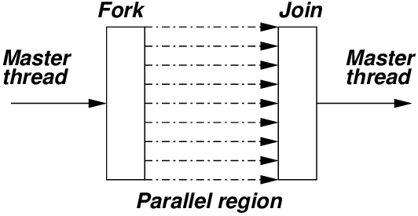
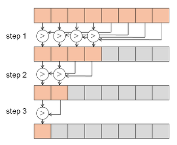

# 6 Parallel Processors (Part I)

---

## 6.1 Interconnect

parallel hardware 설계자들은 모든 processor가 공유하는 단일 physical address space를 만들려고 하였다. 이를 **shared memory multiprocessor**(SMP)라고 하며, multicore chip은 거의 이 방식으로 설계된다.



따라서 CPU, memory, I/O controllers 간에 **interconnection**이 필요하게 되었다. 대표적인 예시로 bus interconnect가 있다.

- **bus**: shared communication channel

  - bus에 연결된 device들은 wire를 공유하기 때문에, 트래픽이 많아지면 bottleneck이 발생한다.

  - wire length, connections 수 등으로 performance가 제한된다.

> 따라서 최근에는 switch를 이용한 high-speed serial connections 같은 대안이 존재한다.(network에서 주로 사용한다.)

---

### 6.1.1 I/O Register Mapping

CPU가 I/O에 접속하는 방법은 크게 두 가지로 나눌 수 있다.



- **memory mapped I/O**

  - memory register와 I/O resister가 하나의 연속된 memory address 영역에 할당된다.

    > 따라서 compiler가 최적화하는 것을 방지하기 위해, 프로그래밍 시 I/O 영역의 변수를 `volatile` 타입으로 선언해야 한다.

  - address decoder가 I/O address를 구분한다.

  - address translation mechanism을 사용해서, 오직 kernel(OS)을 통해서만 접근할 수 있도록 한다.

    > kernel: memory에 상주하는 OS의 핵심 부분. OS는 전원이 켜짐과 동시에 항상 필요한 부분만 memory에 올려서 사용하게 된다.(memory 낭비를 막기 위함)

  - ARM, MIPS 등이 대표적이다. 적은 복잡성 덕분에 로직이 간단하며 임베디드 시스템에서 많이 사용된다.

- **I/O mapped I/O**

  - memory와 I/O가 별개의 address 영역에 할당된다.

  - Intel x86이 대표적이다.

  - 마찬가지로 kernel mode에서만 접근할 수 있다.

---

### 6.1.3 Polling

> [polling, interrupt 정리](https://github.com/erectbranch/Embedded_Architecture/tree/master/ch04)

**polling**이 I/O status register를 주기적으로 확인하는 방식이다.

- device가 ready 상태라면 `do ()` opertion을 시작한다. 

- error일 때는 action을 취한다.

- 장점으로는 hardware cost가 적지만, 단점으로는 장치 register를 계속 읽으므로 CPU time의 낭비가 크다.

- 주로 작고 저사양인 real-time embedded system에서 사용한다.

---

### 6.1.4 interrupt

> [CPU, OS, task 개념 정리](https://jihooyim1.gitbooks.io/iknowosbasic/content/contents/02.html)

**interrupt**란 I/O device 등에서 예외가 발생하면, interrupt 사실을 CPU에게 알려 처리할 수 있도록 하는 방식이다. 

- interrupt는 I/O device에서 interrupt controller로 전달되고, interrupt controller는 해당 interrupt 종류를 파악해서 CPU에게 전달한다. 이를 **IRQ**(Interrupt Request)라고 한다.

- OS는 interrupt 종류에 맞는 interrupt handler를 호출(invoke)하여 처리한다.

  > OS가 현재 CPU가 실행 중인 program을 중단시키고, 우선순위가 높은 task를 CPU에게 할당한다.

참고로 interrupt는 software interrupt, hardware interrupt로 나눌 수 있다.

- software interrupt: DIV 명령어 처리에서 0으로 나누거나, 할당되지 않은 공간에 access하는 등의 예외 상황

- hardware interrupt: 키보드 입력, 디스크 제어 등

---

## 6.2 Heterogeneous Computing

**heterogeneous computing**(이기종 컴퓨팅)이란 CPU만이 아닌 다른 종류의 coprocessor(**GPU**, FPGA 등)를 장착한 시스템을 의미한다.

> 이중에서도 GPU는 parallel processing에 특화된 **manycore processor** 구조를 가지고 있다.

---

### 6.2.1 Parallel programming difficulties

parallel programming에서 발목을 잡는 어려운 문제 세 가지 예시를 살펴보자.

- **partitioning**(=mapping)

    작업을 병렬 조각으로 나누는 일

- **coordination**(=load-balancing, synchronization)

    부하를 균등하게 하고 동기화하는 일

- **communications overhead**(=data movement)

    통신 overhead를 줄이는 일

---

### 6.2.2 Parallel programming and Amdahl's law

parallel programming에서 speedup이 얼마나 어려운지는 **Amdahl's law**를 통해 체감할 수 있다.

```math
T_{new} = T_{parallelizable}/100 + T_{sequantial}
```

Amdahl's law를 speedup과 관련된 식으로 바꾸면 다음과 같다.

```math
speedup = {{Exec \, \, time \, \, before} \over {(Exec \, \, time \, \, before - {Exec \, \, time \, \, affected}) + {Exec \, \, time \, \, affected / Amount \, \, of \, \, improvement}}} 
```

- Exec time before: 원래 실행시간

- Exec time affected: 개선될 (부분의) 시간( $F_{parallelizable}$ )

- Amount of improvement: 개선될 부분의 비율

이때 Exec time before를 1로 가정하면, 식은 다음과 같이 바꿔서 쓸 수 있다.

```math
speedup = {{1} \over {(1 - {Exec \, \, time \, \, affected}) + {Exec \, \, time \, \, affected / Amount \, \, of \, \, improvement}}}
```

### <span style='background-color: #393E46; color: #F7F7F7'>&nbsp;&nbsp;&nbsp;📝 예제 1: 속도 개선의 어려움&nbsp;&nbsp;&nbsp;</span>

processor 수를 100 processors로 하여 90배 speedup을 달성하고 싶다고 하자. 원래 program에서 최대 몇 %까지 sequantial part가 있어도 되는지 구하라.

### <span style='background-color: #C2B2B2; color: #F7F7F7'>&nbsp;&nbsp;&nbsp;🔍 풀이&nbsp;&nbsp;&nbsp;</span>

```math
Speedup = 90 = {{1} \over {(1 - F_{parallelizable}) + {F_{parallelizable}/100}}}
```

계산 시 $F_{parallelizable}=0.999$ 를 얻을 수 있다. 따라서 sequential part는 0.1% 이하로 남아야 한다.

---

## 6.3 Process vs Thread

> [process 정리](http://mm.sookmyung.ac.kr/~bigrain/class/2011/mmso/StallingsOS6e-Chap03.pdf), [thread 정리](http://mm.sookmyung.ac.kr/~bigrain/class/2011/mmso/StallingsOS6e-Chap04.pdf)

**process**와 **thread**는 다음과 같은 차이점이 있다.

- **process**

  실행 중인 프로그램(A program in execution). instructions 집합으로 활동의 단위다.(a unit of activity)
  
  - process는 최소 하나의 thread를 가지며, multiple thread를 가질 수 있다.

  - CPU resource를 할당받는다.(CPU time, code/data/stack과 같은 memory 등)

- **thread**

  process 안의 제어 흐름(control flow) 단위다.

  - 한 process 안의 모든 thread는 memory 및 resource를 공유한다.(kernel 개입 없이 서로 통신)

  - local variable은 독립적으로 사용하고, global variable은 공유한다.

  - process에 비해 새로운 thread를 생성하는 편이 시간과 비용이 절약된다.

    > 대표적으로 interrupt에 의한 **context switching**이 있다. process의 경우 cache, data, stack, heap 초기화로 인한 비용이 드는데, thread는 자신의 stack 영역만 초기화하면 되기 때문에 비용이 훨씬 작다.

    > context switching 때 process는 **PCB**(Process Control Block)에 의해 관리되며, thread는 'process 내 **TCB**(Task Control Block)'에 의해 관리된다.

다음은 **threading**(단일 스레딩), **multithreading**(다중 스레딩)의 예시를 나타낸 그림이다.



한 process에서 single-thread, multi-thread의 자원은 다음과 같이 나뉘게 된다.



> PC register도 thread마다 독립적으로 할당된다.

---

### 6.3.1 Temporal Multi-Threading

그렇다면 Multithreading은 어떻게 구현하는 걸까? Multithreading 중에서도 **TMT**(Temporal Multi-threading)의 구현은 크게 두 가지 방식으로 나뉜다.

> Multi-Threading은 한 명이 여러 일을 멀티태스킹하는 TMT, 여러 명이 여러 일을 스케줄링으로 분담하는 SMT로 비유할 수 있다.



- **Coarse-grained multithreading**

  L2 cache miss와 같은 long stall이 발생헀을 때만 thread를 switch한다.

  - 한 clock cycle에 여러 thread에서 instruction을 issue한다.

  - hardware가 단순하여 구현이 쉽지만, data hazards와 같은 short stall의 hiding이 불가능하다.

- **Fine-grained multithreading**

  cycle마다 threads를 switch한다. 

  > thread switching을 위한 hardware를 두어 overhead를 줄인다.
  
  - 만약 한 thread가 stall되면 다른 thread를 실행한다.

    > 예를 들어 thread A에서 cache miss가 발생하면, latency동안 다른 thread B를 실행한다. 이것이 바로 **context switching**을 통한 **latency hiding**이다.

  - thread들은 interleave instruction execution 방식으로 처리한다.

    > 한 clock cycle에 한 thread만 instruction을 issue한다/

---

### 6.3.2 Simultaneous Multi-Threading

**SMT**(Simultaneous Multi-Threading)이란 여러 thread들이 동시에 동작하는 multi-threading 기법이다.

> Intel에서 **Hyper-threading**이라고 불리는 기술이다. SMT와 비교하여 TMT를 fake multi-threading으로 부르기도 한다.

- function unit(issue slot)만 avaliable하면, 다른 thread instruction을 동시에 수행한다.

- 여러 thread들이 동시에 동작하기 때문에 hardware resource가 더 필요하다.

- **dependency**를 scheduling, register renaming을 통해 관리한다. 

---

### 6.3.3 Multi-Threading Example

4개의 thread A, B, C, D가 있다고 할 때, 각 방법별 multi-threading을 통한 instruction 실행을 살펴보자.



- Coarse MT: Thread A에서 long stall이 발생하자 thread B로 switch했다.

- Fine MT: cycle마다 thread A, B, C, D를 switch했다.

- SMT: 가능한 issue slot에서 instruction을 동시에 실행했다.

---

## 6.4 shared memory multiprocessor

parallel hardware system은 physical address를 공유하는가 아닌가에 따라 크게 두 가지로 나뉜다. 이 중에서도 single physical address space를 공유하는 system이 바로 **SMP**(shared memory multiprocessor)이다.

> lock을 이용해서 shared variables를 synchronize한다.

parallel hardware system의 memory access 방식도 두 가지로 나눌 수 있다.

- **UMA**(Uniform Memory Access)

  모든 processor가 서로 연결되어 하나의 memory를 공유한다. 
  
  단, 단일 memory controller를 사용하므로 bandwidth가 제약되고, bottleneck이 발생할 수 있다.

- **NUMA**(Non-Uniform Memory Access)

  각 processor가 자신의 local memory를 갖는다. 
  
  자체 local memory에서 memory access time은 빠르지만, 다른 processor의 memory에 접근할 때는 성능이 저하된다.

---

### 6.4.1 programming for SMP

SMP를 위한 **Thread Programming**을 알아보자. 우선 thread programming을 적용하지 않은 callback function의 흐름과 thread programming을 비교해 보자.

- callback function

  instruction stream이 caller에서 callee로 전환됐다가, 작업이 끝나면 caller로 돌아오는 흐름을 갖는다.(즉, 동시에 실행되지 않는다.)

    

- thread programming

  thread1(master)에서 thread2(slave)가 실행되는 동시에, thread1도 병렬로 처리할 수 있다.

    

---

### 6.4.2 Pthread Programming

**Pthread**(=POSIX thread)는 thread programming을 위한 API(Application Programming Interface)이다. 

> POSIX는 IEEE standard로, UNIX, Linux, Solaris, Mac OS X, MS Windos에서 사용한다.

> C언어의 경우 관련 헤더 파일이 `/usr/include/` 디렉터리에 있는 `pthread.h`에 정의되어 있다. thread library를 사용하는 각 source file에 포함되어야 한다.

다음은 A, B vector를 더하는 vector addition Pthread Example이다.

- `pthread_t threads[4]`: thread를 4개 생성한다.

- `pthread_create(&threads[i], NULL, TaskCode, (void *)&args[i])`: thread를 정의한다.

    - `&threads[i]`: thread id를 저장할 address

    - `NULL`: thread attribute (default: NULL)

    - `TaskCode`: thread가 실행할 function

    - `(void *)&args[i]`: function 인자

- `pthread_join`: thread complete를 기다린다.

    - `threads[i]`: 종료될 thread id

    - `NULL`: return value (default: NULL)

```c
#include <pthread.h>
#include <stdio.h>
#include <stdlib.h>

extern int S[100], A[100], B[100];

void *TaskCode(void *argument)
{
    int tid;

    tid = *((int *) argument);               // pointer cast

    for(int i=tid*25; i<(tid+1)*25; i++){    // loop unrolling
        S[i] = A[i] + B[i];
    }

    return NULL;
}

int main (int argc, char *argv[])
{
    pthread_t threads[4];
    int args[4];
    int i;

    for (i = 0; i < 4; ++i){
        args[i] = i;
        pthread_create(&threads[i], NULL, TaskCode, (void *)&args[i]);
    }

    /* wait for all threads to complete */
    for (i = 0; i < 4; ++i){
        pthread_join(threads[i], NULL);
    }

    exit(EXIT_SUCCESS);
}
```

---

## 6.5 shared memory multiprocessor programming example

### <span style='background-color: #393E46; color: #F7F7F7'>&nbsp;&nbsp;&nbsp;📝 예제 2: sum reduction&nbsp;&nbsp;&nbsp;</span>

100 processor UMA에서 100,000개 숫자를 더한다고 하자. Sum Reduction을 구현하라.



> reduction: divide and conquer. 각 reduction step에서는 synchronize가 필요하다.

- 각 processor는 ID를 0~99 범위 내에서 갖는다.(`myid`)

- processor마다 숫자 1,000개를 계산하도록 partitioning한다.

### <span style='background-color: #C2B2B2; color: #F7F7F7'>&nbsp;&nbsp;&nbsp;🔍 풀이&nbsp;&nbsp;&nbsp;</span>

- step1: 우선 각 processor가 숫자 1,000개에서 원소 2개씩을 더한다.

```c
sum[myid] = 0;
for (i = 1000*myid; i < 1000*(myid+1); i++){
    sum[myid] = sum[myid] + totalData[i];
}
```

- step2: partial sums을 구현하면 다음과 같다.

```c
for (int stride=100/2; stride > 0; stride /= 2) {
    if (myid < stride) {
        sum[myid] = sum[myid + stride]
    }
    synch();     // 다른 thread 연산이 끝날 때 까지 barrier
}
```

---

## 6.6 Message Passing

process는 (1) 다른 processor와 협력하지 않는 process, (2) 영향을 주고 받으며 resource를 공유하는 process(**cooperating process**)로 나눌 수 있다. 그런데 각 processor는 private physical address space를 갖기 때문에, processor 사이에서 공통된 규칙의 hardware send/receives message가 필요하다.

> 비슷하게 network로 연결된 다른 computer도 각자의 private memory과 OS를 갖는다. Ethernet/switch, Internet과 같은 I/O system을 통해 연결되는데, 이때도 message passing이 필요하다.

- **IPC**(Inter-Process Communication): cooperating process 사이에서 서로 data를 주고 받는 행위, 또는 그 방법과 경로

이러한 clusters를 구성하면서 얻는 장단점은 다음과 같다.

- 장점

    - high availability(어떤 컴퓨터가 고장이 나면, 다른 컴퓨터에서 즉시 업무를 대신할 수 있다.)
    
    - scalability
    
    - cost-effective

- 단점

   - administration cost

   - low interconnect bandwidth

---

### 6.6.1 Message Passing Interface

따라서 distributed memory systems에서 parallel programming을 위한 communication protocol로 **MPI**(Message Passing Interface)를 사용한다.

> 주로 HPC(High-Performance Computing)에서 사용한다. `MPI_Send()`, `MPI_Recv()`, `MPI_Broadcast()`...

다음은 MPI Programming을 이용한 vector addition 예시다.

```c
#include <mpi.h>
#include <stdio.h>
#include <stdlib.h>
#define TAG 0

int main(int argc, char *argv[])
{
    int buff[25], numprocs, myid;
    int i;
    MPI_Status stat;

    MPI_Init(&argc, &argv);
    MPI_Comm_size(MPI_COMM_WORLD, &numprocs); // 현재 예제에서 numprocs = 4로 가정한다.
    MPI_Comm_rank(MPI_COMM_WORLD, &myid);     // processor id를 저장한다.

    // id 0 processor = master processor
    if (myid == 0) {
        int S[100], A[100], B[100];    // A, B는 이미 초기화되어 있다고 가정

        for (i = 1, i<numprocs; i++) {
            MPI_Send(A, 25, MPI_INT, i, TAG, MPI_COMM_WORLD);
            MPI_Send(B, 25, MPI_INT, i, TAG, MPI_COMM_WORLD);
        }

        int offset = 0;
        for (i = 1; i < numprocs; i++) {
            MPI_Recv(&S[offset], 25, MPI_INT, i, TAG, MPI_COMM_WORLD, &stat);
            offset += 25;
        }
    }
    else {
        int Sum[25];
        MPI_Recv(A, 25, MPI_INT, 0, TAG, MPI_COMM_WORLD, &stat);
        MPI_Recv(B, 25, MPI_INT, 0, TAG, MPI_COMM_WORLD, &stat);

        for (i = 0; i < 25; i++) {
            Sum[i] = A[i] + B[i];
        }

        MPI_Send(S, 25, MPI_INT, 0, TAG, MPI_COMM_WORLD);
    }

    MPI_Finalize();
    return 0;
}

```

### <span style='background-color: #393E46; color: #F7F7F7'>&nbsp;&nbsp;&nbsp;📝 예제 3: sum reduction + MPI&nbsp;&nbsp;&nbsp;</span>

100 processor UMA에서 100,000개 숫자를 더하는 예제 2번 sum reduction을 MPI를 사용하여 구현하라.

### <span style='background-color: #C2B2B2; color: #F7F7F7'>&nbsp;&nbsp;&nbsp;🔍 풀이&nbsp;&nbsp;&nbsp;</span>

- step 1: 각 processor에서 수행하는 partial sums

```c
sum = 0;
for (i = 0; i < 1000; i++){
    sum = sum + myData[i]
}
```

- step 2: reduction

  processors 절반은 send, 나머지 절반은 receice, add를 수행한다.

  > send, receive는 동시에 synchronization도 수행한다.

```c
limit = 100; half = 100;               // 100개 processor
do {
    half = (half + 1) / 2;             // send와 receive 분배
    
    // send
    if (myid >= half && myid < limit){ 
        send(myid - half, sum);
    }
    // receive, sum
    if (myid < (limit/2)){
        sum = sum + receive();
    }
    limit = half;
} while (half == 1);                   // final sum
```

---